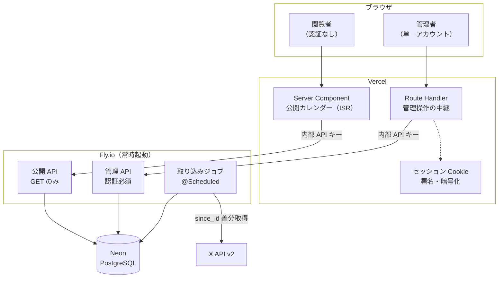
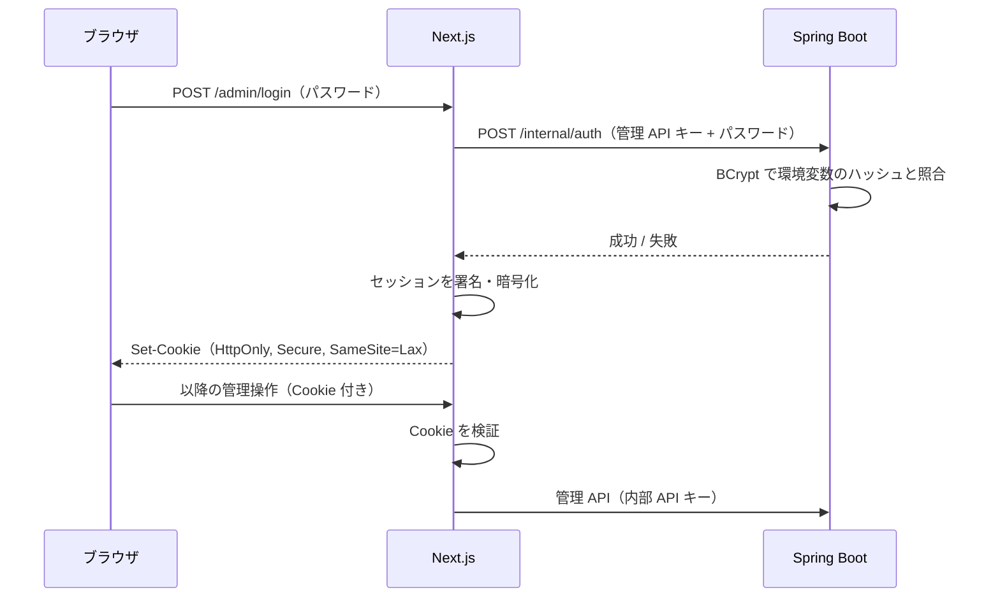

# アーキテクチャ設計 — XINXIN 出演情報カレンダー

最終更新: 2026-09-01

関連文書: [CLAUDE.md](../CLAUDE.md) / [docs/requirements.md](requirements.md) /
[docs/data-model.md](data-model.md) / [docs/x-integration.md](x-integration.md)

---

## 1. 全体構成



**ブラウザは Spring Boot を直接呼ばない。** すべて Next.js を経由する（BFF 構成）。

---

## 2. 構成要素とホスティング

| 層 | 技術 | ホスティング | 月額 |
| --- | --- | --- | --- |
| フロントエンド / BFF | Next.js (App Router) / TypeScript | Vercel | $0（Hobby） |
| バックエンド | Spring Boot / Java | Fly.io（常時起動） | $2〜5 |
| DB | PostgreSQL | Neon（Free） | $0 |
| 外部 API | X API v2 | — | 約 $1.5 |

**合計 月 $4〜7 の見込み。**

### 2.1 Fly.io を常時起動にする理由

取り込みジョブを Spring Boot の `@Scheduled` で動かすため、**スリープさせられない**。
スケールトゥゼロ環境ではスケジューラが動かず、ポーリングが止まる。

加えて JVM のコールドスタートは 5〜15 秒かかる。スリープする構成では
復帰に 30〜60 秒を要し、NFR-01（サーバ応答 p95 300ms）を満たせない。

### 2.2 Neon を選んだ理由と制約

- ストレージ 0.5GB / プロジェクト。本アプリの増加量は**年間約 4MB**（第 11 章）で余裕がある
- バックアップとバージョン管理が自動。個人運用で最も現実的な事故は
  「バックアップを設定し忘れたままのデータ消失」であり、これを避ける
- **制約はコンピュート時間**。無料枠は 100 CU-hours/月で、5 分のアイドルで停止する。
  上限に達すると翌請求月まで**コンピュートが停止する**（自動課金はされない）

この制約に対処するのが第 5 章のキャッシュ戦略。
ただし**閲覧者が 0 でも取り込みジョブが枠を消費する**ため、
キャッシュだけでは足りない。試算は第 11 章。

---

## 3. 通信経路と認証

### 3.1 経路ごとの保護

| 経路 | 保護 |
| --- | --- |
| ブラウザ → Next.js | HTTPS。管理画面はセッション Cookie |
| Next.js → Spring Boot | HTTPS + **内部 API キー**（公開用・管理用の 2 種類）をヘッダに付与 |
| Spring Boot → Neon | TLS + 接続文字列 |
| Spring Boot → X API | HTTPS + Bearer Token |

**Spring Boot は実質インターネットに露出する。** Vercel の送信 IP は固定されないため
IP 制限が使えない。代わりに全リクエストへ内部 API キーを要求し、一致しないものを拒否する。

**キーは公開用と管理用の 2 種類に分ける。** 公開データの取得キーは全ページの
レンダリングで使われて露出機会が多く、1 種類だとそれが漏れただけで
管理操作まで通ってしまう。Next.js は**管理者セッション Cookie の検証に成功した場合にのみ**
管理キーを使い、公開ページのレンダリングでは読み込まない。
加えて公開 API は `GET` のみを提供する（NFR-03）。詳細は [api.md](api.md) 第 2 章。

### 3.2 管理者の認証フロー



- **セッションストアを持たない。** 署名・暗号化した Cookie に
  「管理者としてログイン済み」と有効期限だけを入れる。
  単一管理者であり、Redis などを増やす必要がない
- **有効期限は 8 時間**とする
- パスワードのハッシュは Spring Boot 側の環境変数に置く。
  DB にユーザーテーブルを作らない（FR-20）

**制約: 発行済みセッションの即時失効ができない。** ログアウトは Cookie の削除で行うため、
Cookie を事前に複製されていた場合は有効期限まで使える。
単一管理者で被害範囲が限定されること、有効期限を 8 時間に絞ることで許容する。
厳密な失効が必要になった場合は第 12 章を参照。

---

## 4. バックエンド構成

### 4.1 パッケージ構成

レイヤ（controller / service / repository）ではなく**機能で分ける**。
関連するコードが 1 か所に集まり、取り込み機能ごと差し替えやすくなる。

```
backend/src/main/java/dev/mzhin/hatenacal/
├── appearance/          出演情報（公開・管理の両方）
│   ├── Appearance.java              エンティティ
│   ├── AppearanceRepository.java
│   ├── AppearanceService.java       event_key の生成もここ
│   ├── PublicAppearanceController.java   GET のみ
│   └── AdminAppearanceController.java    認証必須
├── ingestion/           X からの取り込み
│   ├── XApiClient.java              API 呼び出しのみ
│   ├── PostParser.java              本文 → 出演情報（純粋関数）
│   ├── IngestionService.java        取得・抽出・登録の調停
│   ├── IngestionScheduler.java      @Scheduled
│   ├── IngestedPost.java
│   └── IngestionRun.java
├── auth/                管理者認証
├── config/              SecurityConfig, 各種 Properties
└── common/              例外ハンドラなど
```

### 4.2 設計上の原則

- **`PostParser` を副作用のない純粋関数にする。** 本文の文字列を受け取り、
  抽出結果を返すだけ。DB も HTTP も触らない。
  実サンプル（`docs/x-post-sample/`）に対するテストをここに集約する
- **`XApiClient` は取得だけを担い、解釈をしない。** 課金に直結するため、
  呼び出し箇所を 1 クラスに閉じ込めて監査しやすくする
- **`event_key` の生成は `AppearanceService` の単一メソッドに集約する。**
  自動登録・手動登録・編集のすべてがそこを通る
  （[data-model.md](data-model.md) 第 4.3.2 節）
- 公開用と管理用でコントローラを分ける。公開側に更新系メソッドを**書かない**

### 4.3 取り込みジョブ

`@Scheduled` で 30 分間隔（[x-integration.md](x-integration.md) 第 10 章）。

- **多重起動を防ぐ。** 判定規則は [x-integration.md](x-integration.md) 第 10.1 節。
  Fly.io のインスタンスを 1 台に固定し、単一インスタンス前提で運用する
- 取り込みの失敗が公開 API に影響しない（NFR-02）。ジョブと Web は
  同一プロセスだが、例外はジョブ内で完結させる

---

## 5. フロントエンド構成とキャッシュ戦略

### 5.1 ルーティング

```
frontend/
├── proxy.ts                          サイト全体の停止（第 5.4 節）と
│                                     管理画面への未認証アクセスの誘導
├── lib/                              セッション・API クライアント
└── app/
    ├── page.tsx                      当月カレンダー
    ├── [year]/[month]/page.tsx       指定月（FR-05：URL に年月を反映）
    ├── unavailable/page.tsx          停止中の案内（第 5.4 節）
    ├── admin/
    │   ├── actions.ts                Server Action（管理操作の中継）
    │   ├── login/page.tsx
    │   ├── page.tsx                  自動登録の点検一覧（FR-24）
    │   ├── appearances/new/page.tsx  手動登録（FR-21）
    │   ├── appearances/[id]/page.tsx 編集・削除（FR-22, FR-23）
    │   └── unparsed/page.tsx         未処理投稿（FR-25）
    └── layout.tsx                    免責表示を含むフッタ（FR-07）
```

### 5.2 キャッシュ戦略

**これが Neon の CU-hours 対策の要になる。**

| 対象 | 方式 |
| --- | --- |
| 公開カレンダー | Server Component + **ISR（`revalidate: 300`）** |
| 管理画面 | キャッシュしない（`no-store`） |

閲覧者のアクセスは Vercel のキャッシュで返るため、**DB まで届かない**。
Neon のコンピュートが起動する回数が減り、無料枠に収まりやすくなる。

**管理操作の直後は明示的に再検証する。** FR-22 の
「編集内容は保存後ただちに公開画面へ反映される」を満たすため、
登録・編集・削除を処理する Route Handler の中で `revalidatePath()` を呼ぶ。

取り込みジョブによる更新は時間ベースの再検証に任せる（最大 5 分の遅れ）。
FR-08 で最終更新日時を表示するため、この遅延は閲覧者に判別できる。

**再検証は閲覧者を待たせない。** 期限切れ後の最初のリクエストには
キャッシュ済みのページがそのまま返り、再生成は裏で走る。
Neon がアイドルで停止していても、そのコールドスタートを閲覧者が待つのは
**キャッシュにまだ無い月を開いたとき**だけになる。
NFR-01 がこの 2 つを分けて目標を定めているのはこのため。

**キャッシュキーの範囲を有限にする。** `[year]/[month]` は年月ごとに別の
キャッシュエントリになるため、範囲を絞らないとキーが無制限に増える。
範囲外のリクエストはすべてキャッシュミスになり、Server Component が
Spring Boot を呼び、Neon まで届く。**これは T-04（無料枠の枯渇による
可用性攻撃）の経路そのもの**（[security.md](security.md) T-04）。

- 表示できる年月の範囲は FR-05 で定める
- 検証は **Server Component がデータを取得する前**に行い、範囲外は
  `notFound()` で `404` にする。キャッシュエントリはできても
  **DB クエリは発生しない**
- **`generateStaticParams` は空配列を返す形で置く。消してはいけない。**
  これが無いと Next.js は `[year]/[month]` を純粋な動的レンダリングとして扱い、
  応答が `no-store` になって**毎リクエストが DB まで到達する**。
  空配列にするのはビルド時に 1 ページも事前生成しないため。
  全月を生成するとビルドがバックエンドの生死に依存する
  （[ADR-0014](adr/0014-bounded-calendar-range.md)）

### 5.3 データ取得の方向

- 公開ページ: **Server Component からサーバ間通信**で Spring Boot を呼ぶ。
  内部 API キーがブラウザに渡らない
- 管理ページ: フォーム送信を **Server Action** が受け、Cookie を検証してから
  Spring Boot を呼ぶ。Route Handler ではなく Server Action にしたのは、
  Next.js が Origin ヘッダを検証するため **CSRF の防御が 1 枚増える**から。
  経路（ブラウザ → Next.js → Spring Boot）と、管理キーを Cookie 検証後にしか
  読まない性質は変わらない

**ブラウザから Spring Boot を直接呼ぶコードを書かない。** 内部 API キーが漏れる。

### 5.4 サイト全体の停止

削除要請を受けた際に公開を止める手段（LR-05）。**Next.js の `proxy.ts` で止める。**

> `middleware.ts` は Next.js 16 で非推奨になり `proxy.ts` に改称された。
> 役割は同じで、ルートのレンダリングより前に実行される。

```
proxy.ts
  SITE_DISABLED === 'true' なら、/admin 配下を除く全リクエストを
  /unavailable へ rewrite する（200 で停止中の案内を返す）

停止手順
  1. Vercel の環境変数に SITE_DISABLED=true を設定
  2. 再デプロイ（1〜2 分）
```

**バックエンドを止めるだけでは不十分。** 公開カレンダーは ISR でキャッシュされており
（第 5.2 節）、Fly.io や Neon を停止してもキャッシュ済みのページは配信され続ける。
`proxy.ts` は**キャッシュの手前**で全リクエストを受けるため、
キャッシュ済みのページも確実に止められる。ここが方式選定の決め手になっている。

- 停止ページには**削除要請の連絡先**を残す。要請者が状況を確認できないまま
  サイトが消える状態にしない（連絡手段そのものは
  [requirements.md](requirements.md) 第 12 章の未決定事項）
- `/admin` 配下を除外するのは、停止中も管理者が個別削除（FR-23）を行えるようにするため
- 反映に再デプロイを挟むが、LR-05 が求めるのは**手段を持つこと**であり即時性ではない

### 5.5 公開ページのレート制限

**レート制限は Next.js 側に置く。** Spring Boot から見た送信元は
Vercel の egress IP であり、そこで IP 単位に絞ると攻撃者ではなく
**全閲覧者がまとめて絞られる**。第 3.1 節で IP 許可リストを諦めたのと同じ理由。

- Next.js 側（`proxy.ts` または Server Action）なら実クライアントの IP が見える
- Spring Boot 側のレート制限も残すが、目的が違う。こちらは
  「Vercel からの総量」を守る最後の防波堤で、発動すれば閲覧者全体に影響が出る
- 具体値は運用のアクセス量を見て決める（[security.md](security.md) 第 9 章）

---

## 6. 主要な処理フロー

### 6.1 カレンダー表示（FR-01, FR-03）

```
ブラウザ → Vercel（ISR キャッシュ命中なら即返す）
              ↓ 未命中
          Server Component → Spring Boot GET /api/public/appearances?from=&to=
                                 ↓
                             Neon（1 か月分を 1 クエリ）
```

月の範囲は JST の暦日で指定する。日付ごとにリクエストを分割しない（NFR-01）。

### 6.2 取り込み（FR-40〜43）

詳細は [x-integration.md](x-integration.md) 第 2 章。

### 6.3 管理者による訂正（FR-22）

```
ブラウザ → Route Handler（Cookie 検証）→ Spring Boot 管理 API → Neon
                    ↓
              revalidatePath('/') で公開ページを再検証
```

---

## 7. 設定と環境変数

すべて環境変数で注入する。リポジトリに値を置かない。
`.env.example` に**キー名だけ**を記載する。

### Next.js（Vercel）

| 変数 | 用途 |
| --- | --- |
| `BACKEND_BASE_URL` | Spring Boot のベース URL |
| `BACKEND_API_KEY` | 公開 API 用の内部キー |
| `BACKEND_ADMIN_API_KEY` | 管理 API 用の内部キー。**Cookie 検証に成功したときだけ使う** |
| `SESSION_SECRET` | セッション Cookie の署名・暗号化鍵 |
| `SITE_DISABLED` | `true` でサイト全体を停止する（第 5.4 節。LR-05） |

`NEXT_PUBLIC_` を付けるとブラウザに露出する。**上記のいずれにも付けない。**

### Spring Boot（Fly.io Secrets）

| 変数 | 用途 |
| --- | --- |
| `DATABASE_URL` | Neon の接続文字列 |
| `X_BEARER_TOKEN` | X API の認証。**課金に直結する** |
| `X_SOURCE_USERNAME` | 情報源アカウントのハンドル |
| `ADMIN_PASSWORD_HASH` | 管理者パスワードの BCrypt ハッシュ |
| `INTERNAL_API_KEY` | 公開 API 用の共有シークレット |
| `INTERNAL_ADMIN_API_KEY` | 管理 API・内部 API 用の共有シークレット |

`spring.jpa.hibernate.ddl-auto` は `validate` に固定する
（[data-model.md](data-model.md) 第 8 章）。

---

## 8. デプロイ

| 対象 | 方法 |
| --- | --- |
| Next.js | GitHub 連携で Vercel が自動デプロイ |
| Spring Boot | `Dockerfile` + `fly.toml`、`fly deploy` |
| DB マイグレーション | アプリ起動時に Flyway が適用 |

- Fly.io のインスタンス数は **1 に固定**する（取り込みジョブの多重起動を防ぐため）
- シークレットは `fly secrets set` で設定する。`fly.toml` に書かない
- Neon の接続文字列はプーリング対応のものを使う

---

## 9. 将来の EAS 対応

モバイルアプリは **Next.js を経由できない**（BFF はウェブ専用）。
そのため Spring Boot の公開 API を、そのままモバイルから叩ける形に保つ。

- 公開 API のレスポンスに HTML 断片や CSS クラス名を含めない（NFR-07）
- 表示の都合（日付の書式、時刻の表記）はクライアント側で組み立てる。
  API は ISO 8601 の日付と時刻を返す
- モバイル対応時に公開 API の内部 API キー要件を見直す。
  アプリに埋め込んだキーは秘密にならないため、公開 API は
  **キーなしで読めるが GET のみ**という形に変更する想定

---

## 10. 監視と運用

| 見る値 | 目的 |
| --- | --- |
| 直近の取り込み成否 | FR-08 の表示、NFR-09 |
| 当月の `fetched_resource_count` 合計 | X API のコスト（NFR-04） |
| Neon の CU-hours 消費 | 無料枠の上限に近づいていないか |
| `UNPARSED` の滞留件数 | 抽出精度の劣化 |

Neon の無料枠を超えると**翌請求月までコンピュートが停止し、サイトが閲覧不能になる**。
CU-hours の消費は定期的に確認し、上限に近づいたら従量課金へ切り替える。

---

## 11. 運用コストの試算

### ストレージ（年間）

| テーブル | 前提 | 年間増加 |
| --- | --- | --- |
| `appearance` | 年 100 公演 | 約 30KB |
| `ingested_post` | 1 日 3 投稿 | 約 66KB |
| `ingestion_run` | 30 分間隔 | 約 1.8MB |
| 合計 | | **約 2MB** |

Neon Free の 0.5GB に対して 100 年以上の余裕がある。

### コンピュート時間（月間）

**無料枠で最も逼迫するのはストレージではなくコンピュート時間**であり、
その主な消費者は閲覧者ではなく**取り込みジョブ**になる。
Neon は最終クエリから 5 分でサスペンドするため、ジョブが DB に触るたびに
最低 5 分は起動したままになる（第 2.2 節）。

| ポーリング間隔 | 稼働率 | 月間コンピュート時間 | 0.25 CU 換算 |
| --- | --- | --- | --- |
| 15 分 | 約 34% | 約 250 時間 | 約 62 CU-hours |
| **30 分（採用）** | 約 17% | 約 124 時間 | **約 31 CU-hours** |

1 回の実行が数秒で終わる前提、月 730 時間で計算。30 分間隔なら
100 CU-hours のうち**約 69 が閲覧・再検証・管理操作に残る**。

- **autoscaling の下限を 0.25 CU に固定する。** ここが上振れすると
  コンピュート時間に比例して CU-hours が増え、この試算が崩れる
- **新規投稿がない実行でも `ingestion_run` は記録する。** FR-08 は
  「最後に取り込みが**成功**した日時」を出し 24 時間で警告するため、
  無風の実行を省くと、告知が数日ないだけで誤って「古い可能性」と表示される。
  ジョブが枠を消費するのはこの仕様の代償であり、消すのではなく予算に入れる
- この常時起床には、キャッシュにない月を開いたときの Neon コールドスタートを
  減らす副次効果もある（NFR-01）

### 月額

| 項目 | 金額 |
| --- | --- |
| Vercel Hobby | $0 |
| Fly.io（常時起動） | $2〜5 |
| Neon Free | $0 |
| X API（差分取得） | 約 $1.5 |
| **合計** | **約 $4〜7** |

---

## 12. 未決定事項

1. **セッションの即時失効**（第 3.2 節）。現状は Cookie ベースで
   サーバ側の失効ができない。必要になれば Spring Session + DB へ移す
2. **取り込み結果の即時反映**（第 5.2 節）。現状は時間ベースの再検証に任せている。
   Spring Boot から Next.js の On-Demand Revalidation を呼ぶ構成も可能
3. **CI の構成**。GitHub Actions でテストを回す想定だが未定。
   **X API を叩くテストを CI に含めない**ことだけは確定している
4. **Fly.io のリージョン**。Neon のリージョンと近い場所を選ぶ
5. **ログの保存先**。Fly.io の標準出力に流すだけで足りるか、
   外部に集約するかは運用してから判断する
