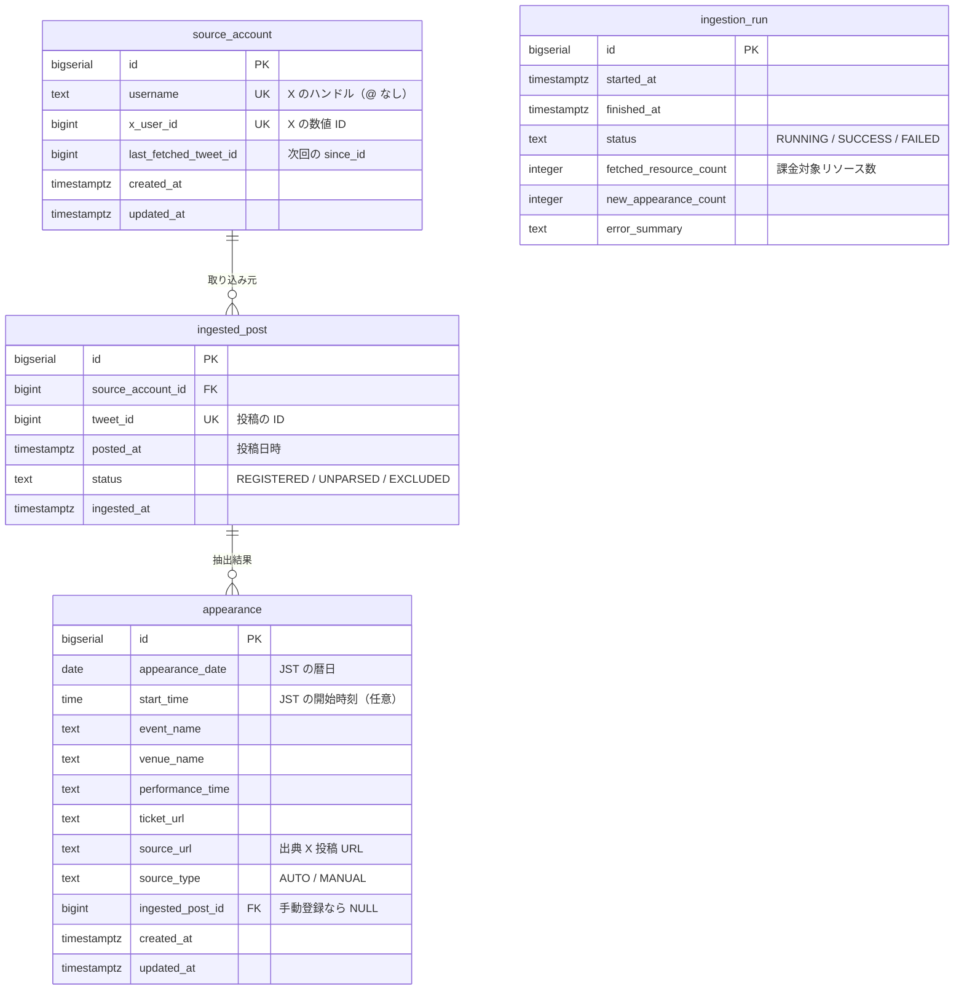

# データモデル設計 — XINXIN 出演情報カレンダー

最終更新: 2026-08-28

関連文書: [CLAUDE.md](../CLAUDE.md) / [docs/requirements.md](requirements.md)

---

## 1. 前提

| 項目 | 決定 |
| --- | --- |
| DBMS | PostgreSQL |
| 主キー | `BIGSERIAL`（連番）。公開情報のみを扱うため連番の推測可能性は問題にならない |
| マイグレーション | Flyway（番号付き SQL） |
| 文字型 | 可変長は一律 `TEXT`。PostgreSQL では `VARCHAR(n)` に性能上の利点がなく、長さ制限は用途に応じて `CHECK` で表現する |
| 時刻型 | 用途により `TIMESTAMPTZ` と `DATE` / `TIME` を使い分ける（第 6 章） |

テーブルは 4 つ。要件（[docs/requirements.md](requirements.md) 第 8 章）で定めた
「保持するもの」に一対一で対応する。

---

## 2. ER 図



`ingestion_run` は他テーブルと外部キーで結ばれない独立した実行記録。

---

## 3. 命名規約

- テーブル名・カラム名は **snake_case**、テーブル名は**単数形**
- 主キーは一律 `id`
- 外部キーは `<参照先テーブル名>_id`
- 日時は `_at`（`TIMESTAMPTZ`）、日付は `_date`（`DATE`）、時刻は `_time`（`TIME`）
- 状態を表す列は `status`、区分は `_type`
- 列挙値は **`TEXT` + `CHECK` 制約**で表現する。PostgreSQL の `ENUM` 型は値の追加に
  `ALTER TYPE` が必要で、変更がマイグレーションとして扱いにくいため使わない

---

## 4. テーブル定義

### 4.1 source_account — 情報源アカウント

取得元の X アカウントと、差分取得の位置（`since_id`）を保持する。
MVP では 1 行のみだが、取得位置を永続化する置き場所として必要（FR-40）。

```sql
CREATE TABLE source_account (
    id                    BIGSERIAL   PRIMARY KEY,
    username              TEXT        NOT NULL UNIQUE,
    x_user_id             BIGINT      NOT NULL UNIQUE,
    last_fetched_tweet_id BIGINT,
    created_at            TIMESTAMPTZ NOT NULL DEFAULT now(),
    updated_at            TIMESTAMPTZ NOT NULL DEFAULT now()
);
```

| 列 | 説明 |
| --- | --- |
| `username` | X のハンドル。`@` を含めない |
| `x_user_id` | `GET /2/users/by/username/{handle}` で **初回に一度だけ**解決した値。以降は解決 API を呼ばない（FR-40） |
| `last_fetched_tweet_id` | 取得済みの最大 tweet_id。次回リクエストの `since_id` に渡す。初回取り込み前は `NULL` |

**`tweet_id` を `BIGINT` にする理由。** X の ID は 63 bit の snowflake で、
PostgreSQL の `BIGINT`（符号付き 64 bit）に収まる。`TEXT` で保持すると
「最大値の取得」が文字列比較になり、桁数が変わった瞬間に `"9..." > "10..."` と
誤判定して**取得位置が巻き戻る**。巻き戻りは同じ投稿の再取得＝再課金に直結するため、
数値型で持つ（[CLAUDE.md](../CLAUDE.md) の必須ルール）。

なお API のレスポンスでは文字列として返るため、パース時に数値へ変換する。
逆にフロントエンドへ tweet_id をそのまま渡さない（JavaScript の `Number` は
53 bit までで精度が落ちる）。画面には出典 URL を組み立てて渡す。

### 4.2 ingested_post — 取り込み済み投稿の記録

処理済みの投稿を記録し、**再処理時の冪等性**を担保する（FR-23, FR-41）。

```sql
CREATE TABLE ingested_post (
    id                BIGSERIAL   PRIMARY KEY,
    source_account_id BIGINT      NOT NULL REFERENCES source_account (id),
    tweet_id          BIGINT      NOT NULL UNIQUE,
    posted_at         TIMESTAMPTZ NOT NULL,
    status            TEXT        NOT NULL
                                  CHECK (status IN ('REGISTERED', 'UNPARSED', 'EXCLUDED')),
    ingested_at       TIMESTAMPTZ NOT NULL DEFAULT now()
);
```

| `status` | 意味 |
| --- | --- |
| `REGISTERED` | 出演情報を抽出して登録済み |
| `UNPARSED` | 抽出できず未処理。管理者の手動処理を待つ（FR-25） |
| `EXCLUDED` | 出演告知ではないと管理者が判断した（FR-25） |

**投稿本文を保持しない**（LR-02）。未処理投稿を手で処理する管理者は、
`tweet_id` から組み立てた X 投稿 URL を開いて**原文を X 上で読む**。
本文を DB に持たなくても FR-25 は成立する。

`tweet_id` の `UNIQUE` 制約が冪等性の要。定常運用では `since_id` により同じ投稿を
再取得しないが、障害復旧や初回バックフィルで再処理が起きても、この制約により
出演情報が二重登録されない。

### 4.3 appearance — 出演情報

公開の対象となる本体。登録された時点で閲覧者に見える（承認フローなし。FR-41）。

```sql
CREATE TABLE appearance (
    id               BIGSERIAL   PRIMARY KEY,
    appearance_date  DATE        NOT NULL,
    start_time       TIME,
    event_name       TEXT        NOT NULL CHECK (length(event_name) BETWEEN 1 AND 200),
    venue_name       TEXT        CHECK (venue_name IS NULL OR length(venue_name) <= 200),
    performance_time TEXT        CHECK (performance_time IS NULL OR length(performance_time) <= 100),
    ticket_url       TEXT        CHECK (ticket_url IS NULL OR ticket_url ~ '^https://'),
    source_url       TEXT        NOT NULL CHECK (source_url ~ '^https://'),
    source_type      TEXT        NOT NULL CHECK (source_type IN ('AUTO', 'MANUAL')),
    ingested_post_id BIGINT      REFERENCES ingested_post (id),
    created_at       TIMESTAMPTZ NOT NULL DEFAULT now(),
    updated_at       TIMESTAMPTZ NOT NULL DEFAULT now(),

    CONSTRAINT appearance_auto_requires_post
        CHECK ((source_type = 'AUTO' AND ingested_post_id IS NOT NULL)
            OR (source_type = 'MANUAL'))
);
```

| 列 | 説明 |
| --- | --- |
| `appearance_date` | **JST の暦日**。カレンダーの配置に使う（第 6 章） |
| `start_time` | JST の開始時刻。**未定を表現するため nullable**（FR-03 で時刻なしを後ろに並べる） |
| `performance_time` | 「19:30-20:00」のような出演時間。表記が多様なため構造化せず文字列で保持する |
| `source_url` | 出典 X 投稿の URL。**手動登録でも必須**（FR-06。根拠のないデータを公開しない） |
| `source_type` | `AUTO`（自動取り込み）/ `MANUAL`（管理者が手で登録）。FR-24 の一覧はこれで絞る |
| `ingested_post_id` | 自動登録なら抽出元の投稿を指す。手動登録は `NULL` |

**1 つの投稿から複数の出演情報が生まれうる。** 「8/30 と 8/31 に出演」のように
1 つの告知へ複数の日程が書かれる場合、`ingested_post` 1 行に対して `appearance` が
複数紐づく（1 対多）。抽出処理はこれを前提に設計する。

`appearance_auto_requires_post` により、「自動登録なのに抽出元が不明」という
不整合をデータベース側で防ぐ。

URL 列の `CHECK` は `https://` で始まることだけを検証する簡易なもの。
X 由来の値を信頼しない方針（NFR-03）の最後の砦であり、
本格的な検証はアプリケーション側（Bean Validation）で行う。

**`updated_at` はアプリケーション側で更新する**（JPA の `@UpdateTimestamp`）。
トリガーを使うと更新経路が SQL とアプリの二箇所に分かれ、追いにくくなるため。

### 4.4 ingestion_run — 取り込み実行ログ

課金額の追跡（NFR-04）と、最終更新日時の表示（FR-08）に使う。

```sql
CREATE TABLE ingestion_run (
    id                     BIGSERIAL   PRIMARY KEY,
    started_at             TIMESTAMPTZ NOT NULL DEFAULT now(),
    finished_at            TIMESTAMPTZ,
    status                 TEXT        NOT NULL
                                       CHECK (status IN ('RUNNING', 'SUCCESS', 'FAILED')),
    fetched_resource_count INTEGER     NOT NULL DEFAULT 0 CHECK (fetched_resource_count >= 0),
    new_appearance_count   INTEGER     NOT NULL DEFAULT 0 CHECK (new_appearance_count >= 0),
    error_summary          TEXT        CHECK (error_summary IS NULL OR length(error_summary) <= 500)
);
```

| 列 | 説明 |
| --- | --- |
| `fetched_resource_count` | **レスポンスで返ってきたリソース数**。X API の課金単位そのもの。これを期間で合計すれば消費額を算出できる |
| `error_summary` | 失敗理由の要約。**スタックトレースやトークンを入れない**（NFR-03, NFR-09） |

FR-08 の「最後に取り込みが成功した日時」は
`SELECT max(finished_at) FROM ingestion_run WHERE status = 'SUCCESS'` で得る。

---

## 5. インデックス

```sql
-- カレンダーの月次表示（FR-01, FR-03）。範囲検索が主
CREATE INDEX idx_appearance_date ON appearance (appearance_date);

-- 自動登録された出演情報の点検一覧（FR-24）
CREATE INDEX idx_appearance_source_type_created
    ON appearance (source_type, created_at DESC);

-- 未処理投稿の一覧（FR-25）
CREATE INDEX idx_ingested_post_status_posted
    ON ingested_post (status, posted_at DESC);

-- 最終成功日時の取得（FR-08）
CREATE INDEX idx_ingestion_run_status_finished
    ON ingestion_run (status, finished_at DESC);
```

`ingested_post.tweet_id` と `source_account` の各 `UNIQUE` 制約には
自動でインデックスが作られるため、別途定義しない。

`appearance_date` にインデックスを置くことで、1 か月分の取得が
`WHERE appearance_date BETWEEN ? AND ?` の 1 クエリで完結する（NFR-01）。

---

## 6. タイムゾーンの扱い

**この章の方針が守られないとカレンダーの日付がズレる。** 最も壊れやすい箇所なので、
実装前に必ず読むこと。

保存形式を用途で 2 種類に分ける。

| 種類 | 型 | 例 | 扱い |
| --- | --- | --- | --- |
| システムの時刻 | `TIMESTAMPTZ` | `created_at`, `posted_at`, `started_at` | **UTC で保存**し、表示時に JST へ変換する |
| イベントの開催日・開始時刻 | `DATE` / `TIME` | `appearance_date`, `start_time` | **JST のローカル値として保存**し、UTC に変換しない |

**なぜイベントの日付を UTC にしないか。** 「8 月 30 日の出演」という情報は、
特定の瞬間ではなく**暦日そのもの**を指す。これを `TIMESTAMPTZ` に変換すると
`2026-08-30T00:00+09:00` = `2026-08-29T15:00Z` となり、UTC で日付を取り出せば
8 月 29 日になる。この状態で月境界のクエリを書くと、月初・月末の出演情報が
隣の月へ紛れ込む。誕生日や祝日を UTC で保存しないのと同じ理由。

したがって:

- 月次クエリは `WHERE appearance_date BETWEEN '2026-08-01' AND '2026-08-31'` と書ける
- サーバやコンテナの `TZ` 設定に結果が依存しない
- `start_time` が `NULL` でも日付は確定する（時刻未定の出演情報を表現できる）

**深夜公演の扱い。** 「26:00 開演」のような表記は、`appearance_date` を翌日、
`start_time` を `02:00` として保存する（実際に時刻が属する暦日に置く）。
ただしこの方針は告知どおりの日付で探すファンの直感とずれる可能性があり、
[docs/requirements.md](requirements.md) の未決定事項 7 として再検討の対象になっている。
**実装前に結論を出すこと。**

---

## 7. 削除と冪等性

FR-23 の「削除しても同じ投稿から再び出演情報が作られない」を、次の形で担保する。

- `appearance` は**物理削除**する。論理削除フラグを持たない
- 削除しても `ingested_post` の行は残り、`status` は `REGISTERED` のまま
- 再処理が走っても `ingested_post.tweet_id` の `UNIQUE` 制約に阻まれ、
  同じ投稿から新しい `appearance` は作られない

`appearance.ingested_post_id` の外部キーは既定（`NO ACTION`）とする。
`appearance` を消しても `ingested_post` には触れないため、削除の連鎖は起きない。

論理削除を採らない理由は、公開/非公開の状態を持たない設計だから。
承認フローがないため（FR-41）、`appearance` に行が存在すること自体が公開を意味する。
状態列を増やすと「削除済みだが公開されている」ような矛盾を作り込む余地が生まれる。

---

## 8. マイグレーション運用（Flyway）

```
backend/src/main/resources/db/migration/
└── V1__init_schema.sql      # 上記 4 テーブル + インデックス
```

- 適用済みのマイグレーションファイルを**後から編集しない**。
  変更は必ず新しい番号のファイルを追加する（Flyway がチェックサム不一致で起動を止める）
- ファイル名は `V<番号>__<内容>.sql`。番号は連番、内容は snake_case
- `spring.jpa.hibernate.ddl-auto` は **`validate` に固定**する。
  `update` はカラムのリネームや削除を反映せず、消したはずの列が残り続けて
  データの二重管理を招くため、本番はもちろんローカルでも使わない
- ロールバックは Flyway Community の対象外。取り消しが必要な場合は
  **打ち消すマイグレーションを新しい番号で追加**する

---

## 9. 要件との対応

| 要件 | 対応するテーブル / 列 |
| --- | --- |
| FR-01, FR-03 カレンダー表示 | `appearance.appearance_date` + `idx_appearance_date` |
| FR-04 詳細表示 | `appearance` の各列（`NULL` の列は画面に出さない） |
| FR-06 出典リンク | `appearance.source_url`（`NOT NULL`） |
| FR-08 最終更新日時 | `ingestion_run.finished_at` (`status = 'SUCCESS'`) |
| FR-22 編集 | `appearance.updated_at` |
| FR-23 削除の冪等性 | `ingested_post.tweet_id` の `UNIQUE` |
| FR-24 自動登録の点検 | `appearance.source_type` + `idx_appearance_source_type_created` |
| FR-25 未処理投稿 | `ingested_post.status = 'UNPARSED'` |
| FR-40 差分取得 | `source_account.last_fetched_tweet_id` |
| FR-42 コスト記録 | `ingestion_run.fetched_resource_count` |
| NFR-05 タイムゾーン | 第 6 章 |
| LR-02 本文を保持しない | 投稿本文の列が存在しない |

要件に対応しない列は作らない。将来必要になった時点でマイグレーションを追加する。

---

## 10. 未決定事項

1. **`event_name` と `venue_name` の正規化**。現時点では `appearance` に文字列で
   持たせる（非正規化）。会場別の絞り込みは非スコープであり、
   同じ会場名の表記ゆれを吸収する必要が出るまで別テーブルにしない
2. **`performance_time` の構造化**。「19:30-20:00」「3 番目」「時間未定」など
   表記が多様なため、当面は文字列のまま持つ。集計要件が出たら再検討する
3. **タイムゾーンをアプリ全体でどう固定するか**（JVM の `user.timezone`、
   PostgreSQL の `timezone` 設定、コンテナの `TZ`）。第 6 章の設計は
   これらに依存しないが、`TIMESTAMPTZ` の表示変換には影響する
4. **深夜公演の日付配置**（第 6 章）。requirements.md 未決定事項 7 と同一
