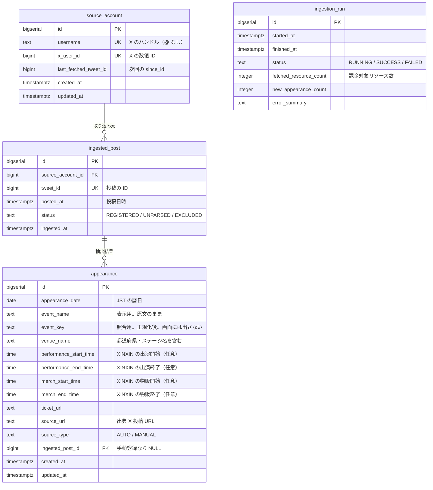

# データモデル設計 — XINXIN 出演情報カレンダー

最終更新: 2026-09-01

関連文書: [CLAUDE.md](../CLAUDE.md) / [docs/requirements.md](requirements.md)

---

## 1. 前提

| 項目 | 決定 |
| --- | --- |
| DBMS | PostgreSQL |
| 主キー | `BIGSERIAL`（連番）。公開情報のみを扱うため連番の推測可能性は問題にならない |
| マイグレーション | Flyway（番号付き SQL） |
| 文字型 | 可変長は一律 `TEXT`。PostgreSQL では `VARCHAR(n)` に性能上の利点がなく、長さ制限は用途に応じて `CHECK` で表現する |
| 時刻型 | 用途により `TIMESTAMPTZ` と `DATE` / `TIME` を使い分ける（第 6 章） |

テーブルは 4 つ。要件（[docs/requirements.md](requirements.md) 第 8 章）で定めた
「保持するもの」に一対一で対応する。

---

## 2. ER 図



`ingestion_run` は他テーブルと外部キーで結ばれない独立した実行記録。

---

## 3. 命名規約

- テーブル名・カラム名は **snake_case**、テーブル名は**単数形**
- 主キーは一律 `id`
- 外部キーは `<参照先テーブル名>_id`
- 日時は `_at`（`TIMESTAMPTZ`）、日付は `_date`（`DATE`）、時刻は `_time`（`TIME`）
- 状態を表す列は `status`、区分は `_type`
- 列挙値は **`TEXT` + `CHECK` 制約**で表現する。PostgreSQL の `ENUM` 型は値の追加に
  `ALTER TYPE` が必要で、変更がマイグレーションとして扱いにくいため使わない

---

## 4. テーブル定義

### 4.1 source_account — 情報源アカウント

取得元の X アカウントと、差分取得の位置（`since_id`）を保持する。
MVP では 1 行のみだが、取得位置を永続化する置き場所として必要（FR-40）。

```sql
CREATE TABLE source_account (
    id                    BIGSERIAL   PRIMARY KEY,
    username              TEXT        NOT NULL UNIQUE,
    x_user_id             BIGINT      NOT NULL UNIQUE,
    last_fetched_tweet_id BIGINT,
    created_at            TIMESTAMPTZ NOT NULL DEFAULT now(),
    updated_at            TIMESTAMPTZ NOT NULL DEFAULT now()
);
```

| 列 | 説明 |
| --- | --- |
| `username` | X のハンドル。`@` を含めない |
| `x_user_id` | `GET /2/users/by/username/{handle}` で **初回に一度だけ**解決した値。以降は解決 API を呼ばない（FR-40） |
| `last_fetched_tweet_id` | 取得済みの最大 tweet_id。次回リクエストの `since_id` に渡す。初回取り込み前は `NULL` |

**`tweet_id` を `BIGINT` にする理由。** X の ID は 63 bit の snowflake で、
PostgreSQL の `BIGINT`（符号付き 64 bit）に収まる。`TEXT` で保持すると
「最大値の取得」が文字列比較になり、桁数が変わった瞬間に `"9..." > "10..."` と
誤判定して**取得位置が巻き戻る**。巻き戻りは同じ投稿の再取得＝再課金に直結するため、
数値型で持つ（[CLAUDE.md](../CLAUDE.md) の必須ルール）。

なお API のレスポンスでは文字列として返るため、パース時に数値へ変換する。
逆にフロントエンドへ tweet_id をそのまま渡さない（JavaScript の `Number` は
53 bit までで精度が落ちる）。画面には出典 URL を組み立てて渡す。

### 4.2 ingested_post — 取り込み済み投稿の記録

処理済みの投稿を記録し、**再処理時の冪等性**を担保する（FR-23, FR-41）。

```sql
CREATE TABLE ingested_post (
    id                BIGSERIAL   PRIMARY KEY,
    source_account_id BIGINT      NOT NULL REFERENCES source_account (id),
    tweet_id          BIGINT      NOT NULL UNIQUE,
    posted_at         TIMESTAMPTZ NOT NULL,
    status            TEXT        NOT NULL
                                  CHECK (status IN ('REGISTERED', 'UNPARSED', 'EXCLUDED')),
    ingested_at       TIMESTAMPTZ NOT NULL DEFAULT now()
);
```

| `status` | 意味 |
| --- | --- |
| `REGISTERED` | 出演情報が登録済み。自動抽出に成功した場合と、管理者が未処理から手で登録した場合の両方を含む |
| `UNPARSED` | 抽出できず未処理。管理者の手動処理を待つ（FR-25） |
| `EXCLUDED` | 出演告知ではないと管理者が判断した（FR-25） |

**投稿本文を保持しない**（LR-02）。未処理投稿を手で処理する管理者は、
`tweet_id` から組み立てた X 投稿 URL を開いて**原文を X 上で読む**。
本文を DB に持たなくても FR-25 は成立する。

`tweet_id` の `UNIQUE` 制約が冪等性の要。定常運用では `since_id` により同じ投稿を
再取得しないが、障害復旧や初回バックフィルで再処理が起きても、この制約により
出演情報が二重登録されない。

### 4.3 appearance — 出演情報

公開の対象となる本体。登録された時点で閲覧者に見える（承認フローなし。FR-41）。

```sql
CREATE TABLE appearance (
    id                     BIGSERIAL   PRIMARY KEY,
    appearance_date        DATE        NOT NULL,
    event_name             TEXT        NOT NULL CHECK (length(event_name) BETWEEN 1 AND 200),
    event_key              TEXT        NOT NULL CHECK (length(event_key) BETWEEN 1 AND 200),
    venue_name             TEXT        CHECK (venue_name IS NULL OR length(venue_name) <= 300),
    performance_start_time TIME,
    performance_end_time   TIME,
    merch_start_time       TIME,
    merch_end_time         TIME,
    ticket_url             TEXT        CHECK (ticket_url IS NULL OR ticket_url ~ '^https?://'),
    source_url             TEXT        NOT NULL CHECK (source_url ~ '^https://'),
    source_type            TEXT        NOT NULL CHECK (source_type IN ('AUTO', 'MANUAL')),
    ingested_post_id       BIGINT      REFERENCES ingested_post (id),
    created_at             TIMESTAMPTZ NOT NULL DEFAULT now(),
    updated_at             TIMESTAMPTZ NOT NULL DEFAULT now(),

    CONSTRAINT appearance_auto_requires_post
        CHECK ((source_type = 'AUTO' AND ingested_post_id IS NOT NULL)
            OR (source_type = 'MANUAL')),

    CONSTRAINT appearance_performance_time_order
        CHECK (performance_start_time IS NULL
            OR performance_end_time IS NULL
            OR performance_start_time <= performance_end_time),

    CONSTRAINT appearance_merch_time_order
        CHECK (merch_start_time IS NULL
            OR merch_end_time IS NULL
            OR merch_start_time <= merch_end_time),

    CONSTRAINT appearance_unique_event
        UNIQUE NULLS NOT DISTINCT
            (appearance_date, event_key, performance_start_time)
);
```

| 列 | 説明 |
| --- | --- |
| `appearance_date` | **JST の暦日**。カレンダーの配置に使う（第 6 章） |
| `event_name` | **表示用のイベント名。告知の原文をそのまま保持する** |
| `event_key` | **照合用の正規化済みイベント名。** 画面には出さない。生成規則と一意性は第 4.3.2 節 |
| `venue_name` | 会場名。**都道府県とステージ名を含めた形**で保持する（下記） |
| `performance_start_time` | **XINXIN の出演開始時刻**（JST）。告知の 🎤 行から抽出する |
| `performance_end_time` | XINXIN の出演終了時刻（JST） |
| `merch_start_time` | **XINXIN の物販開始時刻**（JST）。告知の 📸 行から抽出する（下記） |
| `merch_end_time` | XINXIN の物販終了時刻（JST） |
| `ticket_url` | チケット販売ページ。**価格は保持しない**（下記） |
| `source_url` | 出典 X 投稿の URL。**手動登録でも必須**（FR-06。根拠のないデータを公開しない） |
| `source_type` | `AUTO`（自動取り込み）/ `MANUAL`（管理者が手で登録）。FR-24 の一覧はこれで絞る |
| `ingested_post_id` | 自動登録なら抽出元の投稿を指す。手動登録は `NULL` |

#### 4.3.1 実際の告知投稿との対応

`docs/x-post-sample/` の実データに基づく。告知は絵文字が項目マーカーになっている。

| 告知の記述 | 対応する列 |
| --- | --- |
| `9/16(水)` | `appearance_date`（**年は書かれていない**。投稿日時から補い、曜日で検証する） |
| `📍愛知・大須RADHALL` | `venue_name` |
| `lonlium pre.『LONELY KIDS』` | `event_name` |
| `🎤19:50-20:15 XINXIN出演` | `performance_start_time` / `performance_end_time` |
| `📸21:25-22:35 終演後物販` | `merch_start_time` / `merch_end_time` |
| `🔗https://livepocket.jp/...` | `ticket_url` |

**1 つの投稿が複数の行になることがある。** 実サンプル 6.txt のように、
同じ日・同じイベントで XINXIN が複数回出演する告知がある。
この場合は出演枠ごとに `appearance` を 1 行ずつ作る（第 4.3.2 節）。
会場も枠ごとに変わりうるため、行ごとに別の `venue_name` を持つ。

**`venue_name` に都道府県とステージ名を含める。** 告知は必ず「愛知・大須RADHALL」の形式で
都道府県が付く。フェスではさらに「📍Orange Shelter」のステージ指定が入る。
これらを別列に分けないのは、地域別の絞り込みが非スコープであり、
分割してもカレンダー表示で再び連結するだけだから。
1 つのイベントが複数会場にまたがるサーキット形式（実サンプル 1.txt は 7 会場）もあるため、
長さ上限は 300 文字とする。

**物販時刻は保持する。** 告知の `📸21:25-22:35 終演後物販` にあたる。
出演枠が 15〜30 分なのに対し物販は 1 時間前後あり、
**ファンが実際に本人と会える時間帯**はこちらで決まる。
「何時に行けば会えるか」は出演時刻からは分からないため、別の列として持つ。
タイムテーブルが発表済みの実サンプル 4 件すべてに 📸 行があり、
出演時刻と同じ精度で抽出できる。

**`📸` 行には `XINXIN` の語が入らない。** `🎤` 行は「同じ行に XINXIN を含むこと」で
他の出演者の枠と区別できるが、物販行にはその手がかりがない。
どの `📸` 行を採用するかの規則は
[x-integration.md](x-integration.md) 第 5.7 節で定める。

**イベントの OPEN / START 時刻は保持しない。** `⏰OPEN 17:00 / START 17:30` は
会場全体の時刻であり、XINXIN の出演時刻と物販時刻が分かればファンの行動には足りる。
必要なら出典 X 投稿（`source_url`）で確認できる。列を増やさず MVP を軽く保つ。

**チケット価格は保持しない。** 券種が「先行 / 一般 / 早期 / 通常 / 当日 / 2Days 通し /
女性学生」と多様で構造化が難しく、転記ミスによる誤った価格の公開はファンに実害を与える。
価格は `ticket_url` の先で確認してもらう（LR-02 の観点でも安全）。

`ticket_url` の `CHECK` が `^https?://` と `http` を許すのは、実サンプル 5.txt の
チケット URL が `http://kusanoneidolfes.com/#ticket` であるため。
一方 `source_url` は X の投稿 URL を組み立てるので `^https://` に固定する。

#### 4.3.2 同一イベントの一意性と event_key

**表示と照合で列を分ける。**

| 列 | 用途 | 値 |
| --- | --- | --- |
| `event_name` | 画面に出す | 告知の原文（`『ORANGE CHEER』`） |
| `event_key` | 同一判定にだけ使う | 正規化後（`orangecheer`） |

画面には常に `event_name` を出す。正規化した文字列を表示に使うと、
**元の告知と違う名前がカレンダーに並ぶ**ことになるため、両者を混同しない。

`UNIQUE NULLS NOT DISTINCT (appearance_date, event_key, performance_start_time)` を張る。
制約を `event_key` 側に置くことで、アプリケーションの照合ロジックと DB の制約が
**同じキーで判定する**。`event_name` に制約を張ると、表記ゆれをアプリが吸収しても
DB が別物として通してしまい、二重登録を防げない。

**開始時刻を含めるのは、同じ日に同じイベントで複数回出演することがあるため。**
実サンプル 6.txt では、1 つのサーキットイベントの中で XINXIN が
2 つの会場に出演している。

```
8/25(火) 『DERAX JAM~ DERA MAXIMUM JAM ~』
  📍NAGOYA ReNY limited  🎤16:35-17:05 XINXIN①
  📍RADHALL              🎤19:50-20:15 XINXIN②
```

`(appearance_date, event_key)` の 2 列だけで一意にすると、
**2 公演目が登録できない**。開始時刻を加えることで別々の行として持てる。

**`NULLS NOT DISTINCT` を付ける理由。** PostgreSQL の `UNIQUE` は既定で
`NULL` 同士を「異なる値」として扱うため、これを付けないと
`performance_start_time` が `NULL` の行を何行でも作れてしまう。
時刻が `NULL` の行は**管理者の手動登録から生まれる**。
出演時刻が未確定の告知（実サンプル 1.txt）は自動取り込みの対象外で
（[x-integration.md](x-integration.md) 第 5.2 節）、管理者が手で登録するため。
`NULLS NOT DISTINCT` により「時刻未定の行は 1 日 1 イベントにつき 1 行」を
DB 側で保証する。

> `NULLS NOT DISTINCT` は **PostgreSQL 15 以降**の構文。
> Neon が提供するのは 16 / 17 系なので利用できる。

##### 正規化ルール

1. **NFKC 正規化**（半角カナ → 全角、全角英数 → 半角）
2. 小文字化
3. 英数字・日本語文字**以外**（記号・空白・括弧・句読点）をすべて除去

実サンプルに適用した結果:

| `event_name`（原文＝表示用） | `event_key`（照合用） |
| --- | --- |
| `#ﾆｷﾌﾟﾚ『カンシャサイ。-秋-』` | `ニキプレカンシャサイ秋` |
| `『ORANGE CHEER』` | `orangecheer` |
| `｢IGNITION-狂騒-｣` | `ignition狂騒` |
| `lonlium pre.『LONELY KIDS』` | `lonliumprelonelykids` |
| `「くさのねアイドルフェスティバル2026」` | `くさのねアイドルフェスティバル2026` |
| `『DERAX JAM~ DERA MAXIMUM JAM ~』` | `deraxjamderamaximumjam` |

NFKC 正規化は必須。実サンプル 1.txt のイベント名には**半角カナ**（`ﾆｷﾌﾟﾚ`）が含まれ、
同じイベントが全角で再告知された場合に別物と判定されてしまうため。

表記ゆれの吸収例（すべて同じ `event_key` になる）:

```
『ORANGE CHEER』   →  orangecheer
ORANGE CHEER      →  orangecheer
「ORANGE　CHEER」  →  orangecheer   （全角空白・別の括弧）
```

##### 切り詰めをしない理由

「先頭数文字だけをキーにする」案は**採用しない**。実データで破綻する。

| 問題 | 例 |
| --- | --- |
| 日本語のみの名前で空になる | `#ﾆｷﾌﾟﾚ『カンシャサイ。-秋-』` → 英数字 5 文字では `''` |
| 別イベントが衝突する | `LONELY KIDS` と `LONELY NIGHT` が両方 `lonel` |
| 同上 | `ORANGE CHEER` と `ORANGE PARTY` が両方 `orang` |

キーが衝突すると、同じ日に掛け持ち出演した**別のイベントを同一とみなして空欄補完し、
片方がカレンダーから消える**。誤情報の公開に直結するため、全長を使う。

##### 生成の責任

`event_key` は**アプリケーション層で設定する**（生成列にしない）。
NFKC 正規化を含むため PostgreSQL の生成列では表現が環境依存になりやすく、
Java 側の `java.text.Normalizer` で確実に処理するほうが挙動を検証しやすい。

`event_name` を変更する経路（自動登録・手動登録・編集）すべてで
`event_key` を必ず再計算する。サービス層に単一の生成メソッドを置き、
そこを通さずに `appearance` を保存しない。

正規化結果が空文字になる場合（記号だけのイベント名）は、
フォールバックとして `event_name` を小文字化した値を使う。`NOT NULL` を守るため。

##### 制約が守る範囲

公式は 1 つのイベントについて**複数回に分けて告知する**（実サンプル参照）。

```
① 「XINXIN東京公演情報解禁」   → 日付・会場・イベント名・チケット（出演時刻はまだ無い）
② 「XINXIN千葉公演タイムテーブル解禁」→ 出演時刻を後から告知
```

この制約と第 7.1 節の補完ルールにより、②が①の行を二重に作らず、空欄を埋める形で反映される。

同じ日に別のイベントへ掛け持ち出演する場合は `event_key` が異なるため制約に触れない。
複数日開催のイベントは `appearance_date` が異なるため同様。

**1 つの投稿から複数の出演情報が生まれうる。** 「8/30 と 8/31 に出演」のように
1 つの告知へ複数の日程が書かれる場合、`ingested_post` 1 行に対して `appearance` が
複数紐づく（1 対多）。抽出処理はこれを前提に設計する。

`appearance_auto_requires_post` により、「自動登録なのに抽出元が不明」という
不整合をデータベース側で防ぐ。

URL 列の `CHECK` はスキームだけを検証する簡易なもの。
X 由来の値を信頼しない方針（NFR-03）の最後の砦であり、
本格的な検証はアプリケーション側（Bean Validation）で行う。

`appearance_performance_time_order` と `appearance_merch_time_order` は、
抽出ミスで終了時刻が開始時刻より前になった行を弾く。

**出演時刻と物販時刻の前後関係は制約にしない。** 実サンプルでは物販が出演の後に来るが、
「並行物販」は他ステージの進行と並行して行われるため、
XINXIN の出演より前に始まる告知がありうる。順序を制約にすると正しい告知を弾く。

**`updated_at` はアプリケーション側で更新する**（JPA の `@UpdateTimestamp`）。
トリガーを使うと更新経路が SQL とアプリの二箇所に分かれ、追いにくくなるため。

### 4.4 ingestion_run — 取り込み実行ログ

課金額の追跡（NFR-04）と、最終更新日時の表示（FR-08）に使う。

```sql
CREATE TABLE ingestion_run (
    id                     BIGSERIAL   PRIMARY KEY,
    started_at             TIMESTAMPTZ NOT NULL DEFAULT now(),
    finished_at            TIMESTAMPTZ,
    status                 TEXT        NOT NULL
                                       CHECK (status IN ('RUNNING', 'SUCCESS', 'FAILED')),
    fetched_resource_count INTEGER     NOT NULL DEFAULT 0 CHECK (fetched_resource_count >= 0),
    new_appearance_count   INTEGER     NOT NULL DEFAULT 0 CHECK (new_appearance_count >= 0),
    error_summary          TEXT        CHECK (error_summary IS NULL OR length(error_summary) <= 500)
);
```

| 列 | 説明 |
| --- | --- |
| `fetched_resource_count` | **レスポンスで返ってきたリソース数**。X API の課金単位そのもの。これを期間で合計すれば消費額を算出できる |
| `error_summary` | 失敗理由の要約。**スタックトレースやトークンを入れない**（NFR-03, NFR-09） |

FR-08 の「最後に取り込みが成功した日時」は
`SELECT max(finished_at) FROM ingestion_run WHERE status = 'SUCCESS'` で得る。

---

## 5. インデックス

```sql
-- 自動登録された出演情報の点検一覧（FR-24）
CREATE INDEX idx_appearance_source_type_created
    ON appearance (source_type, created_at DESC);

-- 未処理投稿の一覧（FR-25）
CREATE INDEX idx_ingested_post_status_posted
    ON ingested_post (status, posted_at DESC);

-- 最終成功日時の取得（FR-08）
CREATE INDEX idx_ingestion_run_status_finished
    ON ingestion_run (status, finished_at DESC);
```

`UNIQUE` 制約には自動でインデックスが作られるため、別途定義しない。
これには `appearance_unique_event`（第 4.3 節）も含まれる。
**先頭列が `appearance_date` なので、月次の範囲検索にそのまま使える。**
1 か月分の取得は `WHERE appearance_date BETWEEN ? AND ?` の 1 クエリで完結する（NFR-01）。
`appearance_date` 単独のインデックスは重複するため作らない。

---

## 6. タイムゾーンの扱い

**この章の方針が守られないとカレンダーの日付がズレる。** 最も壊れやすい箇所なので、
実装前に必ず読むこと。

保存形式を用途で 2 種類に分ける。

| 種類 | 型 | 例 | 扱い |
| --- | --- | --- | --- |
| システムの時刻 | `TIMESTAMPTZ` | `created_at`, `posted_at`, `started_at` | **UTC で保存**し、表示時に JST へ変換する |
| イベントの開催日・出演時刻 | `DATE` / `TIME` | `appearance_date`, `performance_start_time`, `merch_start_time` | **JST のローカル値として保存**し、UTC に変換しない |

**なぜイベントの日付を UTC にしないか。** 「8 月 30 日の出演」という情報は、
特定の瞬間ではなく**暦日そのもの**を指す。これを `TIMESTAMPTZ` に変換すると
`2026-08-30T00:00+09:00` = `2026-08-29T15:00Z` となり、UTC で日付を取り出せば
8 月 29 日になる。この状態で月境界のクエリを書くと、月初・月末の出演情報が
隣の月へ紛れ込む。誕生日や祝日を UTC で保存しないのと同じ理由。

したがって:

- 月次クエリは `WHERE appearance_date BETWEEN '2026-08-01' AND '2026-08-31'` と書ける
- サーバやコンテナの `TZ` 設定に結果が依存しない
- `performance_start_time` が `NULL` でも日付は確定する
  （出演時刻がまだ告知されていない公演を、管理者が手で登録できる）

**深夜公演の扱い。** 「26:00 開演」のような 24 時以上の表記は、
**時刻が実際に属する暦日**に置く。`appearance_date` を翌日、
`performance_start_time` を `02:00` として保存する
（[ADR-0011](adr/0011-midnight-date-rule.md)）。

```
告知「9/16(火) ... 🎤26:00-26:30 XINXIN出演」
  → appearance_date        = 2026-09-17   ← 翌日
    performance_start_time = 02:00
    performance_end_time   = 02:30
```

`TIME` 型は `24:00` 以上を表現できないため、この変換は保存の前提であって
選択肢ではない。告知の日付で探すファンとはカレンダー上の位置がずれるが、
**同じ暦日に 2 つの出演が並ぶ**（16 日夜の別公演と、16 日深夜＝17 日未明の公演）
状況で日付をずらさずに持つと、時系列で並べたときに順序が壊れる。

**出演枠そのものが日を跨ぐ場合**（「23:50-24:30」のような表記）は、
`performance_start_time` > `performance_end_time` となり
`appearance_performance_time_order` 制約に反する。この場合は自動登録せず、
投稿を `UNPARSED` として管理者に回す（[x-integration.md](x-integration.md) 第 5.6 節）。
実サンプルの出演枠はいずれも 15〜30 分で、日を跨ぐ枠は想定していない。

**物販時刻の繰り上げは出演時刻に従う。** `appearance_date` は出演時刻で決まるため、
物販時刻だけが 24 時以上になる場合（`🎤23:30-23:55` に対し `📸24:10-25:00`）、
物販は翌日の `00:10` を指すのにこの行の暦日は当日のままになる。
この不一致を行の中に持ち込まないため、**繰り上げの判定が出演時刻と一致しないときは
物販時刻を保存しない**（`NULL` にする）。出演情報そのものは登録する。
物販時刻は補助情報であり、取れないことを許容する側に倒す。

---

## 7. 更新・削除と冪等性

### 7.1 追加告知による空欄補完

公式は 1 つのイベントを複数回に分けて告知する（第 4.3.2 節）。
後続の告知は既存の行を二重に作らず、**空欄を埋める形で反映する**。

1. `appearance_date` / `event_key` / `performance_start_time` が**すべて一致**する
   既存行を探す（`event_key` の作り方は第 4.3.2 節）
2. 見つからなければ、同じ `appearance_date` と `event_key` を持ち
   `performance_start_time` が `NULL` の行を探す。あればその行へ時刻を書き込む
   （管理者が手で登録した時刻なしの行に、後続の「タイムテーブル解禁」が時刻を入れる流れ）。
   自動取り込みが作る行は必ず開始時刻を持つため、ここで見つかるのは手動登録の行になる
3. どちらも見つからなければ新規登録（`INSERT`）
4. 補完する場合は、**値が `NULL` の列だけ**を埋める（`UPDATE`）

手順 2 は**時刻なしの行 1 つに対して 1 回だけ成立する**。
同じ日・同じイベントに 2 つの出演枠が告知された場合（実サンプル 6.txt）、
最初に成立した枠が既存行の時刻を埋め、もう一方は手順 3 で新規登録される。

**1 投稿から複数の出演枠を抽出したときは、出演開始時刻の昇順で処理する。**
これにより「既存行を引き継ぐのは最も早い枠」と決まる。

順序を決めないと**同じ入力から違う結果が出る**。引き継いだ行にイベント全体の会場
（サーキット形式なら会場が並んだ文字列）が既に入っていると、
**枠ごとの会場では上書きされない**（値のある列は触らないため）。
どの枠が古い会場を抱えるかが処理順で入れ替わり、再現性がなくなる。
行数は変わらないが、行の内容は変わる。

```
6.txt を 2 通りの順で処理した結果（順序を固定しない場合）

  枠A → 枠B          16:35 会場が古いまま / 19:50 正しい
  枠B → 枠A          16:35 正しい         / 19:50 会場が古いまま
```

昇順に固定したうえで残る取りこぼし（最も早い枠がイベント全体の会場を抱える）は、
管理者の修正（FR-22）で直す。引き継がれるのは会場の羅列であって誤った会場ではないため、
閲覧者を別の場所へ誘導することはない。

**値が入っている列は上書きしない。** これにより、管理者が手で直した内容が
後続の取り込みで巻き戻らない（FR-22）。公式が日程変更や中止を告知した場合は
既存の値を書き換える必要があるが、それは自動では行わず管理者が手で対応する。

補完が起きたときは `source_url` と `ingested_post_id` も**その告知のものへ更新する**。
出演時刻を載せた告知が出典として示されるべきで、
時刻の書かれていない最初の告知を指し続けるのは FR-06 の趣旨に反するため。

#### `ingested_post_id` が指すもの

1 つの公演に複数の告知がぶら下がるため（「公演情報解禁」と「タイムテーブル解禁」）、
どの投稿を指すかを決めておく必要がある。

> **`ingested_post_id` は「最後に内容を反映した告知」を指す。
> `source_url` と常に同じ投稿を指す。**

- 新規登録なら、抽出元の投稿
- 補完が起きたら、**埋めた告知**へ両方まとめて移る（何も埋まらなければ動かさない）
- 複数の告知を同時に指すことはない。関連を持ちたくなっても中間テーブルを作らない
  （MVP の非スコープ）

この値は**導出値**であって管理者が選ぶものではないため、
編集（[api.md](api.md) 第 5.3 節）では変更できない。
用途は 2 つに限られ、どちらも「誰が作ったか」の記録である。

| 用途 | 場所 |
| --- | --- |
| `AUTO` の行が取り込み由来であることの保証 | `appearance_auto_requires_post` |
| 未処理一覧から作った投稿を `REGISTERED` へ進める | [api.md](api.md) 第 5.2 節 |

**公開 API では返さない**（同 第 4.1 節）。閲覧者に見せる出典は `source_url` である。

照合に使うのは `event_key` であり、`UNIQUE` 制約も同じ列に張られているため、
**アプリケーションの判定と DB の制約が食い違わない**。

ただし正規化は表記の揺れ（括弧・空白・全角半角）しか吸収できない。
略称と正式名称が使い分けられた場合（`カンシャサイ` と `カンシャサイ。-秋-` など）は
別イベントとして登録される。この取りこぼしの保険として FR-23 の手動削除を残す。

補完の対象は `AUTO` の行に限らず `MANUAL` の行も含む。
管理者が先に手で登録したイベントへ、後から公式のタイムテーブルが届く場合があるため。

### 7.2 削除と冪等性

FR-23 の「削除しても同じ投稿から再び出演情報が作られない」を、次の形で担保する。

- `appearance` は**物理削除**する。論理削除フラグを持たない
- 削除しても `ingested_post` の行は残り、**`status` も `REGISTERED` のまま動かさない**
- 取り込みジョブは `ingested_post.tweet_id` が既にあるかを見て弾く。
  **`status` を見ていない**ので、状態が何であれ再登録は起きない。
  `tweet_id` の `UNIQUE` 制約が最後の砦として残る
- 加えて `last_fetched_tweet_id` が既に先へ進んでおり、その投稿はもう取得されない

`appearance.ingested_post_id` の外部キーは既定（`NO ACTION`）とする。
`appearance` を消しても `ingested_post` には触れないため、削除の連鎖は起きない。

#### 削除したあとに何が残るか

| 消した行 | `ingested_post` | 未処理一覧 | 自動での復活 |
| --- | --- | --- | --- |
| `MANUAL`（紐付けなし） | — | — | しない |
| `MANUAL`（未処理一覧から作成） | 残る。`REGISTERED` のまま | **出ない** | しない |
| `AUTO` | 残る。`REGISTERED` のまま | 出ない | しない |

**削除で `status` を `UNPARSED` に戻さない。** 戻せば未処理一覧に再び現れて
作り直せるが、1 投稿から複数の枠を作る設計（[ADR-0012](adr/0012-multi-slot-uniqueness.md)）
では「残りの枠がまだ生きているのに未処理として出る」条件が生まれ、
一覧の意味が「抽出に失敗した投稿」から曖昧になる。

その結果、次の 2 つの状態が残る。どちらも意図した削除の結果であり矛盾はしないが、
把握しておく。

- `AUTO` の行をすべて消すと、その投稿は `REGISTERED` なのに `appearance` が 0 件になる
- 誤った投稿から作ってしまった場合、その投稿は「対応済み」のまま一覧に戻らない

**紐付けを訂正する手順**（誤った投稿から作ったとき）。まず出演情報を削除し、
次の URL を組んで登録し直す。未処理一覧からは辿れないため、
出典 URL と投稿 ID を控えてから消すこと。

```
/admin/appearances/new?sourceUrl=<出典 URL>&ingestedPostId=<投稿 ID>
```

論理削除を採らない理由は、公開/非公開の状態を持たない設計だから。
承認フローがないため（FR-41）、`appearance` に行が存在すること自体が公開を意味する。
状態列を増やすと「削除済みだが公開されている」ような矛盾を作り込む余地が生まれる。

---

## 8. マイグレーション運用（Flyway）

```
backend/src/main/resources/db/migration/
└── V1__init_schema.sql      # 上記 4 テーブル + インデックス
```

- 適用済みのマイグレーションファイルを**後から編集しない**。
  変更は必ず新しい番号のファイルを追加する（Flyway がチェックサム不一致で起動を止める）
- ファイル名は `V<番号>__<内容>.sql`。番号は連番、内容は snake_case
- `spring.jpa.hibernate.ddl-auto` は **`validate` に固定**する。
  `update` はカラムのリネームや削除を反映せず、消したはずの列が残り続けて
  データの二重管理を招くため、本番はもちろんローカルでも使わない
- ロールバックは Flyway Community の対象外。取り消しが必要な場合は
  **打ち消すマイグレーションを新しい番号で追加**する

---

## 9. 要件との対応

| 要件 | 対応するテーブル / 列 |
| --- | --- |
| FR-01, FR-03 カレンダー表示 | `appearance.appearance_date`（`appearance_unique_event` のインデックスを利用） |
| FR-03 出演の並び順 | `appearance.performance_start_time`（`NULL` は末尾に置く） |
| FR-04 詳細表示 | `appearance` の各列（`NULL` の列は画面に出さない） |
| FR-06 出典リンク | `appearance.source_url`（`NOT NULL`） |
| FR-08 最終更新日時 | `ingestion_run.finished_at` (`status = 'SUCCESS'`) |
| FR-22 編集 | `appearance.updated_at` |
| FR-23 削除の冪等性 | `ingested_post.tweet_id` の `UNIQUE` |
| 追加告知の補完 | `appearance_unique_event` + 第 7.1 節 |
| FR-24 自動登録の点検 | `appearance.source_type` + `idx_appearance_source_type_created` |
| FR-25 未処理投稿 | `ingested_post.status = 'UNPARSED'` |
| FR-40 差分取得 | `source_account.last_fetched_tweet_id` |
| FR-42 コスト記録 | `ingestion_run.fetched_resource_count` |
| NFR-05 タイムゾーン | 第 6 章 |
| LR-02 本文を保持しない | 投稿本文の列が存在しない |

要件に対応しない列は作らない。将来必要になった時点でマイグレーションを追加する。

---

## 10. 未決定事項

1. **正規化で吸収できない表記ゆれへの対処**（第 4.3.2 節）。
   正規化ルール自体は確定したが、略称と正式名称の使い分け、
   サブタイトルの有無といった違いは吸収できない。
   実運用で取りこぼしが目立つようなら、類似度による候補提示などを検討する
2. **`event_name` と `venue_name` の正規化（テーブル分割）**。現時点では
   `appearance` に文字列で持たせる。会場別の絞り込みは非スコープであり、
   会場名の表記ゆれを吸収する必要が出るまで別テーブルにしない
3. **イベントの OPEN / START 時刻を将来持つか**（第 4.3.1 節）。
   MVP では持たない。物販時刻は保持することにしたが（同節）、
   OPEN / START は XINXIN の出演時刻と物販時刻が分かれば行動に足りるため見送る
4. **タイムゾーンをアプリ全体でどう固定するか**（JVM の `user.timezone`、
   PostgreSQL の `timezone` 設定、コンテナの `TZ`）。第 6 章の設計は
   これらに依存しないが、`TIMESTAMPTZ` の表示変換には影響する
