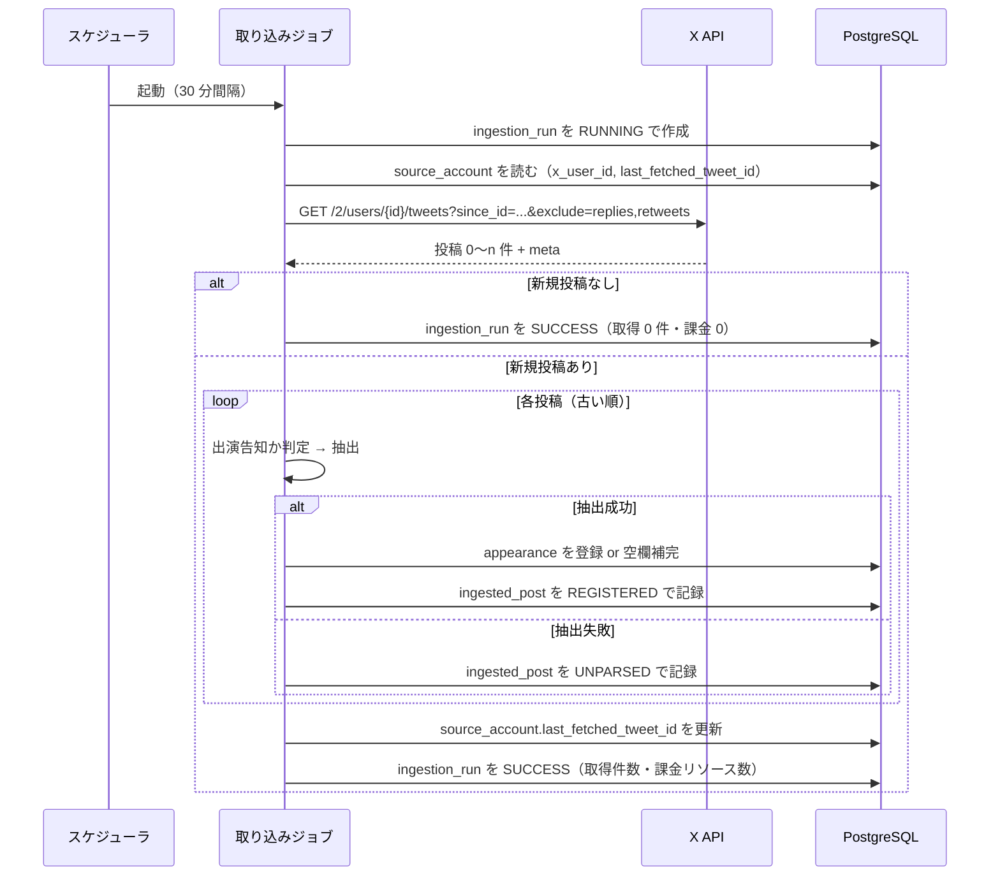

# X API 連携設計 — 取得・課金・抽出

最終更新: 2026-09-05

関連文書: [CLAUDE.md](../CLAUDE.md) / [docs/requirements.md](requirements.md) /
[docs/data-model.md](data-model.md) / 実キーの設定手順は [docs/runbook-x-api-setup.md](runbook-x-api-setup.md) /
実サンプル `docs/x-post-sample/`

---

## 1. 概要と前提

XINXIN 公式アカウントの新規投稿を定期的に取得し、出演情報を抽出して登録する。
対応する要件は FR-40〜FR-43、NFR-02、NFR-04。

| 項目 | 内容 |
| --- | --- |
| エンドポイント | `GET /2/users/{id}/tweets` |
| 認証 | Bearer Token（OAuth2 App-Only） |
| 情報源 | `@xinxin_official`（XINXIN 公式）1 件のみ。ユーザー ID は [runbook](runbook-x-api-setup.md) 付録 C.3 |
| 取得方式 | `since_id` による差分取得 |
| 承認 | なし。抽出に成功した情報はそのまま公開する（FR-41） |

**この連携が落ちても公開カレンダーは動き続ける**（NFR-02）。
取り込みは独立したバッチであり、閲覧系の処理から切り離す。

---

## 2. 取得フロー



### 2.1 処理順序の原則

- **投稿は古い順に処理する。** API は新しい順に返すため、逆順に並べ替えてから処理する。
  「公演情報解禁 → タイムテーブル解禁」の順で反映しないと、
  空欄補完（第 6 章）が意図通りに働かない
- **`last_fetched_tweet_id` の更新は全件処理後**に、取得できた最大 ID で一度だけ行う。
  ページ上限で打ち切った場合も**同じ**。未取得の古い側は諦める（第 3.4 節）
- 途中で失敗した場合は `last_fetched_tweet_id` を更新しない。
  次回同じ範囲を取り直す（取得位置を進めるより、再取得のほうが安全）。
  ポーリング間隔が 30 分なので、取り直しは **X API の 24 時間の重複排除の内側**に収まり
  再課金されない。ただし**失敗が UTC の日跨ぎで続くと、この保証は切れる**。
  その歯止めが第 7 章の連続失敗による打ち切り

### 2.2 取得位置を後退させない

`last_fetched_tweet_id` は**単調増加**でなければならない。
後退すると同じ投稿を翌日以降に再取得し、24 時間の重複排除が効かず再課金になる。

- 更新は `新しい値 > 現在の値` のときだけ行う（`UPDATE ... WHERE last_fetched_tweet_id < ?`）
- この比較を成立させるため `BIGINT` で保持している（[data-model.md](data-model.md) 第 4.1 節）

---

## 3. API 呼び出し仕様

### 3.1 ユーザー ID の解決（初回のみ）

```
GET /2/users/by/username/{handle}
```

`source_account.x_user_id` が未設定のときだけ呼ぶ。1 回 $0.010。
取得したら永続化し、**二度と呼ばない**（FR-40）。

### 3.2 投稿の取得

```
GET /2/users/{id}/tweets
    ?since_id={last_fetched_tweet_id}
    &exclude=replies,retweets
    &max_results=100
    &tweet.fields=created_at,note_tweet
```

| パラメータ | 値と理由 |
| --- | --- |
| `since_id` | 前回の最大 ID。**省略した呼び出しを実装に作らない**（全件取り直しの禁止） |
| `exclude` | `replies,retweets`。出演告知は本投稿のみ。除外した分は課金対象にならない |
| `max_results` | 100（上限）。ページング回数を減らす |
| `tweet.fields` | `created_at`（年の補完に使う）、`note_tweet`（長文投稿の本文） |

**レート制限は制約にならない。** 実測で `x-rate-limit-limit: 10000`
（アプリ単位・15 分あたり）。30 分間隔のポーリングは 15 分あたり 0〜1 回なので、
4 桁の余裕がある。間隔を決めているのは X API ではなく Neon の CU-hours
（第 4.3 節）。

**`expansions` と `media.fields` は指定しない。** 画像を保持しないため（LR-03）、
メディア情報を取得する必要がない。指定すると返却リソースが増えて課金が膨らむ。

初回（`since_id` なし）の扱いは第 8 章。

### 3.3 本文の取り出し

```
本文 = note_tweet.text があればそれ、なければ text
```

`text` は途中で切れ、末尾が `https://t.co/...` に置き換わる。
実サンプル 5.txt は 1,253 バイトあり、**`text` だけを見ると出演時刻の行に到達しない**。
必ず `note_tweet` を優先する。

実 API でも確認済み（2026-09-02、直近 5 件）。

| 投稿 | `text` | `note_tweet.text` |
| --- | --- | --- |
| タイムテーブル解禁 | 233 字。**物販の行の途中で切れる** | 492 字 |
| 情報解禁 | 247 字 | 645 字 |

**`text` は半分以下しか含まない。** とくに物販時刻は末尾寄りに現れるため、
`note_tweet` を見ないと第 5.7 節の抽出が成立しない。

### 3.4 ページング

`meta.next_token` が返る間、`pagination_token` に渡して繰り返す。
ただし 1 回の実行で取得するページ数に上限を設ける（既定 10 ページ = 最大 1,000 件）。
暴走した課金を防ぐため。

**上限に達したら、未取得の古い側は取得を諦める。**
取得位置（`last_fetched_tweet_id`）は第 2.1 節どおり、
取得できた最大 ID へ進める（[ADR-0020](adr/0020-drop-posts-beyond-page-limit.md)）。

API は新しい順に返し、`next_token` はより古いページへ進む。
つまり打ち切ったときに残るのは**古い側**であり、位置を最新へ進めるとその区間は
`since_id` の外に落ちて二度と取得されない。**これは意図した仕様である。**

「次回に持ち越す」（＝位置を進めない）を選ぶと、滞留が 1,000 件を超えている限り
次回も同じ最新 1,000 件を取って再び打ち切り、**位置が永久に進まない**。
24 時間の重複排除は UTC の日跨ぎで切れるため、$5/日 が上限なく積み上がる。
諦めるほうが被害が小さい。

| | 1 回の課金 | 位置 | 失うもの |
| --- | --- | --- | --- |
| 諦める（採用） | 最大 $5 | 必ず前進する | 古い側の投稿 |
| 持ち越す | 上限なし | 進まない | なし（ただし停止するまで課金が続く） |

失う投稿があること自体は、既に受け入れている性質と同じである。
タイムラインは約 3,200 件までしか遡れず、過去分の完全な取り込みは非スコープ
（第 8 章、[requirements.md](requirements.md) 第 9 章）。

**打ち切ったことは実行の記録に残す。** `ingestion_run.truncated` を `true` にし、
管理画面に警告として出す（NFR-09）。諦めたことを知らなければ、
管理者は手動登録で補う判断ができない。ログだけでは Fly のログを見に行かないと読めない。

```sql
-- 取りこぼしの起きた実行
SELECT id, started_at, fetched_resource_count FROM ingestion_run WHERE truncated;
```

---

## 4. 課金とコスト管理

### 4.1 単価（2026 年時点）

| 項目 | 単価 |
| --- | --- |
| Posts: Read | $0.005 / 1 リソース |
| User: Read | $0.010 / 1 リソース |

課金は**レスポンスで返ってきたリソース数**に対して発生する。リクエスト数ではない。
同一リソースは 24 時間（UTC）で重複排除されるが、これはソフトな保証であり、
障害時に重複課金が起きうる。詳細は [CLAUDE.md](../CLAUDE.md)。

### 4.2 記録

各実行で `ingestion_run.fetched_resource_count` に**返却された投稿数**を加算する
（`meta.result_count` の合計、ページングした場合は全ページ分）。

```sql
-- 現在の請求サイクルの消費リソース数（起点が毎月 2 日の場合）
SELECT sum(fetched_resource_count)
FROM ingestion_run
WHERE started_at >= timestamptz '2026-09-02 00:00+09';
```

**暦月で切らない。** X API の請求サイクルはクレジットの購入日を起点に切られ
（[runbook-x-api-setup.md](runbook-x-api-setup.md) 第 3.3 節）、暦月で集計すると
支出上限のリセット日とずれる。アプリ側の起点は設定値
`x.billing-cycle-start-day`（1〜31。`1` で暦月と一致）で、
境界は JST で切る（[api.md](api.md) 第 5.7 節）。

概算コストは `リソース数 × $0.005`。1 サイクル $5 を超えない想定（NFR-04）。

**課金がレスポンスのリソース数と一致することは実測済み**（2026-09-02）。
`max_results=5` で 5 件を取得したところ、`GET /2/usage/tweets` の
`project_usage` がちょうど 5 増えた。

**ただし X 側の使用量エンドポイントは Post 読み取りしか数えない。**
`GET /2/users/by/username/{handle}`（User Read、$0.010）は
`project_usage` に加算されない。この差は初回の 1 回だけなので実害はないが、
**請求額と `project_usage` を突き合わせるときは一致しない**ことを踏まえる。

日次の内訳が要る場合は `usage.fields` を指定する
（`?days=7&usage.fields=daily_project_usage`。既定では返らない）。
使用量エンドポイントの呼び出し自体は課金されない。

### 4.3 想定コスト

1 日 10 投稿として月 300 リソース ≒ **$1.5/月**。
`exclude=replies,retweets` により実際の課金対象はさらに少なくなる。
新規投稿がない実行は返却 0 件で**課金されない**ため、
ポーリング間隔を短くしても X API のコストはほぼ増えない。

**ただし間隔は X API のコストだけでは決められない。** 実行のたびに
Neon のコンピュートが最低 5 分起動するため、間隔を詰めると
無料枠の CU-hours を圧迫する。この制約で 30 分に決めている
（[architecture.md](architecture.md) 第 11 章）。

### 4.4 コスト増を招く実装上の地雷

- `since_id` を省略した取得（全件取り直し）
- `last_fetched_tweet_id` の後退（第 2.2 節）
- `expansions` の不要な指定
- **取得位置を進めず、毎回同じ範囲を取り直し続ける実装**（第 2.1 節と混同しない。
  失敗時に 1 回取り直すのは想定内で、地雷なのは位置が進まないこと）
- テストコードから実 API を叩くこと（第 9 章）

---

## 5. 出演情報の抽出（パース）仕様

`docs/x-post-sample/` の実サンプル 20 件から導出した。
**告知は絵文字が項目マーカーになっている**ため、これを手がかりにする。

公式アカウントは公演告知以外の投稿もするため、まず**扱う投稿型を絞る**（第 5.2 節）。
以下の抽出ルールは、すべて絞り込みを通過した投稿に対するもの。

### 5.1 実際の投稿構造

```
🔸XINXIN{地域}公演{情報解禁|タイムテーブル解禁}🔸     ← 告知の種別

{M}/{D}({曜日})📍{都道府県}・{会場}                   ← 日付と会場が同一行
{イベント名}                                          ← 括弧で囲まれる

⏰OPEN {HH:MM} / START {HH:MM}                        ← 保持しない
🎫{価格情報}                                          ← 保持しない
🔗{URL}                                               ← チケット URL

▪️タイムテーブル
📍{ステージ名}                                        ← フェスのみ
🎤{HH:MM}-{HH:MM} XINXIN出演                          ← 出演時刻
📸{HH:MM}-{HH:MM} {物販種別}                          ← 物販時刻（XINXIN の語は入らない）

【出演者(敬称略)】                                     ← 保持しない
```

同じ日に 2 公演あるときは、この構造が**1 投稿の中に 2 つ並ぶ**
（第 5.10 節 パターン C）。

**ヘッダ部とタイムテーブル部**に分かれる。前が公演そのものの情報
（日付・会場・イベント名）、後ろがチケット販売条件と各出演者の進行という構造で、
**抽出対象のすべてが従う**。見た目の区切りは `⏰` 行だが、
**探索範囲の境界には使わない**（`⏰` は保持しない項目で、書き方が揺れる。第 5.3 節）。

複数日開催のサーキット / フェスでは、ここから次のように崩れる（実サンプル 6.txt）。

```
{M}/{D}({曜日}) & {M}/{D}({曜日})                     ← 日付が複数、会場は別行
📍{都道府県}・{会場A} / {会場B} / {会場C}              ← 会場が並ぶ
他 全12会場
{イベント名}

⏰OPEN {HH:MM} / START {HH:MM}
🔻{M}/{D}({曜日})チケット🔻                           ← 販売条件にも日付が出る
販売：{M}/{D}({曜日})...

▪️{M}/{D}({曜日})タイムテーブル                       ← 見出しに日付が入る
📍{会場A}
🎤{HH:MM}-{HH:MM} XINXIN①                            ← 同じ日に 2 枠
📸{HH:MM}-{HH:MM} {物販種別}

📍{会場B}
🎤{HH:MM}-{HH:MM} XINXIN②
📸{HH:MM}-{HH:MM} {物販種別}
```

### 5.2 抽出対象の判定

**自動取り込みが扱うのは公演告知だけとする。**
それ以外はすべて `UNPARSED` として管理者に回す（FR-25）。

公式は 1 つの公演を「公演情報解禁 / 出演日程解禁」と「タイムテーブル解禁」に
分けて告知する。**どちらも登録する**が、要求する条件が違う
（[ADR-0021](adr/0021-register-appearances-without-timetable.md)）。

#### 共通条件

次の 3 つは経路によらず要る。

1. 探索範囲（第 5.3 節）に日付候補がある
2. 探索範囲に `📍` がある
3. イベント名が取れる（第 5.5 節）

**1 つでも欠ければ `UNPARSED`。** 部分的にしか埋まっていない出演情報を作らない。
日付とイベント名は `NOT NULL` で保存すらできず（[data-model.md](data-model.md) 第 4.3 節）、
会場や時刻だけが入った行は誤情報として公開される。

#### 経路 A：タイムテーブルが確定している

`XINXIN` を含む `🎤` 行がある（第 5.6 節）。出演時刻まで取る。

#### 経路 B：タイムテーブルが未確定

`XINXIN` を含む `🎤` 行が無い。**出演時刻を持たない出演情報を 1 件だけ作る。**
後続の「タイムテーブル解禁」が空欄補完で時刻を埋める（第 6 章）。

`🎤` 行は出演時刻の出どころであると同時に**「これは公演告知だ」という証拠**でもある。
外すだけでは 7.txt のような次回予告つきのお礼投稿を弾く根拠が無くなるため、
共通条件に加えて次を要求する。

| # | 条件 | 理由 |
| --- | --- | --- |
| B-1 | **`📍` の行から公演日がちょうど 1 つ取れる** | この経路は `▪️` も `🎤` も無く探索範囲が本文末尾まで広がるため、第 5.3 節のフォールバックが販売期間の日付を拾う（23.txt は候補が 8 個になる） |
| B-2 | **イベント名が括弧付きで取れる** | 連結（第 5.5 節）を許すと、括弧も空行も無い投稿で本文後半を名前にする。`event_key` が後続の告知と一致せず、**消えない重複行**になる |
| B-3 | **チケット URL が取れる**（第 5.8 節） | 「これから行われる公演の告知にはチケット情報が付き、過ぎた公演のお礼投稿には付かない」という意味の違いを条件にする。`🔗` は保持する項目なので、捨てる値の書き方が抽出の成否を決める形にならない |

B-3 が要求するのは**マーカーの存在ではなく、スキーム付きの URL が取れること**である
（第 5.8 節）。実 API の本文はリンクを `https://t.co/…` に短縮して返すため
スキームは必ず付く。実サンプルは抽出対象の 16 件すべてが `🔗` から URL を取れる（第 5.11 節）。

**`🎤` 行があるのに `XINXIN` が入っていない投稿は経路 B に入れない。**
タイムテーブルは公開済みで、そこに XINXIN が載っていないということであり、
「まだ出ていない」とは別の状態である。時刻なしで登録すると誤情報になる。

**抽出できても、サーバ側検証（Bean Validation）に落ちれば同じく `UNPARSED`。**
X 由来のテキストは信頼しない入力であり（[CLAUDE.md](../CLAUDE.md)）、
抽出が想定外の値を作ったら登録しない。**この判定も投稿単位**（第 5.10 節）。

#### 対応する投稿型

| 型 | 経路 | 実サンプル | 内容 |
| --- | --- | --- | --- |
| タイムテーブル確定の公演告知 | A | 2〜6.txt | 日付・会場・イベント名・出演時刻が 1 投稿に揃う |
| 前日告知 | A | 12.txt | 構造は上と同一。先行する告知で作られた行があれば空欄補完に吸収される（第 6 章） |
| 公演情報解禁（出演時刻が未確定） | B | 1.txt, 21.txt | 日付・会場・イベント名だけが確定している |

前日告知を別扱いしないのは、**機械的に区別できず、区別する必要もない**ため。
抽出すると同じ形になり、`(日付, event_key, 開始時刻)` が一致して重複行にならない。

#### 対応しない投稿型

実サンプル 23 件から確認できた型。**取りこぼしではなく、意図して対象外にしている。**

| 型 | 実サンプル | 対象外になる理由 | 扱い |
| --- | --- | --- | --- |
| 出演時間の訂正 | 8.txt, 11.txt | 日付が「本日」としか書かれず、日付候補が取れない | 将来対応（第 11 章） |
| 複数日開催の出演日程解禁 | 23.txt | `📍` の行に日付が無く、公演日を 1 つに絞れない（B-1） | 対象外 |
| 公演後のお礼・次回予告 | 7.txt | イベント名が取れず、チケット URL も無い（B-2 / B-3） | 対象外 |
| 公演に関係するが時刻情報のない連絡 | 9.txt, 10.txt | 日付候補も `📍` もない | 対象外 |
| 物販・グッズの告知 | 13.txt | `📍` がない | 対象外 |

**保守的に判定する。** 誤って出演情報にするより、`UNPARSED` として
管理者に回すほうが害が小さい。実サンプル 7.txt は
「次回、XINXINライブは8/26(水)📍愛知・栄Zephyr Hall…」という次回予告を含むが、
これを拾うと**イベント名のない、会場が文章のままの行**ができる。

**23.txt を捨てるのは惜しいが、他に手が無い。** 「8/25(火) & 8/26(水)」の
どちらに出演するかは、この投稿からは決まらない。日付を別行に書く形（6.txt と同じ）で、
`📍` の行から公演日を取れないため B-1 で落ちる。管理者が手で登録する。

### 5.3 日付

```
正規表現: (\d{1,2})/(\d{1,2})\((月|火|水|木|金|土|日)(?:祝)?\)
例: 9/15(火)  10/12(月祝)  9/6(日)
```

**公演日の候補は `📍` の行に書かれた日付から取る。** 基本形は
`{M}/{D}({曜日})📍{都道府県}・{会場}` で日付と会場が同一行にあり（第 5.1 節）、
**販売期間の日付が `📍` の行に載ることはない。**
本文には販売期間の日付も書かれており、正規表現をそのまま全文に当てると
公演日でない日付を拾う（ヒット数は 2.txt が 7 件、6.txt が 9 件、12.txt が 2 件）。

```
公演日の候補: 探索範囲の中で 📍 を含む行に書かれた日付
            📍 の行に日付が無ければ、探索範囲の中のすべての日付
```

`📍` の行に日付が無い告知（実サンプル 6.txt は日付行と会場行が別）のために
フォールバックを残す。

**経路 B ではフォールバックを使わない**（第 5.2 節 B-1）。`🎤` が無い投稿は
`▪️` も `🎤` も無いため探索範囲が本文の末尾まで広がり、
フォールバックが販売期間の日付を拾ってしまう。

```
23.txt を経路 B のフォールバックで処理した場合の候補

  8/25(火) 8/26(水)      ← 公演日（正しい）
  8/25(土) 8/26(日)      ← 販売条件の見出し。曜日が誤記
  8/9(日) 8/9(日)        ← 販売開始日。曜日は正しく、検証で落とせない
  8/25(土) 8/26(日)      ← 販売終了日
```

曜日検証は誤記の 4 件を落とすが、`8/9(日)` は 2026 年に実際に日曜であり
**素通りする**。`📍` の行に限れば、第 5.1 節の基本形
`{M}/{D}({曜日})📍{都道府県}・{会場}` そのものが条件になり、
探索範囲の広さに依存しなくなる。

**境界を開演時刻に置かない。** 開演時刻（`⏰OPEN / START`）は**保持しない項目**であり
（第 5.1 節）、そこを探索範囲の境界にすると**捨てる値の書き方が抽出の成否を決める**。
実サンプル 19.txt は `OPEN 19:00 / START 19:30` と `⏰` が落ちており、
これだけで投稿ごと `UNPARSED` になっていた。

```
探索範囲: 先頭 〜 ▪️ を含む最初の行の直前
        ▪️ が無ければ 🎤 を含む最初の行の直前
        どちらも無ければ本文全体
```

探索範囲はイベント名（第 5.5 節）と枠会場（第 5.4 節）の探索上限に使う。
**境界に使うのは `▪️` と `🎤`、つまり保持する項目のマーカーだけ**にする。
`▪️` は第 5.4 節が既に会場の境界として使っており、2 つあった境界が 1 つになる。

**1 投稿に複数イベントが入る場合、探索範囲はブロックごとに取る**（第 5.10 節 パターン C）。
投稿全体に対して 1 回だけ取ると、2 つ目以降のイベントのヘッダが範囲外に落ちる。

**年が書かれていない。** 投稿の `created_at` から補う。

1. 投稿日の年を仮定して日付を組み立てる
2. 組み立てた日付が**投稿日より 30 日以上前**なら、翌年と解釈する
   （告知は未来の公演に対して行われるため。過去日の告知は基本的にない）
3. 組み立てた日付の曜日が、**告知に併記された曜日と一致するか検証する**
4. 一致しなければ `UNPARSED` にする

手順 3 が重要な安全弁になる。年の推測を誤ると曜日がずれるため、
誤った年で登録される事故をここで止められる。

「(月祝)」のような祝日表記は曜日部分だけを見る。

**曜日検証は探索範囲の中の日付にだけ適用する。** 実サンプル 6.txt では、
ヘッダの `8/25(火) & 8/26(水)` が正しく、販売条件とタイムテーブル見出しの
`8/25(土)` `8/26(日)` が**告知側の誤記**になっている。

| 記述 | 位置 | 2026 年の実際 |
| --- | --- | --- |
| `8/25(火) & 8/26(水)` | ヘッダ（▪️ より前） | 火・水 → 一致 |
| `🔻8/25(土)チケット🔻` | 販売条件 | 火 → **不一致** |
| `▪️8/25(土)タイムテーブル` | タイムテーブル見出し | 火 → **不一致** |

範囲を限定せずに検証すると、この投稿は曜日不一致で丸ごと `UNPARSED` になる。
公式の告知に誤記が混じることは避けられないため、
**検証するのは公演日として採用する日付だけ**とする。
タイムテーブル見出しの日付は日付部分（`8/25`）だけを見てブロックの対応付けに使い、
曜日は検証しない（第 5.10 節）。

### 5.4 会場

```
最初の 📍 から行末まで
例: 東京・渋谷音楽堂/Shibuya Milkyway/...  愛知・大須RADHALL
```

- 都道府県を含んだ形のまま `venue_name` に入れる（[data-model.md](data-model.md) 第 4.3.1 節）
- **ヘッダ会場は探索範囲（第 5.3 節）の最初の 📍 から取る**。
  実サンプル 6.txt では日付行と会場行が別行になっており、
  「日付と同じ行の 📍」という取り方はできない
- **`▪️` より後の 📍 は出演枠ごとの会場**を示す。扱いはヘッダ会場の形で決まる

```
ヘッダ会場に「/」を含まない（単一会場）
    → ヘッダ会場 / 枠の📍     例: 千葉・草ぶえの丘(千葉 佐倉) / Orange Shelter
                                    （枠の📍はステージ名にすぎない）

ヘッダ会場に「/」を含む（サーキット・フェスで会場が並ぶ）
    → {都道府県}・{枠の📍}    例: 愛知・NAGOYA ReNY limited
                                    （枠の📍が実際の出演会場。会場の羅列は捨てる）
```

  都道府県はヘッダ会場の `・` より前から取る。
  サーキット形式でヘッダ会場をそのまま使うと、
  実サンプル 6.txt では 12 会場の羅列に出演会場が埋もれてしまう
- **セクションの判定には `▪️` を必ず含める。** 「タイムテーブル」という語は
  1 行目のタイトル（`🔸XINXIN千葉公演タイムテーブル解禁🔸`）にも現れるため、
  語だけで判定すると本文全体がタイムテーブル扱いになり、
  会場が 1 つも取れなくなる（第 5.11 節の検証で実際に踏んだ）
- **枠の `📍` がない告知では、ヘッダ会場をそのまま使う**（実サンプル 2.txt）。
  タイムテーブルに会場の指定がないのは、会場が 1 つしかないため

#### 経路 B（タイムテーブル未確定）の会場

**会場が並んでいるなら空欄で登録する。**

```
ヘッダ会場に「/」も「&」も含まない  → ヘッダ会場をそのまま入れる
                                       例: 東京・品川インターシティホール（21.txt）

ヘッダ会場に「/」または「&」を含む  → 空欄。タイムテーブル解禁が実際の会場を埋める
                                       例: 東京・渋谷音楽堂/Shibuya Milkyway/…（1.txt）
                                           愛知・NAGOYA ReNY limited & 栄Zephyr Hall（22.txt）
```

この経路には枠の `📍` が無いため、羅列から出演会場を絞り込めない。
**羅列を入れてしまうと後から直らない**——空欄補完は値のある列を上書きしないため
（[ADR-0004](adr/0004-fill-blanks-only.md)）、タイムテーブルが出た後も羅列が残り続ける。
空欄にしておけば、タイムテーブル解禁が枠の `📍` から実際の会場を入れる。

**区切りの集合が経路 A と違う。** 経路 A のサーキット判定は `/` だけを見る。
`&` を足す変更を駆動する失敗ケースが実サンプルに無く（`&` を含む会場行は
22.txt だけで、その投稿にタイムテーブルが無い）、動いている経路を
根拠なく変えないためである。実データで踏んだら揃える。

### 5.5 イベント名

**「会場行の次の行」というルールは使えない。** 実サンプル 5.txt では
会場行と イベント名の間に住所行が挟まる。

```
9/6(日)📍千葉・草ぶえの丘(千葉 佐倉)
千葉県佐倉市飯野820          ← 住所が挟まる
「くさのねアイドルフェスティバル2026」
```

代わりに**括弧を手がかりにする**。

1. 会場行より後、探索範囲（第 5.3 節）の終わりまでを探す
2. **開き括弧**（`『` `「` `｢`）を含む最初の行を探す
3. その行**全体**をイベント名とする
4. **同じ行で閉じていなければ、閉じるまで後続行を連結する**
5. 空行までに閉じなければ `UNPARSED`

手順 4 と 5 が要る。開き括弧の行だけを採ると、タイトルが 2 行に分かれた告知で
**閉じ括弧の無い値**（`『テストイベント`）ができ、そのまま公開される。
閉じない場合に取りこぼすのは、壊れた名前を登録するより良いという判断
（第 5.10 節と同じ）。

**閉じたあとの行は連結しない。** `『テストイベント』` の次の行に `-DAY1-` があっても
イベント名は `『テストイベント』` になる。括弧の後ろの行がタイトルの続きである保証が無く、
実サンプルでは括弧の行の直後は必ず空行だった。

行全体を取るのは、`lonlium pre.『LONELY KIDS』` のように
主催者名が括弧の外に付くケースを取りこぼさないため。

**括弧が 1 つも無ければ、会場行の次から空行までを 1 行にまとめる。**
実サンプル 20.txt はイベント名が 3 行に分かれ、括弧が付いていない。

```
10/10(土)📍金沢・REDSUN
HATENA CREATION Presents      ┐
ジエメイ VS XINXIN             │ まとめて 1 つのイベント名にする
BANDSET 2MAN LIVE             ┘
                              ← 空行で止める
⏰OPEN 15:00 / START 15:30
```

**括弧があるときは連結しない。** 括弧の前にある行は、タイトルの一部とは限らない。

| サンプル | 括弧の前の行 | 正体 |
| --- | --- | --- |
| 5.txt | `千葉県佐倉市飯野820` | 住所 |
| 6.txt | `他 全12会場` | 会場数 |
| 19.txt | `HATENA CREATION x PLAYPIT presents` | **主催者名** |

**3 件のうち 2 件はタイトルの一部ではない。** 連結すると住所や会場数まで
イベント名に入るため、括弧があるときは括弧の行だけを採る。
その結果 19.txt は `「新進火花」` になり主催者名を落とすが、
**誤った値を公開するより取りこぼす**（第 5.10 節と同じ判断）。

連結してよいのは「括弧が無く、他に手がかりが無い」ときだけ。

**連結は経路 A でしか使わない**（第 5.2 節 B-2）。経路 B は `▪️` も `🎤` も無いため
探索範囲が本文の末尾まで広がり、**連結を止めるのが空行だけ**になる。
括弧も空行も無い投稿では本文の後半をまるごと名前にしてしまう。

```
9/15(火)📍東京・テスト会場
出演メンバーは後日発表します     ┐
チケットは明日から               │ 経路 B で連結を許すと、ここまでが
🔗https://example.com/ticket     ┘ イベント名になる
```

見た目が汚れるだけでは済まない。この名前から作られる `event_key` は
後続の「タイムテーブル解禁」のものと一致しないため、
**空欄補完が働かず、消えない重複行が残る**。
経路 B が取りこぼすのは実サンプル 23 件のうち 20.txt 型の 1 件だけで、
落ちた投稿は未処理一覧から手で登録できる。

**先頭のハッシュタグを除去しない。** 実サンプル 1.txt の
`#ﾆｷﾌﾟﾚ『カンシャサイ。-秋-』` は主催者を示すタグが括弧の直前に空白なしで付いており、
`lonlium pre.『LONELY KIDS』` と同じ役割を持つ。
除去しようとして `^#\S+` のような正規表現を当てると、区切りの空白がないため
**行全体が消える**（第 5.11 節の検証で実際に踏んだ）。行はそのまま保持する。

### 5.6 XINXIN の出演時刻

```
正規表現: 🎤[ 　\t]*(\d{1,2}):(\d{2})-(\d{1,2}):(\d{2})
条件: 同じ行に XINXIN を含むこと
例: 🎤19:50-20:15 XINXIN出演
```

- **`XINXIN` を含む 🎤 行に限定する。** 他の出演者のタイムテーブルが
  併記される可能性があるため
- **該当する 🎤 行が複数あれば、それぞれが別の出演情報になる。**
  実サンプル 6.txt では `🎤16:35-17:05 XINXIN①` と `🎤19:50-20:15 XINXIN②` が
  同じ日・同じイベントに並ぶ。1 行にまとめず 2 行として登録する（第 5.10 節）
- **見つからなければ投稿ごと対象外**にする（第 5.2 節の条件 1）。
  出演時刻が確定していない告知は自動登録しない
- `⏰OPEN / START` の時刻を出演時刻として代用**しない**。
  実サンプル 3.txt では START 16:40 に対し XINXIN の出演は 21:05 で、4 時間以上ずれる

**24 時以上の時刻表記（深夜公演）。** `🎤26:00-26:30` のような表記は、
**時刻が実際に属する暦日**へ置き換えてから保存する。
`TIME` 型は `24:00` 以上を表現できない（[data-model.md](data-model.md) 第 6 章）。

```
開始・終了の両方が 24〜29 のとき:
    appearance_date = その日付ブロックの日付 + 1 日
    start / end     = それぞれ -24 時間

例: 「9/16(火)」ブロックの 🎤26:00-26:30
    → appearance_date = 2026-09-17, 02:00-02:30
```

- **開始が 24 未満で終了が 24 以上**（`🎤23:50-24:30` など）は、出演枠そのものが
  日を跨ぐ。どちらの暦日に置いても片方の時刻を表現できず、`appearance_performance_time_order`
  制約にも反するため、**登録せず `UNPARSED`** にして管理者に回す
- **30 以上の時刻**（`🎤31:00-` など）は誤記とみなし `UNPARSED` にする。
  正規表現の `\d{1,2}` は 2 桁を素通しするため、値域の検証を別途行う
- 分は `00〜59` の範囲を検証する
- 日付を繰り上げた結果として**月・年をまたぐ**場合がある（8/31 の 26:00 は 9/1 の 02:00）。
  日付加算はカレンダー演算で行い、文字列操作で日を足さない

### 5.7 物販時刻

```
正規表現: 📸[ 　\t]*(\d{1,2}):(\d{2})-(\d{1,2}):(\d{2})
条件: XINXIN の 🎤 行より後にある最初の 📸 行
例: 📸21:25-22:35 終演後物販
```

- **`📸` 行には `XINXIN` の語が入らない。** ラベルは「終演後物販」「並行物販(ブースA)」
  「並行物販B」のように書かれ、🎤 行のような限定ができない。
  そこで**第 5.6 節で採用した 🎤 行より後**に現れる最初の 📸 行を物販時刻とする
- **次の 🎤 行を越えない。** 出演枠が複数ある投稿（実サンプル 6.txt）では、
  各枠の 📸 をその枠に紐づける。次の 🎤 行に達したら打ち切り、
  見つからなければその枠の物販時刻は `NULL` にする。
  越えて探すと隣の枠の物販時刻を拾う
- 対応する実サンプル 6 件は、いずれも 📸 行が 🎤 行の直後にある
- 見つからない場合は `NULL` のままにする。エラーにしない。
  基準となる 🎤 行は必ず存在する（第 5.2 節の条件 1）
- 24 時以上の表記は第 5.6 節と同じ規則で変換する。ただし
  **日付の繰り上げ判定が出演時刻と一致しない場合は物販時刻を保存しない**
  （`🎤23:30-23:55` に対する `📸24:10-25:00` など。
  [data-model.md](data-model.md) 第 6 章）
- 開始時刻が終了時刻より後になる場合は物販時刻を `NULL` にする。
  出演枠と違い投稿全体を `UNPARSED` にはしない。
  **物販時刻は補助情報**であり、取れないことを許容する側に倒す

### 5.8 チケット URL

```
正規表現: 🔗[ 　\t]*(https?://\S+)
最初に見つかったものを採用する
```

- `🔗` マーカーの付いた URL のみを対象にする。
  本文末尾の「オフィシャルサイト：」などは対象外
- **マーカーと値の間の空白を許す。** 当初の実サンプル 13 件はすべて
  `🔗https://...` だったが、実 API で取得した投稿は
  `🔗 https://...` とスペースを挟んでいた（第 5.12 節）。
  14.txt / 16.txt も空白を挟む側
- `http://` のケースがある（実サンプル 5.txt）ため、スキームは `https?` を許容する
- 取得した URL は信頼しない入力として検証する（NFR-03）。
  スキームが `http` / `https` 以外なら破棄する

### 5.9 抽出しない項目

`⏰OPEN/START`、`🎫`（価格）、`【出演者】`、注意事項、`🎁`（入場特典）は
抽出しない。理由は [data-model.md](data-model.md) 第 4.3.1 節。

### 5.10 1 投稿から複数の出演情報

1 つの投稿が複数の `appearance` になるパターンは 2 つある。

#### パターン A: 同じ日に複数の出演枠

タイムテーブル内に XINXIN の 🎤 行が複数あれば、それぞれを別の出演情報にする
（実サンプル 6.txt）。

```
▪️8/25(土)タイムテーブル
📍NAGOYA ReNY limited        ┐
🎤16:35-17:05 XINXIN①        │ 1 件目
📸17:25-18:35 並行B(ガスビル)  ┘

📍RADHALL                    ┐
🎤19:50-20:15 XINXIN②        │ 2 件目
📸21:25-22:45 終演後          ┘
```

- **抽出した枠は出演開始時刻の昇順で登録処理へ渡す。** 順序を決めないと、
  既存行を引き継ぐ枠が入れ替わって結果が非決定的になる
  （[data-model.md](data-model.md) 第 7.1 節）
- 枠の会場は、その 🎤 行より前にある最も近い 📍 を取る（前の 🎤 行を越えない）
- 枠の物販時刻は、その 🎤 行より後の最初の 📸 を取る（次の 🎤 行を越えない。第 5.7 節）
- 同じ日・同じイベントの複数行は `UNIQUE` の対象になるため、
  `appearance` は開始時刻を含めて一意にしている
  （[data-model.md](data-model.md) 第 4.3.2 節）

#### パターン B: 複数日開催

探索範囲（第 5.3 節）に日付候補が複数あれば複数日開催。
**タイムテーブル見出しの日付でブロックを対応付ける**。

```
8/25(火) & 8/26(水)          ← ヘッダ：2 日間開催
...
▪️8/25(土)タイムテーブル      ← このブロックは 8/25 のもの
```

- 見出しの日付は**月日だけで対応付け、曜日は検証しない**。
  実サンプル 6.txt では見出しの曜日が誤記になっている（第 5.3 節）
- **見出しのないブロックは、ヘッダの日付が 1 つのときだけ**その日付に紐づける。
  実サンプル 1〜5.txt がこのケース
- **対応するブロックがない日付には出演情報を作らない。** 6.txt の 8/26 がこれにあたる。
  イベントが 2 日間開催であることと、XINXIN が両日出演することは別である。
  告知されていない出演を推測で作らない。2 日目のタイムテーブルは後続の投稿で届き、
  そのとき新しい行として登録される
- ヘッダの日付が複数あり、ブロック見出しでも対応付けられない場合は
  **すべてを `UNPARSED`** にして管理者に回す。
  誤った組み合わせで登録するより取りこぼすほうがよい

#### パターン C: 1 投稿に複数イベント

同じ日に 2 公演あるとき、公式は**両方を 1 つの投稿にまとめて**告知する
（実サンプル 16.txt。冒頭に「2公演に出演‼️」と書かれる）。

```
☀️8/1(土)📍東京・渋谷DESEO          ← ブロック 1 の開始
「KAMAITACI Pre."つむじ風"」
⏰OPEN 12:00 / START 12:30
▪️タイムテーブル
🎤13:30-14:00 XINXIN出演

ーーーーーーーーーーーーーーー        ← 区切り線。判定には使わない

🌙8/1(土)📍東京・白金高輪SELENEb2    ← ブロック 2 の開始
「SELENE SUMMER FES」-DAY1-
⏰OPEN 10:00 / START 10:15
▪️タイムテーブル
🎤19:35-20:00 XINXIN出演
```

- **ブロックの開始は「日付と `📍` を同じ行に持つ行」。** この行が 2 つ以上あれば
  まとめ告知とみなし、その位置で本文を分割する。
  区切り線は装飾で、形も有無も投稿によって変わるため判定に使わない
- **各ブロックを 1 投稿として扱う。** 探索範囲（第 5.3 節）・会場（第 5.4 節）・
  イベント名（第 5.5 節）・チケット URL（第 5.8 節）は、
  すべて**そのブロックの中だけ**を見る
- **最初のブロックの開始行より前（前置き）は捨てる。** まとめ告知は冒頭で
  両方の会場を並べることがあり、そこに `📍` が付く（実サンプル 17.txt）。
  前置きを最初のブロックに含めると、**ヘッダ会場がそちらから採られる**

```
／
📍大阪・Music Club JANUSと          ← 前置き。日付がないので境界にならないが、
📍大阪・心斎橋SUNHALLの                ヘッダ会場としては拾われてしまう
2公演に出演‼️
＼

☀️8/9(日)📍大阪・Music Club JANUS   ← ここがブロック 1 の開始
```

  前置きを含めると会場が `大阪・Music Club JANUSと` になり、
  接続助詞の「と」が残る。**この形は 2026-08-09 の本番データで実際に出た**
- タイムテーブル内の `📍` は枠ごとの会場（ステージ名）を示し**日付を伴わない**ため、
  6.txt のようなサーキット形式をブロック境界と誤認しない。
  パターン C を足す前の実サンプル 13 件では、この形の行はどれも 1 行以下だった

**投稿全体を 1 イベントとして扱うと 3 つが同時に壊れる。**
2026-09-04 時点の本番で、公開中 76 件のうち 6 件がこの誤りだった。

| 壊れ方 | 原因 |
| --- | --- |
| 会場が連結される | 後続ブロックの `📍` を前ブロックの「枠の `📍`」と誤認し、`{ヘッダ会場} / {枠の会場}` を作る（第 5.4 節） |
| イベント名が使い回される | ヘッダから 1 回だけ取り、すべての枠に適用する（第 5.5 節） |
| チケット URL が使い回される | 本文全体の最初の `🔗` をすべての枠に適用する（第 5.8 節） |

**一意制約では止まらない。** できあがる行は `event_key` が前ブロックと同じでも
出演開始時刻が違うため、`(appearance_date, event_key, performance_start_time)`
（[ADR-0012](adr/0012-multi-slot-uniqueness.md)）を通り抜けて新しい行になる。

#### 判定の単位は投稿

**枠ごとに捨てない。** 1 投稿から取り出した枠のうち 1 つでも成立しなければ、
その投稿からは 1 件も登録せず `UNPARSED` にする。
**ブロック単位でも同じ**（パターン C）。1 ブロックでも成立しなければ投稿ごと回す。
第 5.2 節の判定と同じ単位であり、落ちる場所によらず扱いを変えない。

| 落ちる場所 | 例 |
| --- | --- |
| 抽出（第 5.6 節ほか） | 2 枠のうち 1 枠が日を跨ぐ（`🎤23:50-24:30`） |
| サーバ側検証（Bean Validation） | 2 枠のうち 1 枠の会場が 300 字を超える |

**枠単位で捨てると取りこぼしが見えなくなる。** 残りの枠が登録されると投稿は
`REGISTERED` として記録されるため、未処理一覧（FR-25）に現れない。
落ちた枠はログにしか残らず、**管理者が補う手段が無くなる**。
取れる枠を捨ててでも、投稿を人の目に乗せるほうを選ぶ。

### 5.11 実サンプルでの検証結果

本章のルールを `docs/x-post-sample/` の実サンプル 23 件に適用した結果。
**これをそのまま抽出テストの期待値にする**（第 9 章）。値は省略せず全文を載せる。

#### 抽出する 16 件（20 行）

```
2.txt   日付      2026-10-12 (月)
        会場      東京・渋谷CLUB QUATTRO
        イベント名  『ORANGE CHEER』
        出演時刻    16:45-17:05        物販時刻  17:15-18:20
        チケット    https://livepocket.jp/e/orange-cheer_261012

3.txt   日付      2026-09-04 (金)
        会場      愛知・NAGOYA ReNY limited
        イベント名  ｢IGNITION-狂騒-｣
        出演時刻    21:05-21:30        物販時刻  21:30-22:40
        チケット    https://t-dv.com/IGNITION-Kyosou-0904

4.txt   日付      2026-09-16 (水)
        会場      愛知・大須RADHALL
        イベント名  lonlium pre.『LONELY KIDS』
        出演時刻    19:50-20:15        物販時刻  21:25-22:35
        チケット    https://livepocket.jp/e/lk-nagoya0916

5.txt   日付      2026-09-06 (日)
        会場      千葉・草ぶえの丘(千葉 佐倉) / Orange Shelter
        イベント名  「くさのねアイドルフェスティバル2026」
        出演時刻    14:40-15:05        物販時刻  15:50-16:50
        チケット    http://kusanoneidolfes.com/#ticket

6.txt ① 日付      2026-08-25 (火)
        会場      愛知・NAGOYA ReNY limited
        イベント名  『DERAX JAM~ DERA MAXIMUM JAM ~』
        出演時刻    16:35-17:05        物販時刻  17:25-18:35
        チケット    http://t-dv.com/DERAX_JAM

6.txt ② 日付      2026-08-25 (火)
        会場      愛知・RADHALL
        イベント名  『DERAX JAM~ DERA MAXIMUM JAM ~』
        出演時刻    19:50-20:15        物販時刻  21:25-22:45
        チケット    http://t-dv.com/DERAX_JAM

12.txt  日付      2026-08-19 (水)
        会場      愛知・大須RAD HALL
        イベント名  『RAD iD LIVE-NO残業DAY-』
        出演時刻    21:25-21:50        物販時刻  22:00-23:00
        チケット    https://ticketdive.com/event/RADiD-LIVE-NOZangyoDAY-0819

14.txt  日付      2026-08-01 (土)
        会場      東京・渋谷DESEO
        イベント名  「KAMAITACI Pre."つむじ風"」
        出演時刻    13:30-14:00        物販時刻  15:50-17:10
        チケット    https://t.co/NGGpRDBOgq

15.txt  日付      2026-08-01 (土)
        会場      東京・白金高輪SELENEb2
        イベント名  「SELENE SUMMER FES」-DAY1-
        出演時刻    19:35-20:00        物販時刻  20:30-21:50
        チケット    https://t.co/TQRJrHN9Dj

16.txt① 日付      2026-08-01 (土)
        会場      東京・渋谷DESEO
        イベント名  「KAMAITACI Pre."つむじ風"」
        出演時刻    13:30-14:00        物販時刻  15:50-17:10
        チケット    https://t.co/NGGpRDBOgq

16.txt② 日付      2026-08-01 (土)
        会場      東京・白金高輪SELENEb2
        イベント名  「SELENE SUMMER FES」-DAY1-
        出演時刻    19:35-20:00        物販時刻  20:30-21:50
        チケット    https://t.co/TQRJrHN9Dj

17.txt① 日付      2026-08-09 (日)
        会場      大阪・Music Club JANUS
        イベント名  I to U $CREAMing!! 8周年記念 大阪主催「symmetric」
        出演時刻    13:20-13:45        物販時刻  14:20-15:20
        チケット    http://eplus.jp/ayusuku_8th

20.txt  日付      2026-10-10 (土)
        会場      金沢・REDSUN
        イベント名  HATENA CREATION Presents ジエメイ VS XINXIN BANDSET 2MAN LIVE
        出演時刻    16:00-16:45        物販時刻  18:15-19:45
        チケット    https://t-dv.com/jiexin1010

17.txt② 日付      2026-08-09 (日)
        会場      大阪・心斎橋SUNHALL
        イベント名  こぐまカリー主催「Mash UP!」
        出演時刻    19:50-20:13        物販時刻  20:25-21:35
        チケット    https://ticketdive.com/event/kc2026080809

18.txt① 日付      2026-06-06 (土)
        会場      韓国・SETi LIVE HALL
        イベント名  「 SETi FES vol.33 」
        出演時刻    13:45-14:05        物販時刻  14:40-16:20
        チケット    http://tiget.net/events/490634

18.txt② 日付      2026-06-06 (土)
        会場      韓国・SETi LIVE HALL
        イベント名  「XINXIN NEKIRU ジエメイ 3MANLIVE in KOREA」
        出演時刻    19:20-19:50        物販時刻  21:10-22:50
        チケット    http://tiget.net/events/490990

19.txt  日付      2026-10-22 (木)
        会場      愛知・NAGOYA JAMMIN'
        イベント名  「新進火花」
        出演時刻    20:05-20:40        物販時刻  20:50-22:30
        チケット    https://t-dv.com/xinhiba1022

--- 経路 B（タイムテーブル未確定）---

1.txt   日付      2026-09-15 (火)
        会場      （空欄。7 会場が / で並ぶ）
        イベント名  #ﾆｷﾌﾟﾚ『カンシャサイ。-秋-』
        出演時刻    （なし）           物販時刻  （なし）
        チケット    https://t-dv.com/20260915_nikipre

21.txt  日付      2026-09-26 (土)
        会場      東京・品川インターシティホール
        イベント名  「アイドル甲子園 in 品川インターシティホール」supported by My-th
        出演時刻    （なし）           物販時刻  （なし）
        チケット    https://user.my-th.jp/tickets/event/aikou_0926

22.txt  日付      2026-09-19 (土)
        会場      （空欄。2 会場が & で並ぶ）
        イベント名  『手羽先セッション vol.19』
        出演時刻    （なし）           物販時刻  （なし）
        チケット    https://t-dv.com/tebasession_19
```

**21.txt は `🎫` が `📝` に化けている**（`📝前売エリア¥8,500`）。価格は保持しない項目で
判定にも使わないため、抽出結果は変わらない。**保持しない項目のマーカーに
依存しない設計**（第 5.3 節）が効いている例になる。`🔗` は
`🔗 https://…` とスペース区切りだが、第 5.12 節の規則で拾える。

**6.txt は 1 投稿から 2 行**になる（同じ日・同じイベントの 2 枠）。
8/26 は 2 日間開催のうち 2 日目だが、タイムテーブルが告知されていないため行を作らない。

**16.txt も 1 投稿から 2 行**になるが、こちらは**別イベントの 2 ブロック**
（第 5.10 節 パターン C）。14.txt と 15.txt は同じ 2 公演を個別に告知したもので、
**16.txt の 2 行はそれぞれと一致する**。実際の告知はこの順で届き、
まとめ告知は既存行の空欄補完だけで済む（[data-model.md](data-model.md) 第 7.1 節）。

**18.txt は 2 公演が同じ会場**。ブロックを分けないと会場を自分自身と連結して
`韓国・SETi LIVE HALL / 韓国・SETi LIVE HALL` になる。
**投稿日は 2026-06-05 を使う。** 基準日（8/1）から 30 日以上前になるため、
そのままだと翌年と解釈され曜日検証で落ちる（第 5.3 節）。

**19.txt は `⏰` が落ちた告知**（`OPEN 19:00 / START 19:30`）。
`⏰` を探索範囲の境界にしていたため、範囲が `▪️` まで広がって
販売期間の `8/21(金)` `8/28(金)` が公演日の候補になり、
候補 3 つでは対応付けられず `UNPARSED` に落ちていた。
**公演日を `📍` の行から取るようにして、保持しない項目への依存を外した**（第 5.3 節）。
イベント名が `「新進火花」` になり主催者名を落としているのは第 5.5 節の既知の制限。

**17.txt もまとめ告知**だが、16.txt と違い**冒頭の前置きに `📍` が付く**。
ブロックの開始行より前を捨てないと、会場が `大阪・Music Club JANUSと` になる
（第 5.10 節 パターン C）。17.txt はイベント名が括弧の外から始まる形
（`I to U $CREAMing!! 8周年記念 大阪主催「symmetric」`）でもあり、
第 5.5 節の「行全体を取る」が効いている。

**14〜16.txt の `🔗` 行は、一度 X の表示形**（`🔗 ticketdive.com/event/TcX3Cpew…`）で
採取されていた。本文をコピーする際に表示上の短縮形が入り込んだもので、
スキームが無いためチケット URL が取れなかった。

**本番に登録済みの行から実際の値を引いて復元した**（2026-09-05）。
実 API の本文が含むのは t.co の短縮 URL である。

| 公演 | チケット URL |
| --- | --- |
| 「KAMAITACI Pre."つむじ風"」 | `https://t.co/NGGpRDBOgq` |
| 「SELENE SUMMER FES」-DAY1- | `https://t.co/TQRJrHN9Dj` |

**t.co の短縮 URL は投稿ごとに振られる。** 同じ公演でも、個別告知（14 / 15.txt）と
まとめ告知（16.txt）が同じ値を持つとは限らない。ここでは公演ごとに 1 つの値を
入れてあるため、`sample16MatchesIndividualPosts` はチケット URL を比較から外している。
実害は無く、先に登録された行の値が空欄補完で保たれる（第 6 章）。

#### 抽出しない 7 件

```
7.txt   公演後のお礼・次回予告       イベント名が取れず、🔗 も無い
8.txt   出演時間の訂正               日付が「本日」で日付候補が取れない
9.txt   撮影可能曲の連絡             日付候補も 📍 もない
10.txt  注意事項の訂正               日付候補も 📍 もない
11.txt  出演時間の訂正               日付が「本日」で日付候補が取れない
13.txt  グッズの受注販売告知         📍 がない
23.txt  複数日開催の出演日程解禁     📍 の行に日付が無く、公演日を絞れない
```

7.txt は緩い条件（本文に `XINXIN` / 日付 / `📍`）だけなら通過してしまう。
経路 B の 3 条件のうち B-2（括弧付きのイベント名）と B-3（チケット URL）の
**両方で弾かれる**。会場行の次が空行でイベント名が取れず、`🔗` も 1 つも無い。
13.txt の受注期間 `8/18(火)` も日付候補の形に一致するが、`📍` がないため対象外になる。

#### 曜日検証

公演日として採用した日付は、対応する 16 件すべてで告知の曜日と実際の曜日が一致した
（年を 2026 と解釈した場合）。第 5.3 節の曜日検証が機能することの裏付けになる。
6.txt の販売条件とタイムテーブル見出しにある `8/25(土)` `8/26(日)` は告知側の誤記だが、
`📍` の行に無いため公演日の候補にならず、検証対象にもならない。

イベント名の括弧が `『』` `「」` `｢｣` と 3 種類混在している点に注意
（3.txt は半角カギカッコ）。`event_key` の正規化
（[data-model.md](data-model.md) 第 4.3.2 節）ではこれらをすべて扱う。

---


### 5.12 実 API で見つかった表記ゆれ

パターン C を足す前の実サンプル 13 件では現れず、**実際に取り込んで初めて出た**もの。
サンプルだけでは表記ゆれを網羅できないことの実例として残す
（第 12 章 未決定事項「抽出精度の目標水準」）。

| 見つかった形 | 当初のサンプル 13 件 | 実データ | 影響 |
| --- | --- | --- | --- |
| `🔗 https://...`（スペースあり） | 0 件（8 件すべてスペースなし） | 確認した投稿のすべて | **チケット URL が `NULL` になる。**投稿は登録されるため、欠けても気づきにくい |

**マーカーと値の間の空白を許す形へ改めた**（第 5.6 / 5.7 / 5.8 節）。
`🎤` と `📸` は実データでもスペースなしだったが、同じ壊れ方をする。
`🎤` を取り逃すと投稿ごと `UNPARSED` になるため気づけるが、
`📸` は物販時刻が黙って欠ける。

**空白は行内のものだけを許す**（`[ 　\t]`）。改行をまたいで許すと、
別の節にある URL を拾いうる。

なお `🎫`（価格）にもスペースありの形があったが、
これは抽出しない項目なので影響しない（第 5.9 節）。

---
## 6. 既存レコードへの補完

公式は 1 つのイベントを複数回に分けて告知するため、
抽出結果は新規登録とは限らない。既存行の空欄を埋める形で反映する場合がある。

照合と補完の規則は [data-model.md](data-model.md) 第 7.1 節、
照合キー `event_key` の生成規則は同 第 4.3.2 節に定める。

取り込み側の前提:

- **投稿は古い順に処理する**（第 2.1 節）。「公演情報解禁 → タイムテーブル解禁」の
  順で反映しないと補完が働かない
- 1 投稿から複数の出演枠を抽出した場合、**枠ごとに照合する**（第 5.10 節）
  ただし**枠が 1 つでも成立しなければ投稿ごと `UNPARSED`** にする（同節）。
  照合は枠単位、成否の判定は投稿単位である
- `event_key` は抽出時に生成する。生成メソッドは手動登録・編集と共有する
  （[architecture.md](architecture.md) 第 4.2 節）

---

## 7. エラーハンドリング

| 状況 | 対応 |
| --- | --- |
| 429（レート制限） | `x-rate-limit-reset` を見て待機。指数バックオフでリトライ（最大 3 回） |
| 5xx | 指数バックオフでリトライ（最大 3 回） |
| 401 / 403 | **リトライしない。** トークンの失効や権限の問題であり、再試行しても直らない |
| 404 | アカウントが削除・凍結された可能性。リトライせず失敗として記録する |
| タイムアウト | リトライ対象。接続 5 秒 / 読み取り 30 秒を既定とする |

共通の原則:

- **リトライ回数に上限を設ける**（無限リトライ禁止。FR-43）
- 打ち切っても `last_fetched_tweet_id` を更新しない（第 2.1 節）
- 失敗は `ingestion_run` に `FAILED` と `error_summary`（500 字以内）で記録する。
  **スタックトレースとトークンを含めない**（NFR-03）
- 連続失敗は管理画面に警告として出す（NFR-09、FR-08）
- **連続して 10 回失敗したら取り込みを止め、管理者の操作を待つ**（FR-43）。
  失敗するたびに同じ範囲を取り直すため（第 2.1 節）、
  失敗が UTC の日跨ぎで続くと 24 時間の重複排除が切れて**毎日再課金される**。
  ページ上限 10 × `max_results` 100 で最悪 1,000 リソース = $5/日 になりうる。
  自動で再開せず、原因を確認してから手で戻す。
  **戻し方は [runbook-x-api-setup.md](runbook-x-api-setup.md) 第 9 章**（`ingestion_run` の
  最新の失敗を `CANCELLED` にする）。打ち切られると新しい実行記録が作られないため、
  直近 10 件は放置しても永久に `FAILED` のままになる

---

## 8. 初回バックフィル

`last_fetched_tweet_id` が未設定のとき、過去の投稿をどこまで取るか。

- **`start_time` パラメータで取得範囲を限定する**（既定: 実行時点の 3 か月前まで）。
  無制限に遡ると課金が読めない
- タイムラインは**約 3,200 件までしか遡れない**。それ以前は取得できない
- 過去分の完全な取り込みは**保証しない**（要件の非スコープ）。
  取れたところまでを登録し、不足は管理者が手動登録で補う
- バックフィルは**手動で 1 回だけ実行する**運用とし、定期ジョブから呼ばない。
  誤って繰り返すと再課金するため

**既定の 3 か月で実施済み**（2026-09-03）。338 件を取得して出演情報 76 件を
登録し、実費は $1.69。支出上限 $5 に収まった
（[runbook-x-api-setup.md](runbook-x-api-setup.md) 付録 C）。
遡及期間はこの実績をもって既定のままとする。

バックフィル時も 1 回の実行あたりのページ数上限（第 3.4 節）を適用する。
**打ち切ったときの扱いも同じで、未取得の古い側は諦める。**
本章が既に「取れたところまで」としている範囲に収まる。
狭い範囲で取り直したい場合は `x.backfill-months` を縮めて再実行する。

---

## 9. テスト方針

**実 API を叩くテストを CI に置かない**（[CLAUDE.md](../CLAUDE.md)）。実行のたびに課金される。

| 対象 | 方法 |
| --- | --- |
| 抽出対象の判定 | 実サンプル 23 件が、対応 16 件 / 対象外 7 件に正しく仕分けられること（第 5.2 節） |
| 抽出ロジック | `docs/x-post-sample/` の実サンプルを固定のテストデータとして使う。写しを `backend/src/test/resources/x-post-sample/` に置く |
| 境界ケース | 実サンプルに現れない形（深夜公演、年跨ぎ、複数枠の順序）は告知の骨格を模した本文で確かめる |
| API クライアント | 記録済みの JSON レスポンスを返すスタブに対して検証する |
| 課金カウント | スタブのレスポンス件数と `fetched_resource_count` の一致を検証する |
| 補完ロジック | 「公演情報解禁 → タイムテーブル解禁」の順で 2 件を流し、1 行に統合されることを検証する |
| 照合キーの文字集合 | 保持する文字と落とす文字を `EventKeyTest` で固定する（[data-model.md](data-model.md) 第 4.3.2 節） |

**テストが退行を捕まえるかを確かめる。** 抽出規則をわざと外して
テストが落ちることを見る。落ちなければ、そのテストは規則を守っていない。
実際にこれで穴が 1 つ見つかった（開始だけ 24 時以上の `🎤25:00-02:00` が
別の条件で偶然弾かれており、規則を外しても素通りしていた）。

必ず書くテスト:

- 抽出対象の 16 件が期待どおり抽出できること（第 5.11 節）
- 対象外の 7 件が 1 件も抽出されないこと（第 5.11 節）
- 7.txt（次回予告つきのお礼）が `UNPARSED` になること。
  緩い条件なら通過するため、退行を検知する要になる
- 1.txt / 21.txt / 22.txt（経路 B）が**出演時刻なしで**抽出できること（第 5.2 節）
- 1.txt / 22.txt の会場が**空欄**になること（第 5.4 節）。羅列を入れると後から直らない
- 23.txt（複数日開催の出演日程解禁）が `UNPARSED` になること。
  探索範囲の日付で代用すると通過してしまう（第 5.3 節 B-1）
- 経路 B で `🔗` が無い / イベント名が括弧付きでない投稿が `UNPARSED` になること
- `🎤` 行があるのに `XINXIN` が入っていない投稿が `UNPARSED` になること（第 5.2 節）
- 時刻なしの行がある公演に後続のタイムテーブルが届くと**1 行に統合される**こと。
  逆順（時刻ありが先）でも**行が増えない**こと（[data-model.md](data-model.md) 第 7.1 節）
- 8.txt / 11.txt（出演時間の訂正）が `UNPARSED` になること（第 11.1 節）
- 12.txt（前日告知）が、先行する告知で作られた行と重複しないこと（第 6 章）
- **6.txt の 2 枠を入力順を変えて処理しても、行数と内容が一致すること。**
  昇順への固定が効いていることの検証（[data-model.md](data-model.md) 第 7.1 節）
- 6.txt から**同じ日・同じイベントで 2 行**の出演情報ができること（第 5.10 節 パターン A）
- 6.txt の各行に正しい会場（`愛知・NAGOYA ReNY limited` / `愛知・RADHALL`）と
  物販時刻が紐づくこと
- 6.txt の 8/26（タイムテーブル未告知の 2 日目）に行が作られないこと
- 販売条件の日付（`🔻` 行や「販売：」行の日付）を公演日にしないこと
- タイムテーブル見出しの曜日が誤記でも `UNPARSED` にならないこと（6.txt の `8/25(土)`）
- 📸 行が 🎤 行より前にしかない投稿で、物販時刻が `NULL` になること（第 5.7 節）
- 曜日が一致しない日付を `UNPARSED` にすること
- `🎤26:00-26:30` が翌日の `02:00-02:30` になること（深夜公演。第 5.6 節）
- 月末の深夜表記（8/31 の `🎤26:00`）で月が繰り上がること（9/1 の `02:00`）
- 日を跨ぐ出演枠（`🎤23:50-24:30`）を `UNPARSED` にすること
- 1 投稿の 1 枠だけが検証に落ちたとき、**投稿ごと `UNPARSED`** になり
  他の枠も登録されないこと（第 5.10 節）
- 24 時以上の時刻を含まない通常の投稿で、日付が繰り上がらないこと
- 年跨ぎ（12 月の投稿で 1 月の公演を告知）で正しい年になること
- `since_id` なしで取得を呼ぶ経路が存在しないこと（**CI で機械的に検査する**）
- テストコードが実 X API を叩かないこと（**CI で機械的に検査する**。ADR-0002）
- 同じ投稿を 2 回処理しても `appearance` が増えないこと（冪等性）
- `last_fetched_tweet_id` が後退しないこと（**CI で機械的に検査する**）
- 連続して 10 回失敗したら取り込みが止まること（第 7 章）
- 閾値を超えた `RUNNING` の実行記録があるとき、`FAILED` に倒して実行が続くこと（第 10.1 節）
- 閾値内の `RUNNING` があるとき、実行がスキップされること（第 10.1 節）
- 最新の失敗を `CANCELLED` にすれば打ち切りから戻ること
  （[runbook-x-api-setup.md](runbook-x-api-setup.md) 第 9 章）

---

## 10. 運用と監視

- ポーリング間隔は **30 分**とする。新規投稿がなければ X API の課金は発生しないが、
  実行のたびに Neon のコンピュートが最低 5 分起動するため、
  間隔を短くすると CU-hours を消費する（[architecture.md](architecture.md) 第 11 章）
- 実行基盤は Fly.io 上の Spring Boot `@Scheduled`（[architecture.md](architecture.md) 第 4.3 節）
- 監視すべき値:
  - 直近の実行が成功しているか（FR-08 の表示に直結）
  - 現在の請求サイクルの `fetched_resource_count` 合計（NFR-04）
  - `UNPARSED` の滞留件数（抽出精度の劣化を示す）
- Bearer Token は環境変数で注入する。ログ・エラー・レスポンスに出さない（NFR-03）

### 10.1 多重起動の防止

実行開始時に `ingestion_run` の `RUNNING` を見て判定する。

```
RUNNING の行があり started_at が 15 分以上前
    → FAILED に倒し（error_summary に打ち切りである旨）、今回の実行を続行する
RUNNING の行があり started_at が 15 分以内
    → 今回の実行をスキップする
```

**「終わっていなければスキップ」だけにしない。** ジョブが `RUNNING` を書いた直後に
プロセスが落ちる（再起動・OOM・デプロイ）と、その行が残り続けて
**以降の実行がすべてスキップされ、取り込みが恒久的に止まる**。
閾値で打ち切ることで、クラッシュとハングの両方を 1 つの規則で拾える。

通常の実行は数秒で終わるため 15 分の閾値には十分な余裕がある。
初回バックフィル（第 8 章）は手動実行で定期ジョブから呼ばないため、
長時間実行と行き違わない。

---

## 11. 将来対応する投稿型

初期リリースでは扱わないが、**実サンプルで存在を確認できており、いずれ対応する**型。

### 11.1 出演時間の訂正（実サンプル 8.txt / 11.txt）

`【出演時間訂正のお知らせ】` のように、確定済みの出演時刻を後から訂正する告知。
**当日中に反映しないと価値がゼロになる**情報で、実サンプル 23 件中 2 件と頻度も低くない。

- 現状は `UNPARSED` に落ち、管理者が既存の出演情報を手で直す
- 対応するときの論点は 2 つ
  - **日付が「本日」としか書かれない。** 投稿の `created_at` から解決する経路が要る
  - **既存の値の上書きになる。** 8.txt は「10:50 開始 → 11:00 開始」であり、
    [ADR-0004](adr/0004-fill-blanks-only.md)（空欄補完のみ、値のある列は触らない）と
    正面から衝突する。対応するなら ADR-0004 を置き換える新しい ADR が要る

---

## 12. 未決定事項

**番号で参照しない**（項目を消すと番号がずれる）。他の文書からは**項目名**で参照する。

1. **抽出精度の目標水準**。[requirements.md](requirements.md) 第 12 章の
   同名の項目と同一。
   サンプルが 23 件では表記ゆれを網羅できていない。運用開始後に実データを蓄積して見直す
2. **告知の種別判定**。「公演情報解禁」と「タイムテーブル解禁」以外の
   告知パターン（中止・変更・出演者追加など）が実サンプルにない。
   実データを増やして判定条件を詰める
3. **取得件数と取り込み件数が食い違う実行が 1 件あった**。
   `fetched_resource_count = 2` を記録しながら `ingested_post` に 1 行も
   入れていない実行が観測された。実装上この組み合わせは起こらないはずで、
   原因は特定できていない（記録を消してしまい追跡できなくなった）。
   その後の実行はすべて整合しており、取得件数の記録自体は X 側の返却件数と
   一致することを確認している。再現したら記録を残して調べる
   （[runbook-x-api-setup.md](runbook-x-api-setup.md) 付録 C.4）
