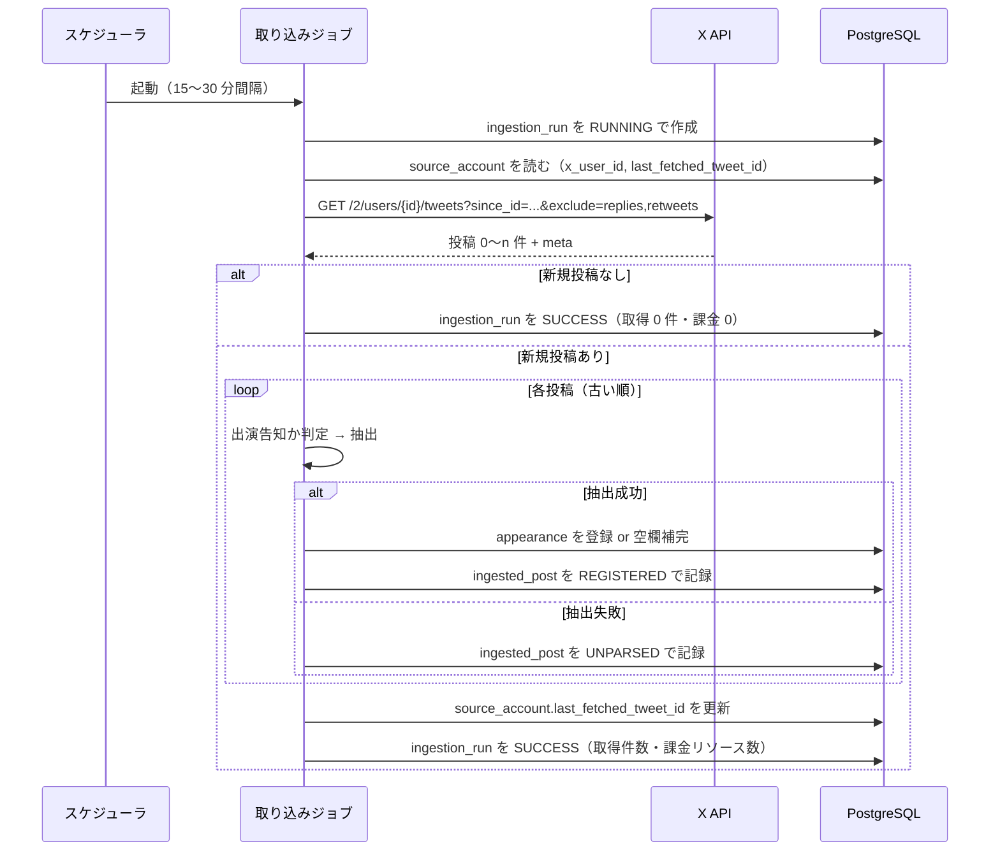

# X API 連携設計 — 取得・課金・抽出

最終更新: 2026-08-28

関連文書: [CLAUDE.md](../CLAUDE.md) / [docs/requirements.md](requirements.md) /
[docs/data-model.md](data-model.md) / 実サンプル `docs/x-post-sample/`

---

## 1. 概要と前提

XINXIN 公式アカウントの新規投稿を定期的に取得し、出演情報を抽出して登録する。
対応する要件は FR-40〜FR-43、NFR-02、NFR-04。

| 項目 | 内容 |
| --- | --- |
| エンドポイント | `GET /2/users/{id}/tweets` |
| 認証 | Bearer Token（OAuth2 App-Only） |
| 情報源 | XINXIN 公式アカウント 1 件のみ |
| 取得方式 | `since_id` による差分取得 |
| 承認 | なし。抽出に成功した情報はそのまま公開する（FR-41） |

**この連携が落ちても公開カレンダーは動き続ける**（NFR-02）。
取り込みは独立したバッチであり、閲覧系の処理から切り離す。

---

## 2. 取得フロー



### 2.1 処理順序の原則

- **投稿は古い順に処理する。** API は新しい順に返すため、逆順に並べ替えてから処理する。
  「公演情報解禁 → タイムテーブル解禁」の順で反映しないと、
  空欄補完（第 6 章）が意図通りに働かない
- **`last_fetched_tweet_id` の更新は全件処理後**に、取得できた最大 ID で一度だけ行う
- 途中で失敗した場合は `last_fetched_tweet_id` を更新しない。
  次回同じ範囲を取り直す（取得位置を進めるより、再取得のほうが安全）

### 2.2 取得位置を後退させない

`last_fetched_tweet_id` は**単調増加**でなければならない。
後退すると同じ投稿を翌日以降に再取得し、24 時間の重複排除が効かず再課金になる。

- 更新は `新しい値 > 現在の値` のときだけ行う（`UPDATE ... WHERE last_fetched_tweet_id < ?`）
- この比較を成立させるため `BIGINT` で保持している（[data-model.md](data-model.md) 第 4.1 節）

---

## 3. API 呼び出し仕様

### 3.1 ユーザー ID の解決（初回のみ）

```
GET /2/users/by/username/{handle}
```

`source_account.x_user_id` が未設定のときだけ呼ぶ。1 回 $0.010。
取得したら永続化し、**二度と呼ばない**（FR-40）。

### 3.2 投稿の取得

```
GET /2/users/{id}/tweets
    ?since_id={last_fetched_tweet_id}
    &exclude=replies,retweets
    &max_results=100
    &tweet.fields=created_at,note_tweet
```

| パラメータ | 値と理由 |
| --- | --- |
| `since_id` | 前回の最大 ID。**省略した呼び出しを実装に作らない**（全件取り直しの禁止） |
| `exclude` | `replies,retweets`。出演告知は本投稿のみ。除外した分は課金対象にならない |
| `max_results` | 100（上限）。ページング回数を減らす |
| `tweet.fields` | `created_at`（年の補完に使う）、`note_tweet`（長文投稿の本文） |

**`expansions` と `media.fields` は指定しない。** 画像を保持しないため（LR-03）、
メディア情報を取得する必要がない。指定すると返却リソースが増えて課金が膨らむ。

初回（`since_id` なし）の扱いは第 8 章。

### 3.3 本文の取り出し

```
本文 = note_tweet.text があればそれ、なければ text
```

`text` は 280 文字で切れる。実サンプル 5.txt は 1,253 バイトあり、
**`text` だけを見ると出演時刻の行に到達しない**。必ず `note_tweet` を優先する。

### 3.4 ページング

`meta.next_token` が返る間、`pagination_token` に渡して繰り返す。
ただし 1 回の実行で取得するページ数に上限を設ける（既定 10 ページ = 最大 1,000 件）。
上限に達したら打ち切り、次回の実行に持ち越す。暴走した課金を防ぐため。

---

## 4. 課金とコスト管理

### 4.1 単価（2026 年時点）

| 項目 | 単価 |
| --- | --- |
| Posts: Read | $0.005 / 1 リソース |
| User: Read | $0.010 / 1 リソース |

課金は**レスポンスで返ってきたリソース数**に対して発生する。リクエスト数ではない。
同一リソースは 24 時間（UTC）で重複排除されるが、これはソフトな保証であり、
障害時に重複課金が起きうる。詳細は [CLAUDE.md](../CLAUDE.md)。

### 4.2 記録

各実行で `ingestion_run.fetched_resource_count` に**返却された投稿数**を加算する
（`meta.result_count` の合計、ページングした場合は全ページ分）。

```sql
-- 当月の消費リソース数
SELECT sum(fetched_resource_count)
FROM ingestion_run
WHERE started_at >= date_trunc('month', now());
```

概算コストは `リソース数 × $0.005`。月 $5 を超えない想定（NFR-04）。

### 4.3 想定コスト

1 日 10 投稿として月 300 リソース ≒ **$1.5/月**。
`exclude=replies,retweets` により実際の課金対象はさらに少なくなる。
新規投稿がない実行は返却 0 件で**課金されない**ため、
ポーリング間隔を短くしてもコストはほぼ増えない。

### 4.4 コスト増を招く実装上の地雷

- `since_id` を省略した取得（全件取り直し）
- `last_fetched_tweet_id` の後退（第 2.2 節）
- `expansions` の不要な指定
- リトライ時に取得済みの範囲を取り直す実装
- テストコードから実 API を叩くこと（第 9 章）

---

## 5. 出演情報の抽出（パース）仕様

`docs/x-post-sample/` の実サンプル 6 件から導出した。
**告知は絵文字が項目マーカーになっている**ため、これを手がかりにする。

### 5.1 実際の投稿構造

```
🔸XINXIN{地域}公演{情報解禁|タイムテーブル解禁}🔸     ← 告知の種別

{M}/{D}({曜日})📍{都道府県}・{会場}                   ← 日付と会場が同一行
{イベント名}                                          ← 括弧で囲まれる

⏰OPEN {HH:MM} / START {HH:MM}                        ← 保持しない
🎫{価格情報}                                          ← 保持しない
🔗{URL}                                               ← チケット URL

▪️タイムテーブル
📍{ステージ名}                                        ← フェスのみ
🎤{HH:MM}-{HH:MM} XINXIN出演                          ← 出演時刻
📸{HH:MM}-{HH:MM} {物販種別}                          ← 物販時刻（XINXIN の語は入らない）

【出演者(敬称略)】                                     ← 保持しない
```

**ヘッダ部とタイムテーブル部**に分かれ、`⏰` 行が実質の境界になっている。
`⏰` より前が公演そのものの情報（日付・会場・イベント名）、
後ろがチケット販売条件と各出演者の進行という構造で、実サンプル 6 件すべてが従う。

複数日開催のサーキット / フェスでは、ここから次のように崩れる（実サンプル 6.txt）。

```
{M}/{D}({曜日}) & {M}/{D}({曜日})                     ← 日付が複数、会場は別行
📍{都道府県}・{会場A} / {会場B} / {会場C}              ← 会場が並ぶ
他 全12会場
{イベント名}

⏰OPEN {HH:MM} / START {HH:MM}
🔻{M}/{D}({曜日})チケット🔻                           ← 販売条件にも日付が出る
販売：{M}/{D}({曜日})...

▪️{M}/{D}({曜日})タイムテーブル                       ← 見出しに日付が入る
📍{会場A}
🎤{HH:MM}-{HH:MM} XINXIN①                            ← 同じ日に 2 枠
📸{HH:MM}-{HH:MM} {物販種別}

📍{会場B}
🎤{HH:MM}-{HH:MM} XINXIN②
📸{HH:MM}-{HH:MM} {物販種別}
```

### 5.2 抽出対象の判定

次を**すべて**満たす投稿だけを抽出対象とする。満たさなければ `UNPARSED`。

1. 本文に `XINXIN` を含む
2. 日付パターン（第 5.3 節）が 1 つ以上見つかる
3. `📍` が 1 つ以上ある

**保守的に判定する。** 対バン発表、物販告知、日常の投稿などを誤って
出演情報にするより、`UNPARSED` として管理者に回すほうが害が小さい（FR-25）。

### 5.3 日付

```
正規表現: (\d{1,2})/(\d{1,2})\((月|火|水|木|金|土|日)(?:祝)?\)
例: 9/15(火)  10/12(月祝)  9/6(日)
```

**公演日の候補は `⏰` 行より前に限る。** 本文には販売期間の日付も書かれており、
正規表現をそのまま全文に当てると公演日でない日付を拾う。
実サンプルでのヒット数は 1.txt が 5 件、2.txt が 7 件、6.txt が 9 件にのぼるが、
`⏰` で始まる行より前に限ると **6 件すべてで公演日だけが残る**
（1〜5.txt は 1 件、6.txt は 2 件）。

```
探索範囲: 先頭 〜 ⏰ で始まる最初の行の直前
        ⏰ 行がなければ ▪️ を含む最初の行の直前
        どちらもなければ本文全体
```

**年が書かれていない。** 投稿の `created_at` から補う。

1. 投稿日の年を仮定して日付を組み立てる
2. 組み立てた日付が**投稿日より 30 日以上前**なら、翌年と解釈する
   （告知は未来の公演に対して行われるため。過去日の告知は基本的にない）
3. 組み立てた日付の曜日が、**告知に併記された曜日と一致するか検証する**
4. 一致しなければ `UNPARSED` にする

手順 3 が重要な安全弁になる。年の推測を誤ると曜日がずれるため、
誤った年で登録される事故をここで止められる。

「(月祝)」のような祝日表記は曜日部分だけを見る。

**曜日検証は探索範囲の中の日付にだけ適用する。** 実サンプル 6.txt では、
ヘッダの `8/25(火) & 8/26(水)` が正しく、販売条件とタイムテーブル見出しの
`8/25(土)` `8/26(日)` が**告知側の誤記**になっている。

| 記述 | 位置 | 2026 年の実際 |
| --- | --- | --- |
| `8/25(火) & 8/26(水)` | ヘッダ（⏰ より前） | 火・水 → 一致 |
| `🔻8/25(土)チケット🔻` | 販売条件 | 火 → **不一致** |
| `▪️8/25(土)タイムテーブル` | タイムテーブル見出し | 火 → **不一致** |

範囲を限定せずに検証すると、この投稿は曜日不一致で丸ごと `UNPARSED` になる。
公式の告知に誤記が混じることは避けられないため、
**検証するのは公演日として採用する日付だけ**とする。
タイムテーブル見出しの日付は日付部分（`8/25`）だけを見てブロックの対応付けに使い、
曜日は検証しない（第 5.10 節）。

### 5.4 会場

```
最初の 📍 から行末まで
例: 東京・渋谷音楽堂/Shibuya Milkyway/...  愛知・大須RADHALL
```

- 都道府県を含んだ形のまま `venue_name` に入れる（[data-model.md](data-model.md) 第 4.3.1 節）
- **ヘッダ会場は `⏰` 行より前の最初の 📍 から取る**（第 5.3 節と同じ探索範囲）。
  実サンプル 6.txt では日付行と会場行が別行になっており、
  「日付と同じ行の 📍」という取り方はできない
- **`▪️` より後の 📍 は出演枠ごとの会場**を示す。扱いはヘッダ会場の形で決まる

```
ヘッダ会場に「/」を含まない（単一会場）
    → ヘッダ会場 / 枠の📍     例: 千葉・草ぶえの丘(千葉 佐倉) / Orange Shelter
                                    （枠の📍はステージ名にすぎない）

ヘッダ会場に「/」を含む（サーキット・フェスで会場が並ぶ）
    → {都道府県}・{枠の📍}    例: 愛知・NAGOYA ReNY limited
                                    （枠の📍が実際の出演会場。会場の羅列は捨てる）
```

  都道府県はヘッダ会場の `・` より前から取る。
  サーキット形式でヘッダ会場をそのまま使うと、
  実サンプル 6.txt では 12 会場の羅列に出演会場が埋もれてしまう
- **セクションの判定には `▪️` を必ず含める。** 「タイムテーブル」という語は
  1 行目のタイトル（`🔸XINXIN千葉公演タイムテーブル解禁🔸`）にも現れるため、
  語だけで判定すると本文全体がタイムテーブル扱いになり、
  会場が 1 つも取れなくなる（第 5.11 節の検証で実際に踏んだ）
- タイムテーブルがない告知（実サンプル 1.txt）では、ヘッダ会場をそのまま使う。
  会場が並んだ文字列のままでよい。どの会場に出るかがまだ告知されていない

### 5.5 イベント名

**「会場行の次の行」というルールは使えない。** 実サンプル 5.txt では
会場行と イベント名の間に住所行が挟まる。

```
9/6(日)📍千葉・草ぶえの丘(千葉 佐倉)
千葉県佐倉市飯野820          ← 住所が挟まる
「くさのねアイドルフェスティバル2026」
```

代わりに**括弧を手がかりにする**。

1. 会場行より後、`⏰` 行より前の範囲を探す
2. `『』` `「」` `｢｣` のいずれかを含む行を探す
3. 最初に見つかった行**全体**をイベント名とする

行全体を取るのは、`lonlium pre.『LONELY KIDS』` のように
主催者名が括弧の外に付くケースを取りこぼさないため。

**先頭のハッシュタグを除去しない。** 実サンプル 1.txt の
`#ﾆｷﾌﾟﾚ『カンシャサイ。-秋-』` は主催者を示すタグが括弧の直前に空白なしで付いており、
`lonlium pre.『LONELY KIDS』` と同じ役割を持つ。
除去しようとして `^#\S+` のような正規表現を当てると、区切りの空白がないため
**行全体が消える**（第 5.11 節の検証で実際に踏んだ）。行はそのまま保持する。

### 5.6 XINXIN の出演時刻

```
正規表現: 🎤(\d{1,2}):(\d{2})-(\d{1,2}):(\d{2})
条件: 同じ行に XINXIN を含むこと
例: 🎤19:50-20:15 XINXIN出演
```

- **`XINXIN` を含む 🎤 行に限定する。** 他の出演者のタイムテーブルが
  併記される可能性があるため
- **該当する 🎤 行が複数あれば、それぞれが別の出演情報になる。**
  実サンプル 6.txt では `🎤16:35-17:05 XINXIN①` と `🎤19:50-20:15 XINXIN②` が
  同じ日・同じイベントに並ぶ。1 行にまとめず 2 行として登録する（第 5.10 節）
- 見つからない場合は `NULL` のままにする。エラーにしない。
  タイムテーブル未発表の段階で告知が出る（実サンプル 1.txt）
- `⏰OPEN / START` の時刻を出演時刻として代用**しない**。
  実サンプル 3.txt では START 16:40 に対し XINXIN の出演は 21:05 で、4 時間以上ずれる

**24 時以上の時刻表記（深夜公演）。** `🎤26:00-26:30` のような表記は、
**時刻が実際に属する暦日**へ置き換えてから保存する。
`TIME` 型は `24:00` 以上を表現できない（[data-model.md](data-model.md) 第 6 章）。

```
開始・終了の両方が 24〜29 のとき:
    appearance_date = その日付ブロックの日付 + 1 日
    start / end     = それぞれ -24 時間

例: 「9/16(火)」ブロックの 🎤26:00-26:30
    → appearance_date = 2026-09-17, 02:00-02:30
```

- **開始が 24 未満で終了が 24 以上**（`🎤23:50-24:30` など）は、出演枠そのものが
  日を跨ぐ。どちらの暦日に置いても片方の時刻を表現できず、`appearance_performance_time_order`
  制約にも反するため、**登録せず `UNPARSED`** にして管理者に回す
- **30 以上の時刻**（`🎤31:00-` など）は誤記とみなし `UNPARSED` にする。
  正規表現の `\d{1,2}` は 2 桁を素通しするため、値域の検証を別途行う
- 分は `00〜59` の範囲を検証する
- 日付を繰り上げた結果として**月・年をまたぐ**場合がある（8/31 の 26:00 は 9/1 の 02:00）。
  日付加算はカレンダー演算で行い、文字列操作で日を足さない

### 5.7 物販時刻

```
正規表現: 📸(\d{1,2}):(\d{2})-(\d{1,2}):(\d{2})
条件: XINXIN の 🎤 行より後にある最初の 📸 行
例: 📸21:25-22:35 終演後物販
```

- **`📸` 行には `XINXIN` の語が入らない。** ラベルは「終演後物販」「並行物販(ブースA)」
  「並行物販B」のように書かれ、🎤 行のような限定ができない。
  そこで**第 5.6 節で採用した 🎤 行より後**に現れる最初の 📸 行を物販時刻とする
- **次の 🎤 行を越えない。** 出演枠が複数ある投稿（実サンプル 6.txt）では、
  各枠の 📸 をその枠に紐づける。次の 🎤 行に達したら打ち切り、
  見つからなければその枠の物販時刻は `NULL` にする。
  越えて探すと隣の枠の物販時刻を拾う
- 実サンプルでタイムテーブルが発表済みの 4 件は、いずれも 📸 行が 🎤 行の直後にある
- **🎤 行が取れなかった投稿では物販時刻も取らない。** 基準となる行が決まらないため
  （タイムテーブル未発表の実サンプル 1.txt がこのケース）
- 見つからない場合は `NULL` のままにする。エラーにしない
- 24 時以上の表記は第 5.6 節と同じ規則で変換する。ただし
  **日付の繰り上げ判定が出演時刻と一致しない場合は物販時刻を保存しない**
  （`🎤23:30-23:55` に対する `📸24:10-25:00` など。
  [data-model.md](data-model.md) 第 6 章）
- 開始時刻が終了時刻より後になる場合は物販時刻を `NULL` にする。
  出演枠と違い投稿全体を `UNPARSED` にはしない。
  **物販時刻は補助情報**であり、取れないことを許容する側に倒す

### 5.8 チケット URL

```
正規表現: 🔗(https?://\S+)
最初に見つかったものを採用する
```

- `🔗` マーカーの付いた URL のみを対象にする。
  本文末尾の「オフィシャルサイト：」などは対象外
- `http://` のケースがある（実サンプル 5.txt）ため、スキームは `https?` を許容する
- 取得した URL は信頼しない入力として検証する（NFR-03）。
  スキームが `http` / `https` 以外なら破棄する

### 5.9 抽出しない項目

`⏰OPEN/START`、`🎫`（価格）、`【出演者】`、注意事項、`🎁`（入場特典）は
抽出しない。理由は [data-model.md](data-model.md) 第 4.3.1 節。

### 5.10 1 投稿から複数の出演情報

1 つの投稿が複数の `appearance` になるパターンは 2 つある。

#### パターン A: 同じ日に複数の出演枠

タイムテーブル内に XINXIN の 🎤 行が複数あれば、それぞれを別の出演情報にする
（実サンプル 6.txt）。

```
▪️8/25(土)タイムテーブル
📍NAGOYA ReNY limited        ┐
🎤16:35-17:05 XINXIN①        │ 1 件目
📸17:25-18:35 並行B(ガスビル)  ┘

📍RADHALL                    ┐
🎤19:50-20:15 XINXIN②        │ 2 件目
📸21:25-22:45 終演後          ┘
```

- 枠の会場は、その 🎤 行より前にある最も近い 📍 を取る（前の 🎤 行を越えない）
- 枠の物販時刻は、その 🎤 行より後の最初の 📸 を取る（次の 🎤 行を越えない。第 5.7 節）
- 同じ日・同じイベントの複数行は `UNIQUE` の対象になるため、
  `appearance` は開始時刻を含めて一意にしている
  （[data-model.md](data-model.md) 第 4.3.2 節）

#### パターン B: 複数日開催

ヘッダ（`⏰` より前）に日付が複数あれば複数日開催。
**タイムテーブル見出しの日付でブロックを対応付ける**。

```
8/25(火) & 8/26(水)          ← ヘッダ：2 日間開催
...
▪️8/25(土)タイムテーブル      ← このブロックは 8/25 のもの
```

- 見出しの日付は**月日だけで対応付け、曜日は検証しない**。
  実サンプル 6.txt では見出しの曜日が誤記になっている（第 5.3 節）
- **見出しのないブロックは、ヘッダの日付が 1 つのときだけ**その日付に紐づける。
  実サンプル 1〜5.txt がこのケース
- **対応するブロックがない日付には出演情報を作らない。** 6.txt の 8/26 がこれにあたる。
  イベントが 2 日間開催であることと、XINXIN が両日出演することは別である。
  告知されていない出演を推測で作らない。2 日目のタイムテーブルは後続の投稿で届き、
  そのとき新しい行として登録される
- ヘッダの日付が複数あり、ブロック見出しでも対応付けられない場合は
  **すべてを `UNPARSED`** にして管理者に回す。
  誤った組み合わせで登録するより取りこぼすほうがよい

### 5.11 実サンプルでの検証結果

本章のルールを `docs/x-post-sample/` の 6 件に適用した結果。
**この表をそのまま抽出テストの期待値にする**（第 9 章）。

| ファイル | 日付 | 会場 | イベント名 | 出演時刻 | 物販時刻 | チケット URL |
| --- | --- | --- | --- | --- | --- | --- |
| 1.txt | 2026-09-15 (火) | 東京・渋谷音楽堂/Shibuya Milkyway/…（7 会場） | `#ﾆｷﾌﾟﾚ『カンシャサイ。-秋-』` | **NULL** | **NULL** | `https://t-dv.com/20260915_nikipre` |
| 2.txt | 2026-10-12 (月) | 東京・渋谷CLUB QUATTRO | `『ORANGE CHEER』` | 16:45-17:05 | 17:15-18:20 | `https://livepocket.jp/e/orange-cheer_261012` |
| 3.txt | 2026-09-04 (金) | 愛知・NAGOYA ReNY limited | `｢IGNITION-狂騒-｣` | 21:05-21:30 | 21:30-22:40 | `https://t-dv.com/IGNITION-Kyosou-0904` |
| 4.txt | 2026-09-16 (水) | 愛知・大須RADHALL | `lonlium pre.『LONELY KIDS』` | 19:50-20:15 | 21:25-22:35 | `https://livepocket.jp/e/lk-nagoya0916` |
| 5.txt | 2026-09-06 (日) | 千葉・草ぶえの丘(千葉 佐倉) / Orange Shelter | `「くさのねアイドルフェスティバル2026」` | 14:40-15:05 | 15:50-16:50 | `http://kusanoneidolfes.com/#ticket` |
| 6.txt ① | 2026-08-25 (火) | 愛知・NAGOYA ReNY limited | `『DERAX JAM~ DERA MAXIMUM JAM ~』` | 16:35-17:05 | 17:25-18:35 | `http://t-dv.com/DERAX_JAM` |
| 6.txt ② | 2026-08-25 (火) | 愛知・RADHALL | `『DERAX JAM~ DERA MAXIMUM JAM ~』` | 19:50-20:15 | 21:25-22:45 | `http://t-dv.com/DERAX_JAM` |

**6.txt は 1 投稿から 2 行**になる（同じ日・同じイベントの 2 枠）。
8/26 は 2 日間開催のうち 2 日目だが、タイムテーブルが告知されていないため行を作らない。

公演日として採用した日付は、6 件すべてで告知の曜日と実際の曜日が一致した
（年を 2026 と解釈した場合）。第 5.3 節の曜日検証が機能することの裏付けになる。
6.txt の販売条件とタイムテーブル見出しにある `8/25(土)` `8/26(日)` は告知側の誤記だが、
公演日の探索範囲（`⏰` 行より前）の外にあるため検証対象にならない。

イベント名の括弧が `『』` `「」` `｢｣` と 3 種類混在している点に注意
（3.txt は半角カギカッコ）。正規化（第 6 章）ではこれらをすべて扱う。

---

## 6. 既存レコードへの補完

公式は 1 つのイベントを複数回に分けて告知する。
抽出した出演情報は、既存行の空欄を埋める形で反映する。

詳細な規則は [data-model.md](data-model.md) 第 7.1 節。要点のみ再掲する。

1. `appearance_date` が一致し、正規化した `event_name` が一致する行を探す
2. なければ `INSERT`
3. あれば**値が `NULL` の列だけ**を `UPDATE`。値が入っている列は触らない
4. 補完が起きたら `source_url` と `ingested_post_id` もその告知のものへ更新する

照合には `event_key`（正規化済みのイベント名）を使う。
`event_name` には**告知の原文をそのまま保存**し、画面表示にはこちらを使う。
正規化した文字列を表示に回すと、元の告知と違う名前がカレンダーに並ぶことになる。

```
正規化: NFKC 正規化 → 小文字化 → 英数字・日本語文字以外を除去
例: 『ORANGE CHEER』        → orangecheer
    #ﾆｷﾌﾟﾚ『カンシャサイ。-秋-』 → ニキプレカンシャサイ秋   （半角カナが NFKC で全角化）
```

`event_key` は抽出時と手動登録時の両方で生成する。
規則と、先頭数文字への切り詰めを採らない理由は
[data-model.md](data-model.md) 第 4.3.2 節。

---

## 7. エラーハンドリング

| 状況 | 対応 |
| --- | --- |
| 429（レート制限） | `x-rate-limit-reset` を見て待機。指数バックオフでリトライ（最大 3 回） |
| 5xx | 指数バックオフでリトライ（最大 3 回） |
| 401 / 403 | **リトライしない。** トークンの失効や権限の問題であり、再試行しても直らない |
| 404 | アカウントが削除・凍結された可能性。リトライせず失敗として記録する |
| タイムアウト | リトライ対象。接続 5 秒 / 読み取り 30 秒を既定とする |

共通の原則:

- **リトライ回数に上限を設ける**（無限リトライ禁止。FR-43）
- 打ち切っても `last_fetched_tweet_id` を更新しない（第 2.1 節）
- 失敗は `ingestion_run` に `FAILED` と `error_summary`（500 字以内）で記録する。
  **スタックトレースとトークンを含めない**（NFR-03）
- 連続失敗は管理画面に警告として出す（NFR-09、FR-08）

---

## 8. 初回バックフィル

`last_fetched_tweet_id` が未設定のとき、過去の投稿をどこまで取るか。

- **`start_time` パラメータで取得範囲を限定する**（既定: 実行時点の 3 か月前まで）。
  無制限に遡ると課金が読めない
- タイムラインは**約 3,200 件までしか遡れない**。それ以前は取得できない
- 過去分の完全な取り込みは**保証しない**（要件の非スコープ）。
  取れたところまでを登録し、不足は管理者が手動登録で補う
- バックフィルは**手動で 1 回だけ実行する**運用とし、定期ジョブから呼ばない。
  誤って繰り返すと再課金するため

バックフィル時も 1 回の実行あたりのページ数上限（第 3.4 節）を適用する。

---

## 9. テスト方針

**実 API を叩くテストを CI に置かない**（[CLAUDE.md](../CLAUDE.md)）。実行のたびに課金される。

| 対象 | 方法 |
| --- | --- |
| 抽出ロジック | `docs/x-post-sample/` の実サンプルを固定のテストデータとして使う |
| API クライアント | 記録済みの JSON レスポンスを返すスタブに対して検証する |
| 課金カウント | スタブのレスポンス件数と `fetched_resource_count` の一致を検証する |
| 補完ロジック | 「公演情報解禁 → タイムテーブル解禁」の順で 2 件を流し、1 行に統合されることを検証する |

必ず書くテスト:

- 実サンプル 6 件がすべて期待どおり抽出できること（第 5.11 節の表）
- 6.txt から**同じ日・同じイベントで 2 行**の出演情報ができること（第 5.10 節 パターン A）
- 6.txt の各行に正しい会場（`愛知・NAGOYA ReNY limited` / `愛知・RADHALL`）と
  物販時刻が紐づくこと
- 6.txt の 8/26（タイムテーブル未告知の 2 日目）に行が作られないこと
- 販売条件の日付（`🔻` 行や「販売：」行の日付）を公演日にしないこと
- タイムテーブル見出しの曜日が誤記でも `UNPARSED` にならないこと（6.txt の `8/25(土)`）
- 1.txt（タイムテーブル未発表）で出演時刻と物販時刻が `NULL` になること
- 📸 行が 🎤 行より前にしかない投稿で、物販時刻が `NULL` になること（第 5.7 節）
- 曜日が一致しない日付を `UNPARSED` にすること
- `🎤26:00-26:30` が翌日の `02:00-02:30` になること（深夜公演。第 5.6 節）
- 月末の深夜表記（8/31 の `🎤26:00`）で月が繰り上がること（9/1 の `02:00`）
- 日を跨ぐ出演枠（`🎤23:50-24:30`）を `UNPARSED` にすること
- 24 時以上の時刻を含まない通常の投稿で、日付が繰り上がらないこと
- 年跨ぎ（12 月の投稿で 1 月の公演を告知）で正しい年になること
- `since_id` なしで取得を呼ぶ経路が存在しないこと
- 同じ投稿を 2 回処理しても `appearance` が増えないこと（冪等性）
- `last_fetched_tweet_id` が後退しないこと

---

## 10. 運用と監視

- ポーリング間隔は **15〜30 分**を暫定とする。新規投稿がなければ課金は発生しない
- 実行基盤は Fly.io 上の Spring Boot `@Scheduled`（[architecture.md](architecture.md) 第 4.3 節）。
  多重起動を防ぐため、前回の実行が終わっていなければスキップする
- 監視すべき値:
  - 直近の実行が成功しているか（FR-08 の表示に直結）
  - 当月の `fetched_resource_count` 合計（NFR-04）
  - `UNPARSED` の滞留件数（抽出精度の劣化を示す）
- Bearer Token は環境変数で注入する。ログ・エラー・レスポンスに出さない（NFR-03）

---

## 11. 未決定事項

1. **ポーリング間隔の確定**。15〜30 分を暫定としている。
   実行基盤は `@Scheduled` で確定済み（第 10 章）。
   運用開始後の投稿頻度と告知から公演までの猶予を見て決める
2. **抽出精度の目標水準**。requirements.md 未決定事項 6 と同一。
   サンプルが 6 件では表記ゆれを網羅できていない。運用開始後に実データを蓄積して見直す
3. **イベント名の正規化ルールの具体化**（第 6 章）。
   どの記号までを除去対象にするかで同一イベントの判定精度が変わる
4. **告知の種別判定**。「公演情報解禁」と「タイムテーブル解禁」以外の
   告知パターン（中止・変更・出演者追加など）が実サンプルにない。
   実データを増やして判定条件を詰める
5. **初回バックフィルの遡及期間**（第 8 章で 3 か月を既定としたが要確認）
