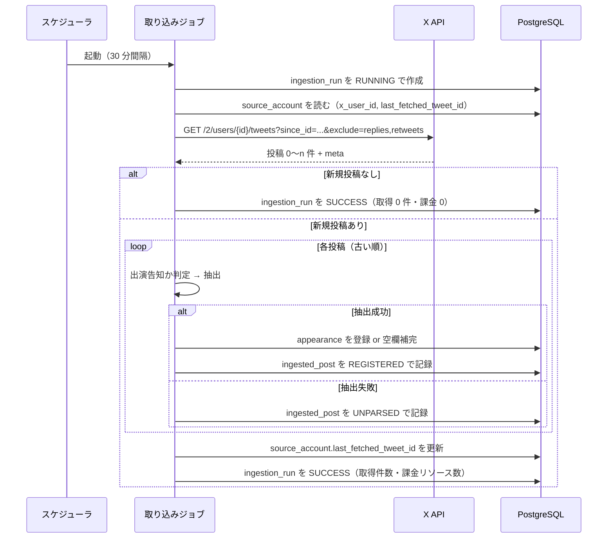

# X API 連携設計 — 取得・課金・抽出

最終更新: 2026-09-02

関連文書: [CLAUDE.md](../CLAUDE.md) / [docs/requirements.md](requirements.md) /
[docs/data-model.md](data-model.md) / 実キーの設定手順は [docs/runbook-x-api-setup.md](runbook-x-api-setup.md) /
実サンプル `docs/x-post-sample/`

---

## 1. 概要と前提

XINXIN 公式アカウントの新規投稿を定期的に取得し、出演情報を抽出して登録する。
対応する要件は FR-40〜FR-43、NFR-02、NFR-04。

| 項目 | 内容 |
| --- | --- |
| エンドポイント | `GET /2/users/{id}/tweets` |
| 認証 | Bearer Token（OAuth2 App-Only） |
| 情報源 | `@xinxin_official`（XINXIN 公式）1 件のみ。ユーザー ID は [runbook](runbook-x-api-setup.md) 付録 C.3 |
| 取得方式 | `since_id` による差分取得 |
| 承認 | なし。抽出に成功した情報はそのまま公開する（FR-41） |

**この連携が落ちても公開カレンダーは動き続ける**（NFR-02）。
取り込みは独立したバッチであり、閲覧系の処理から切り離す。

---

## 2. 取得フロー



### 2.1 処理順序の原則

- **投稿は古い順に処理する。** API は新しい順に返すため、逆順に並べ替えてから処理する。
  「公演情報解禁 → タイムテーブル解禁」の順で反映しないと、
  空欄補完（第 6 章）が意図通りに働かない
- **`last_fetched_tweet_id` の更新は全件処理後**に、取得できた最大 ID で一度だけ行う。
  ページ上限で打ち切った場合も**同じ**。未取得の古い側は諦める（第 3.4 節）
- 途中で失敗した場合は `last_fetched_tweet_id` を更新しない。
  次回同じ範囲を取り直す（取得位置を進めるより、再取得のほうが安全）。
  ポーリング間隔が 30 分なので、取り直しは **X API の 24 時間の重複排除の内側**に収まり
  再課金されない。ただし**失敗が UTC の日跨ぎで続くと、この保証は切れる**。
  その歯止めが第 7 章の連続失敗による打ち切り

### 2.2 取得位置を後退させない

`last_fetched_tweet_id` は**単調増加**でなければならない。
後退すると同じ投稿を翌日以降に再取得し、24 時間の重複排除が効かず再課金になる。

- 更新は `新しい値 > 現在の値` のときだけ行う（`UPDATE ... WHERE last_fetched_tweet_id < ?`）
- この比較を成立させるため `BIGINT` で保持している（[data-model.md](data-model.md) 第 4.1 節）

---

## 3. API 呼び出し仕様

### 3.1 ユーザー ID の解決（初回のみ）

```
GET /2/users/by/username/{handle}
```

`source_account.x_user_id` が未設定のときだけ呼ぶ。1 回 $0.010。
取得したら永続化し、**二度と呼ばない**（FR-40）。

### 3.2 投稿の取得

```
GET /2/users/{id}/tweets
    ?since_id={last_fetched_tweet_id}
    &exclude=replies,retweets
    &max_results=100
    &tweet.fields=created_at,note_tweet
```

| パラメータ | 値と理由 |
| --- | --- |
| `since_id` | 前回の最大 ID。**省略した呼び出しを実装に作らない**（全件取り直しの禁止） |
| `exclude` | `replies,retweets`。出演告知は本投稿のみ。除外した分は課金対象にならない |
| `max_results` | 100（上限）。ページング回数を減らす |
| `tweet.fields` | `created_at`（年の補完に使う）、`note_tweet`（長文投稿の本文） |

**レート制限は制約にならない。** 実測で `x-rate-limit-limit: 10000`
（アプリ単位・15 分あたり）。30 分間隔のポーリングは 15 分あたり 0〜1 回なので、
4 桁の余裕がある。間隔を決めているのは X API ではなく Neon の CU-hours
（第 4.3 節）。

**`expansions` と `media.fields` は指定しない。** 画像を保持しないため（LR-03）、
メディア情報を取得する必要がない。指定すると返却リソースが増えて課金が膨らむ。

初回（`since_id` なし）の扱いは第 8 章。

### 3.3 本文の取り出し

```
本文 = note_tweet.text があればそれ、なければ text
```

`text` は途中で切れ、末尾が `https://t.co/...` に置き換わる。
実サンプル 5.txt は 1,253 バイトあり、**`text` だけを見ると出演時刻の行に到達しない**。
必ず `note_tweet` を優先する。

実 API でも確認済み（2026-09-02、直近 5 件）。

| 投稿 | `text` | `note_tweet.text` |
| --- | --- | --- |
| タイムテーブル解禁 | 233 字。**物販の行の途中で切れる** | 492 字 |
| 情報解禁 | 247 字 | 645 字 |

**`text` は半分以下しか含まない。** とくに物販時刻は末尾寄りに現れるため、
`note_tweet` を見ないと第 5.7 節の抽出が成立しない。

### 3.4 ページング

`meta.next_token` が返る間、`pagination_token` に渡して繰り返す。
ただし 1 回の実行で取得するページ数に上限を設ける（既定 10 ページ = 最大 1,000 件）。
暴走した課金を防ぐため。

**上限に達したら、未取得の古い側は取得を諦める。**
取得位置（`last_fetched_tweet_id`）は第 2.1 節どおり、
取得できた最大 ID へ進める（[ADR-0020](adr/0020-drop-posts-beyond-page-limit.md)）。

API は新しい順に返し、`next_token` はより古いページへ進む。
つまり打ち切ったときに残るのは**古い側**であり、位置を最新へ進めるとその区間は
`since_id` の外に落ちて二度と取得されない。**これは意図した仕様である。**

「次回に持ち越す」（＝位置を進めない）を選ぶと、滞留が 1,000 件を超えている限り
次回も同じ最新 1,000 件を取って再び打ち切り、**位置が永久に進まない**。
24 時間の重複排除は UTC の日跨ぎで切れるため、$5/日 が上限なく積み上がる。
諦めるほうが被害が小さい。

| | 1 回の課金 | 位置 | 失うもの |
| --- | --- | --- | --- |
| 諦める（採用） | 最大 $5 | 必ず前進する | 古い側の投稿 |
| 持ち越す | 上限なし | 進まない | なし（ただし停止するまで課金が続く） |

失う投稿があること自体は、既に受け入れている性質と同じである。
タイムラインは約 3,200 件までしか遡れず、過去分の完全な取り込みは非スコープ
（第 8 章、[requirements.md](requirements.md) 第 9 章）。

**打ち切ったことは実行の記録に残す。** `ingestion_run.truncated` を `true` にし、
管理画面に警告として出す（NFR-09）。諦めたことを知らなければ、
管理者は手動登録で補う判断ができない。ログだけでは Fly のログを見に行かないと読めない。

```sql
-- 取りこぼしの起きた実行
SELECT id, started_at, fetched_resource_count FROM ingestion_run WHERE truncated;
```

---

## 4. 課金とコスト管理

### 4.1 単価（2026 年時点）

| 項目 | 単価 |
| --- | --- |
| Posts: Read | $0.005 / 1 リソース |
| User: Read | $0.010 / 1 リソース |

課金は**レスポンスで返ってきたリソース数**に対して発生する。リクエスト数ではない。
同一リソースは 24 時間（UTC）で重複排除されるが、これはソフトな保証であり、
障害時に重複課金が起きうる。詳細は [CLAUDE.md](../CLAUDE.md)。

### 4.2 記録

各実行で `ingestion_run.fetched_resource_count` に**返却された投稿数**を加算する
（`meta.result_count` の合計、ページングした場合は全ページ分）。

```sql
-- 現在の請求サイクルの消費リソース数（起点が毎月 2 日の場合）
SELECT sum(fetched_resource_count)
FROM ingestion_run
WHERE started_at >= timestamptz '2026-09-02 00:00+09';
```

**暦月で切らない。** X API の請求サイクルはクレジットの購入日を起点に切られ
（[runbook-x-api-setup.md](runbook-x-api-setup.md) 第 3.3 節）、暦月で集計すると
支出上限のリセット日とずれる。アプリ側の起点は設定値
`x.billing-cycle-start-day`（1〜31。`1` で暦月と一致）で、
境界は JST で切る（[api.md](api.md) 第 5.7 節）。

概算コストは `リソース数 × $0.005`。1 サイクル $5 を超えない想定（NFR-04）。

**課金がレスポンスのリソース数と一致することは実測済み**（2026-09-02）。
`max_results=5` で 5 件を取得したところ、`GET /2/usage/tweets` の
`project_usage` がちょうど 5 増えた。

**ただし X 側の使用量エンドポイントは Post 読み取りしか数えない。**
`GET /2/users/by/username/{handle}`（User Read、$0.010）は
`project_usage` に加算されない。この差は初回の 1 回だけなので実害はないが、
**請求額と `project_usage` を突き合わせるときは一致しない**ことを踏まえる。

日次の内訳が要る場合は `usage.fields` を指定する
（`?days=7&usage.fields=daily_project_usage`。既定では返らない）。
使用量エンドポイントの呼び出し自体は課金されない。

### 4.3 想定コスト

1 日 10 投稿として月 300 リソース ≒ **$1.5/月**。
`exclude=replies,retweets` により実際の課金対象はさらに少なくなる。
新規投稿がない実行は返却 0 件で**課金されない**ため、
ポーリング間隔を短くしても X API のコストはほぼ増えない。

**ただし間隔は X API のコストだけでは決められない。** 実行のたびに
Neon のコンピュートが最低 5 分起動するため、間隔を詰めると
無料枠の CU-hours を圧迫する。この制約で 30 分に決めている
（[architecture.md](architecture.md) 第 11 章）。

### 4.4 コスト増を招く実装上の地雷

- `since_id` を省略した取得（全件取り直し）
- `last_fetched_tweet_id` の後退（第 2.2 節）
- `expansions` の不要な指定
- **取得位置を進めず、毎回同じ範囲を取り直し続ける実装**（第 2.1 節と混同しない。
  失敗時に 1 回取り直すのは想定内で、地雷なのは位置が進まないこと）
- テストコードから実 API を叩くこと（第 9 章）

---

## 5. 出演情報の抽出（パース）仕様

`docs/x-post-sample/` の実サンプル 13 件から導出した。
**告知は絵文字が項目マーカーになっている**ため、これを手がかりにする。

公式アカウントは公演告知以外の投稿もするため、まず**扱う投稿型を絞る**（第 5.2 節）。
以下の抽出ルールは、すべて絞り込みを通過した投稿に対するもの。

### 5.1 実際の投稿構造

```
🔸XINXIN{地域}公演{情報解禁|タイムテーブル解禁}🔸     ← 告知の種別

{M}/{D}({曜日})📍{都道府県}・{会場}                   ← 日付と会場が同一行
{イベント名}                                          ← 括弧で囲まれる

⏰OPEN {HH:MM} / START {HH:MM}                        ← 保持しない
🎫{価格情報}                                          ← 保持しない
🔗{URL}                                               ← チケット URL

▪️タイムテーブル
📍{ステージ名}                                        ← フェスのみ
🎤{HH:MM}-{HH:MM} XINXIN出演                          ← 出演時刻
📸{HH:MM}-{HH:MM} {物販種別}                          ← 物販時刻（XINXIN の語は入らない）

【出演者(敬称略)】                                     ← 保持しない
```

**ヘッダ部とタイムテーブル部**に分かれ、`⏰` 行が実質の境界になっている。
`⏰` より前が公演そのものの情報（日付・会場・イベント名）、
後ろがチケット販売条件と各出演者の進行という構造で、**抽出対象の 6 件すべてが従う**。

複数日開催のサーキット / フェスでは、ここから次のように崩れる（実サンプル 6.txt）。

```
{M}/{D}({曜日}) & {M}/{D}({曜日})                     ← 日付が複数、会場は別行
📍{都道府県}・{会場A} / {会場B} / {会場C}              ← 会場が並ぶ
他 全12会場
{イベント名}

⏰OPEN {HH:MM} / START {HH:MM}
🔻{M}/{D}({曜日})チケット🔻                           ← 販売条件にも日付が出る
販売：{M}/{D}({曜日})...

▪️{M}/{D}({曜日})タイムテーブル                       ← 見出しに日付が入る
📍{会場A}
🎤{HH:MM}-{HH:MM} XINXIN①                            ← 同じ日に 2 枠
📸{HH:MM}-{HH:MM} {物販種別}

📍{会場B}
🎤{HH:MM}-{HH:MM} XINXIN②
📸{HH:MM}-{HH:MM} {物販種別}
```

### 5.2 抽出対象の判定

**自動取り込みが扱うのは、タイムテーブルが確定した公演告知だけとする。**
それ以外はすべて `UNPARSED` として管理者に回す（FR-25）。

次を**すべて**満たす投稿だけを抽出対象とする。

1. `XINXIN` を含む `🎤` 行がある（第 5.6 節）
2. 探索範囲（第 5.3 節）に日付候補がある
3. 探索範囲に `📍` がある
4. イベント名が取れる（第 5.5 節）

**1 つでも欠ければ `UNPARSED`。** 部分的にしか埋まっていない出演情報を作らない。
日付とイベント名は `NOT NULL` で保存すらできず（[data-model.md](data-model.md) 第 4.3 節）、
会場や時刻だけが入った行は誤情報として公開される。

#### 対応する投稿型

| 型 | 実サンプル | 内容 |
| --- | --- | --- |
| タイムテーブル確定の公演告知 | 2〜6.txt | 日付・会場・イベント名・出演時刻が 1 投稿に揃う |
| 前日告知 | 12.txt | 構造は上と同一。先行する告知で作られた行があれば空欄補完に吸収される（第 6 章） |

前日告知を別扱いしないのは、**機械的に区別できず、区別する必要もない**ため。
抽出すると同じ形になり、`(日付, event_key, 開始時刻)` が一致して重複行にならない。

#### 対応しない投稿型

実サンプル 13 件から確認できた型。**取りこぼしではなく、意図して対象外にしている。**

| 型 | 実サンプル | 対象外になる理由 | 扱い |
| --- | --- | --- | --- |
| 出演時刻が未確定の情報解禁 | 1.txt | `XINXIN` を含む `🎤` 行がない | 将来対応（第 11 章） |
| 出演時間の訂正 | 8.txt, 11.txt | 日付が「本日」としか書かれず、日付候補が取れない | 将来対応（第 11 章） |
| 公演後のお礼・次回予告 | 7.txt | `🎤` 行がなく、イベント名も取れない | 対象外 |
| 公演に関係するが時刻情報のない連絡 | 9.txt, 10.txt | 日付候補も `📍` もない | 対象外 |
| 物販・グッズの告知 | 13.txt | `📍` がない | 対象外 |

**保守的に判定する。** 誤って出演情報にするより、`UNPARSED` として
管理者に回すほうが害が小さい。実サンプル 7.txt は
「次回、XINXINライブは8/26(水)📍愛知・栄Zephyr Hall…」という次回予告を含むが、
これを拾うと**イベント名のない、会場が文章のままの行**ができる。

### 5.3 日付

```
正規表現: (\d{1,2})/(\d{1,2})\((月|火|水|木|金|土|日)(?:祝)?\)
例: 9/15(火)  10/12(月祝)  9/6(日)
```

**公演日の候補は `⏰` 行より前に限る。** 本文には販売期間の日付も書かれており、
正規表現をそのまま全文に当てると公演日でない日付を拾う。
全文に当てたときのヒット数は 2.txt が 7 件、6.txt が 9 件、12.txt が 2 件にのぼるが、
`⏰` で始まる行より前に限ると **抽出対象の 6 件すべてで公演日だけが残る**
（6.txt は 2 日間開催で 2 件、他は 1 件）。

```
探索範囲: 先頭 〜 ⏰ で始まる最初の行の直前
        ⏰ 行がなければ ▪️ を含む最初の行の直前
        どちらもなければ本文全体
```

**年が書かれていない。** 投稿の `created_at` から補う。

1. 投稿日の年を仮定して日付を組み立てる
2. 組み立てた日付が**投稿日より 30 日以上前**なら、翌年と解釈する
   （告知は未来の公演に対して行われるため。過去日の告知は基本的にない）
3. 組み立てた日付の曜日が、**告知に併記された曜日と一致するか検証する**
4. 一致しなければ `UNPARSED` にする

手順 3 が重要な安全弁になる。年の推測を誤ると曜日がずれるため、
誤った年で登録される事故をここで止められる。

「(月祝)」のような祝日表記は曜日部分だけを見る。

**曜日検証は探索範囲の中の日付にだけ適用する。** 実サンプル 6.txt では、
ヘッダの `8/25(火) & 8/26(水)` が正しく、販売条件とタイムテーブル見出しの
`8/25(土)` `8/26(日)` が**告知側の誤記**になっている。

| 記述 | 位置 | 2026 年の実際 |
| --- | --- | --- |
| `8/25(火) & 8/26(水)` | ヘッダ（⏰ より前） | 火・水 → 一致 |
| `🔻8/25(土)チケット🔻` | 販売条件 | 火 → **不一致** |
| `▪️8/25(土)タイムテーブル` | タイムテーブル見出し | 火 → **不一致** |

範囲を限定せずに検証すると、この投稿は曜日不一致で丸ごと `UNPARSED` になる。
公式の告知に誤記が混じることは避けられないため、
**検証するのは公演日として採用する日付だけ**とする。
タイムテーブル見出しの日付は日付部分（`8/25`）だけを見てブロックの対応付けに使い、
曜日は検証しない（第 5.10 節）。

### 5.4 会場

```
最初の 📍 から行末まで
例: 東京・渋谷音楽堂/Shibuya Milkyway/...  愛知・大須RADHALL
```

- 都道府県を含んだ形のまま `venue_name` に入れる（[data-model.md](data-model.md) 第 4.3.1 節）
- **ヘッダ会場は `⏰` 行より前の最初の 📍 から取る**（第 5.3 節と同じ探索範囲）。
  実サンプル 6.txt では日付行と会場行が別行になっており、
  「日付と同じ行の 📍」という取り方はできない
- **`▪️` より後の 📍 は出演枠ごとの会場**を示す。扱いはヘッダ会場の形で決まる

```
ヘッダ会場に「/」を含まない（単一会場）
    → ヘッダ会場 / 枠の📍     例: 千葉・草ぶえの丘(千葉 佐倉) / Orange Shelter
                                    （枠の📍はステージ名にすぎない）

ヘッダ会場に「/」を含む（サーキット・フェスで会場が並ぶ）
    → {都道府県}・{枠の📍}    例: 愛知・NAGOYA ReNY limited
                                    （枠の📍が実際の出演会場。会場の羅列は捨てる）
```

  都道府県はヘッダ会場の `・` より前から取る。
  サーキット形式でヘッダ会場をそのまま使うと、
  実サンプル 6.txt では 12 会場の羅列に出演会場が埋もれてしまう
- **セクションの判定には `▪️` を必ず含める。** 「タイムテーブル」という語は
  1 行目のタイトル（`🔸XINXIN千葉公演タイムテーブル解禁🔸`）にも現れるため、
  語だけで判定すると本文全体がタイムテーブル扱いになり、
  会場が 1 つも取れなくなる（第 5.11 節の検証で実際に踏んだ）
- **枠の `📍` がない告知では、ヘッダ会場をそのまま使う**（実サンプル 2.txt）。
  タイムテーブルに会場の指定がないのは、会場が 1 つしかないため

### 5.5 イベント名

**「会場行の次の行」というルールは使えない。** 実サンプル 5.txt では
会場行と イベント名の間に住所行が挟まる。

```
9/6(日)📍千葉・草ぶえの丘(千葉 佐倉)
千葉県佐倉市飯野820          ← 住所が挟まる
「くさのねアイドルフェスティバル2026」
```

代わりに**括弧を手がかりにする**。

1. 会場行より後、`⏰` 行より前の範囲を探す
2. `『』` `「」` `｢｣` のいずれかを含む行を探す
3. 最初に見つかった行**全体**をイベント名とする

行全体を取るのは、`lonlium pre.『LONELY KIDS』` のように
主催者名が括弧の外に付くケースを取りこぼさないため。

**先頭のハッシュタグを除去しない。** 実サンプル 1.txt の
`#ﾆｷﾌﾟﾚ『カンシャサイ。-秋-』` は主催者を示すタグが括弧の直前に空白なしで付いており、
`lonlium pre.『LONELY KIDS』` と同じ役割を持つ。
除去しようとして `^#\S+` のような正規表現を当てると、区切りの空白がないため
**行全体が消える**（第 5.11 節の検証で実際に踏んだ）。行はそのまま保持する。

### 5.6 XINXIN の出演時刻

```
正規表現: 🎤[ 　\t]*(\d{1,2}):(\d{2})-(\d{1,2}):(\d{2})
条件: 同じ行に XINXIN を含むこと
例: 🎤19:50-20:15 XINXIN出演
```

- **`XINXIN` を含む 🎤 行に限定する。** 他の出演者のタイムテーブルが
  併記される可能性があるため
- **該当する 🎤 行が複数あれば、それぞれが別の出演情報になる。**
  実サンプル 6.txt では `🎤16:35-17:05 XINXIN①` と `🎤19:50-20:15 XINXIN②` が
  同じ日・同じイベントに並ぶ。1 行にまとめず 2 行として登録する（第 5.10 節）
- **見つからなければ投稿ごと対象外**にする（第 5.2 節の条件 1）。
  出演時刻が確定していない告知は自動登録しない
- `⏰OPEN / START` の時刻を出演時刻として代用**しない**。
  実サンプル 3.txt では START 16:40 に対し XINXIN の出演は 21:05 で、4 時間以上ずれる

**24 時以上の時刻表記（深夜公演）。** `🎤26:00-26:30` のような表記は、
**時刻が実際に属する暦日**へ置き換えてから保存する。
`TIME` 型は `24:00` 以上を表現できない（[data-model.md](data-model.md) 第 6 章）。

```
開始・終了の両方が 24〜29 のとき:
    appearance_date = その日付ブロックの日付 + 1 日
    start / end     = それぞれ -24 時間

例: 「9/16(火)」ブロックの 🎤26:00-26:30
    → appearance_date = 2026-09-17, 02:00-02:30
```

- **開始が 24 未満で終了が 24 以上**（`🎤23:50-24:30` など）は、出演枠そのものが
  日を跨ぐ。どちらの暦日に置いても片方の時刻を表現できず、`appearance_performance_time_order`
  制約にも反するため、**登録せず `UNPARSED`** にして管理者に回す
- **30 以上の時刻**（`🎤31:00-` など）は誤記とみなし `UNPARSED` にする。
  正規表現の `\d{1,2}` は 2 桁を素通しするため、値域の検証を別途行う
- 分は `00〜59` の範囲を検証する
- 日付を繰り上げた結果として**月・年をまたぐ**場合がある（8/31 の 26:00 は 9/1 の 02:00）。
  日付加算はカレンダー演算で行い、文字列操作で日を足さない

### 5.7 物販時刻

```
正規表現: 📸[ 　\t]*(\d{1,2}):(\d{2})-(\d{1,2}):(\d{2})
条件: XINXIN の 🎤 行より後にある最初の 📸 行
例: 📸21:25-22:35 終演後物販
```

- **`📸` 行には `XINXIN` の語が入らない。** ラベルは「終演後物販」「並行物販(ブースA)」
  「並行物販B」のように書かれ、🎤 行のような限定ができない。
  そこで**第 5.6 節で採用した 🎤 行より後**に現れる最初の 📸 行を物販時刻とする
- **次の 🎤 行を越えない。** 出演枠が複数ある投稿（実サンプル 6.txt）では、
  各枠の 📸 をその枠に紐づける。次の 🎤 行に達したら打ち切り、
  見つからなければその枠の物販時刻は `NULL` にする。
  越えて探すと隣の枠の物販時刻を拾う
- 対応する実サンプル 6 件は、いずれも 📸 行が 🎤 行の直後にある
- 見つからない場合は `NULL` のままにする。エラーにしない。
  基準となる 🎤 行は必ず存在する（第 5.2 節の条件 1）
- 24 時以上の表記は第 5.6 節と同じ規則で変換する。ただし
  **日付の繰り上げ判定が出演時刻と一致しない場合は物販時刻を保存しない**
  （`🎤23:30-23:55` に対する `📸24:10-25:00` など。
  [data-model.md](data-model.md) 第 6 章）
- 開始時刻が終了時刻より後になる場合は物販時刻を `NULL` にする。
  出演枠と違い投稿全体を `UNPARSED` にはしない。
  **物販時刻は補助情報**であり、取れないことを許容する側に倒す

### 5.8 チケット URL

```
正規表現: 🔗[ 　\t]*(https?://\S+)
最初に見つかったものを採用する
```

- `🔗` マーカーの付いた URL のみを対象にする。
  本文末尾の「オフィシャルサイト：」などは対象外
- **マーカーと値の間の空白を許す。** 実サンプル 13 件はすべて
  `🔗https://...` だったが、実 API で取得した投稿は
  `🔗 https://...` とスペースを挟んでいた（第 5.12 節）
- `http://` のケースがある（実サンプル 5.txt）ため、スキームは `https?` を許容する
- 取得した URL は信頼しない入力として検証する（NFR-03）。
  スキームが `http` / `https` 以外なら破棄する

### 5.9 抽出しない項目

`⏰OPEN/START`、`🎫`（価格）、`【出演者】`、注意事項、`🎁`（入場特典）は
抽出しない。理由は [data-model.md](data-model.md) 第 4.3.1 節。

### 5.10 1 投稿から複数の出演情報

1 つの投稿が複数の `appearance` になるパターンは 2 つある。

#### パターン A: 同じ日に複数の出演枠

タイムテーブル内に XINXIN の 🎤 行が複数あれば、それぞれを別の出演情報にする
（実サンプル 6.txt）。

```
▪️8/25(土)タイムテーブル
📍NAGOYA ReNY limited        ┐
🎤16:35-17:05 XINXIN①        │ 1 件目
📸17:25-18:35 並行B(ガスビル)  ┘

📍RADHALL                    ┐
🎤19:50-20:15 XINXIN②        │ 2 件目
📸21:25-22:45 終演後          ┘
```

- **抽出した枠は出演開始時刻の昇順で登録処理へ渡す。** 順序を決めないと、
  既存行を引き継ぐ枠が入れ替わって結果が非決定的になる
  （[data-model.md](data-model.md) 第 7.1 節）
- 枠の会場は、その 🎤 行より前にある最も近い 📍 を取る（前の 🎤 行を越えない）
- 枠の物販時刻は、その 🎤 行より後の最初の 📸 を取る（次の 🎤 行を越えない。第 5.7 節）
- 同じ日・同じイベントの複数行は `UNIQUE` の対象になるため、
  `appearance` は開始時刻を含めて一意にしている
  （[data-model.md](data-model.md) 第 4.3.2 節）

#### パターン B: 複数日開催

ヘッダ（`⏰` より前）に日付が複数あれば複数日開催。
**タイムテーブル見出しの日付でブロックを対応付ける**。

```
8/25(火) & 8/26(水)          ← ヘッダ：2 日間開催
...
▪️8/25(土)タイムテーブル      ← このブロックは 8/25 のもの
```

- 見出しの日付は**月日だけで対応付け、曜日は検証しない**。
  実サンプル 6.txt では見出しの曜日が誤記になっている（第 5.3 節）
- **見出しのないブロックは、ヘッダの日付が 1 つのときだけ**その日付に紐づける。
  実サンプル 1〜5.txt がこのケース
- **対応するブロックがない日付には出演情報を作らない。** 6.txt の 8/26 がこれにあたる。
  イベントが 2 日間開催であることと、XINXIN が両日出演することは別である。
  告知されていない出演を推測で作らない。2 日目のタイムテーブルは後続の投稿で届き、
  そのとき新しい行として登録される
- ヘッダの日付が複数あり、ブロック見出しでも対応付けられない場合は
  **すべてを `UNPARSED`** にして管理者に回す。
  誤った組み合わせで登録するより取りこぼすほうがよい

### 5.11 実サンプルでの検証結果

本章のルールを `docs/x-post-sample/` の実サンプル 13 件に適用した結果。
**これをそのまま抽出テストの期待値にする**（第 9 章）。値は省略せず全文を載せる。

#### 抽出する 6 件（7 行）

```
2.txt   日付      2026-10-12 (月)
        会場      東京・渋谷CLUB QUATTRO
        イベント名  『ORANGE CHEER』
        出演時刻    16:45-17:05        物販時刻  17:15-18:20
        チケット    https://livepocket.jp/e/orange-cheer_261012

3.txt   日付      2026-09-04 (金)
        会場      愛知・NAGOYA ReNY limited
        イベント名  ｢IGNITION-狂騒-｣
        出演時刻    21:05-21:30        物販時刻  21:30-22:40
        チケット    https://t-dv.com/IGNITION-Kyosou-0904

4.txt   日付      2026-09-16 (水)
        会場      愛知・大須RADHALL
        イベント名  lonlium pre.『LONELY KIDS』
        出演時刻    19:50-20:15        物販時刻  21:25-22:35
        チケット    https://livepocket.jp/e/lk-nagoya0916

5.txt   日付      2026-09-06 (日)
        会場      千葉・草ぶえの丘(千葉 佐倉) / Orange Shelter
        イベント名  「くさのねアイドルフェスティバル2026」
        出演時刻    14:40-15:05        物販時刻  15:50-16:50
        チケット    http://kusanoneidolfes.com/#ticket

6.txt ① 日付      2026-08-25 (火)
        会場      愛知・NAGOYA ReNY limited
        イベント名  『DERAX JAM~ DERA MAXIMUM JAM ~』
        出演時刻    16:35-17:05        物販時刻  17:25-18:35
        チケット    http://t-dv.com/DERAX_JAM

6.txt ② 日付      2026-08-25 (火)
        会場      愛知・RADHALL
        イベント名  『DERAX JAM~ DERA MAXIMUM JAM ~』
        出演時刻    19:50-20:15        物販時刻  21:25-22:45
        チケット    http://t-dv.com/DERAX_JAM

12.txt  日付      2026-08-19 (水)
        会場      愛知・大須RAD HALL
        イベント名  『RAD iD LIVE-NO残業DAY-』
        出演時刻    21:25-21:50        物販時刻  22:00-23:00
        チケット    https://ticketdive.com/event/RADiD-LIVE-NOZangyoDAY-0819
```

**6.txt は 1 投稿から 2 行**になる（同じ日・同じイベントの 2 枠）。
8/26 は 2 日間開催のうち 2 日目だが、タイムテーブルが告知されていないため行を作らない。

#### 抽出しない 7 件

```
1.txt   出演時刻が未確定の情報解禁   XINXIN を含む 🎤 行がない
7.txt   公演後のお礼・次回予告       🎤 行がなく、イベント名も取れない
8.txt   出演時間の訂正               日付が「本日」で日付候補が取れない
9.txt   撮影可能曲の連絡             日付候補も 📍 もない
10.txt  注意事項の訂正               日付候補も 📍 もない
11.txt  出演時間の訂正               日付が「本日」で日付候補が取れない
13.txt  グッズの受注販売告知         📍 がない
```

7.txt は現行の条件（本文に `XINXIN` / 日付 / `📍`）だけなら通過してしまう。
`XINXIN` を含む `🎤` 行を必須にしたことで**設計として弾かれる**ようになった。
13.txt の受注期間 `8/18(火)` も日付候補の形に一致するが、`📍` がないため対象外になる。

#### 曜日検証

公演日として採用した日付は、対応する 6 件すべてで告知の曜日と実際の曜日が一致した
（年を 2026 と解釈した場合）。第 5.3 節の曜日検証が機能することの裏付けになる。
6.txt の販売条件とタイムテーブル見出しにある `8/25(土)` `8/26(日)` は告知側の誤記だが、
公演日の探索範囲（`⏰` 行より前）の外にあるため検証対象にならない。

イベント名の括弧が `『』` `「」` `｢｣` と 3 種類混在している点に注意
（3.txt は半角カギカッコ）。`event_key` の正規化
（[data-model.md](data-model.md) 第 4.3.2 節）ではこれらをすべて扱う。

---


### 5.12 実 API で見つかった表記ゆれ

`docs/x-post-sample/` の 13 件では現れず、**実際に取り込んで初めて出た**もの。
サンプルだけでは表記ゆれを網羅できないことの実例として残す
（第 12 章 未決定事項 1）。

| 見つかった形 | サンプル 13 件 | 実データ | 影響 |
| --- | --- | --- | --- |
| `🔗 https://...`（スペースあり） | 0 件（8 件すべてスペースなし） | 確認した投稿のすべて | **チケット URL が `NULL` になる。**投稿は登録されるため、欠けても気づきにくい |

**マーカーと値の間の空白を許す形へ改めた**（第 5.6 / 5.7 / 5.8 節）。
`🎤` と `📸` は実データでもスペースなしだったが、同じ壊れ方をする。
`🎤` を取り逃すと投稿ごと `UNPARSED` になるため気づけるが、
`📸` は物販時刻が黙って欠ける。

**空白は行内のものだけを許す**（`[ 　\t]`）。改行をまたいで許すと、
別の節にある URL を拾いうる。

なお `🎫`（価格）にもスペースありの形があったが、
これは抽出しない項目なので影響しない（第 5.9 節）。

---
## 6. 既存レコードへの補完

公式は 1 つのイベントを複数回に分けて告知するため、
抽出結果は新規登録とは限らない。既存行の空欄を埋める形で反映する場合がある。

照合と補完の規則は [data-model.md](data-model.md) 第 7.1 節、
照合キー `event_key` の生成規則は同 第 4.3.2 節に定める。

取り込み側の前提:

- **投稿は古い順に処理する**（第 2.1 節）。「公演情報解禁 → タイムテーブル解禁」の
  順で反映しないと補完が働かない
- 1 投稿から複数の出演枠を抽出した場合、**枠ごとに照合する**（第 5.10 節）
- `event_key` は抽出時に生成する。生成メソッドは手動登録・編集と共有する
  （[architecture.md](architecture.md) 第 4.2 節）

---

## 7. エラーハンドリング

| 状況 | 対応 |
| --- | --- |
| 429（レート制限） | `x-rate-limit-reset` を見て待機。指数バックオフでリトライ（最大 3 回） |
| 5xx | 指数バックオフでリトライ（最大 3 回） |
| 401 / 403 | **リトライしない。** トークンの失効や権限の問題であり、再試行しても直らない |
| 404 | アカウントが削除・凍結された可能性。リトライせず失敗として記録する |
| タイムアウト | リトライ対象。接続 5 秒 / 読み取り 30 秒を既定とする |

共通の原則:

- **リトライ回数に上限を設ける**（無限リトライ禁止。FR-43）
- 打ち切っても `last_fetched_tweet_id` を更新しない（第 2.1 節）
- 失敗は `ingestion_run` に `FAILED` と `error_summary`（500 字以内）で記録する。
  **スタックトレースとトークンを含めない**（NFR-03）
- 連続失敗は管理画面に警告として出す（NFR-09、FR-08）
- **連続して 10 回失敗したら取り込みを止め、管理者の操作を待つ**（FR-43）。
  失敗するたびに同じ範囲を取り直すため（第 2.1 節）、
  失敗が UTC の日跨ぎで続くと 24 時間の重複排除が切れて**毎日再課金される**。
  ページ上限 10 × `max_results` 100 で最悪 1,000 リソース = $5/日 になりうる。
  自動で再開せず、原因を確認してから手で戻す。
  **戻し方は [runbook-x-api-setup.md](runbook-x-api-setup.md) 第 9 章**（`ingestion_run` の
  最新の失敗を `CANCELLED` にする）。打ち切られると新しい実行記録が作られないため、
  直近 10 件は放置しても永久に `FAILED` のままになる

---

## 8. 初回バックフィル

`last_fetched_tweet_id` が未設定のとき、過去の投稿をどこまで取るか。

- **`start_time` パラメータで取得範囲を限定する**（既定: 実行時点の 3 か月前まで）。
  無制限に遡ると課金が読めない
- タイムラインは**約 3,200 件までしか遡れない**。それ以前は取得できない
- 過去分の完全な取り込みは**保証しない**（要件の非スコープ）。
  取れたところまでを登録し、不足は管理者が手動登録で補う
- バックフィルは**手動で 1 回だけ実行する**運用とし、定期ジョブから呼ばない。
  誤って繰り返すと再課金するため

バックフィル時も 1 回の実行あたりのページ数上限（第 3.4 節）を適用する。
**打ち切ったときの扱いも同じで、未取得の古い側は諦める。**
本章が既に「取れたところまで」としている範囲に収まる。
狭い範囲で取り直したい場合は `x.backfill-months` を縮めて再実行する。

---

## 9. テスト方針

**実 API を叩くテストを CI に置かない**（[CLAUDE.md](../CLAUDE.md)）。実行のたびに課金される。

| 対象 | 方法 |
| --- | --- |
| 抽出対象の判定 | 実サンプル 13 件が、対応 6 件 / 対象外 7 件に正しく仕分けられること（第 5.2 節） |
| 抽出ロジック | `docs/x-post-sample/` の実サンプルを固定のテストデータとして使う。写しを `backend/src/test/resources/x-post-sample/` に置く |
| 境界ケース | 実サンプルに現れない形（深夜公演、年跨ぎ、複数枠の順序）は告知の骨格を模した本文で確かめる |

**テストが退行を捕まえるかを確かめる。** 抽出規則をわざと外して
テストが落ちることを見る。落ちなければ、そのテストは規則を守っていない。
実際にこれで穴が 1 つ見つかった（開始だけ 24 時以上の `🎤25:00-02:00` が
別の条件で偶然弾かれており、規則を外しても素通りしていた）。
| API クライアント | 記録済みの JSON レスポンスを返すスタブに対して検証する |
| 課金カウント | スタブのレスポンス件数と `fetched_resource_count` の一致を検証する |
| 補完ロジック | 「公演情報解禁 → タイムテーブル解禁」の順で 2 件を流し、1 行に統合されることを検証する |

必ず書くテスト:

- 抽出対象の 6 件が期待どおり抽出できること（第 5.11 節）
- 対象外の 7 件が 1 件も抽出されないこと（第 5.11 節）
- 7.txt（次回予告つきのお礼）が `UNPARSED` になること。
  現行条件だけなら通過するため、退行を検知する要になる
- 1.txt（出演時刻が未確定の情報解禁）が `UNPARSED` になること。
  将来対応で挙動が変わる箇所（第 11.1 節）
- 8.txt / 11.txt（出演時間の訂正）が `UNPARSED` になること（第 11.2 節）
- 12.txt（前日告知）が、先行する告知で作られた行と重複しないこと（第 6 章）
- **6.txt の 2 枠を入力順を変えて処理しても、行数と内容が一致すること。**
  昇順への固定が効いていることの検証（[data-model.md](data-model.md) 第 7.1 節）
- 6.txt から**同じ日・同じイベントで 2 行**の出演情報ができること（第 5.10 節 パターン A）
- 6.txt の各行に正しい会場（`愛知・NAGOYA ReNY limited` / `愛知・RADHALL`）と
  物販時刻が紐づくこと
- 6.txt の 8/26（タイムテーブル未告知の 2 日目）に行が作られないこと
- 販売条件の日付（`🔻` 行や「販売：」行の日付）を公演日にしないこと
- タイムテーブル見出しの曜日が誤記でも `UNPARSED` にならないこと（6.txt の `8/25(土)`）
- 📸 行が 🎤 行より前にしかない投稿で、物販時刻が `NULL` になること（第 5.7 節）
- 曜日が一致しない日付を `UNPARSED` にすること
- `🎤26:00-26:30` が翌日の `02:00-02:30` になること（深夜公演。第 5.6 節）
- 月末の深夜表記（8/31 の `🎤26:00`）で月が繰り上がること（9/1 の `02:00`）
- 日を跨ぐ出演枠（`🎤23:50-24:30`）を `UNPARSED` にすること
- 24 時以上の時刻を含まない通常の投稿で、日付が繰り上がらないこと
- 年跨ぎ（12 月の投稿で 1 月の公演を告知）で正しい年になること
- `since_id` なしで取得を呼ぶ経路が存在しないこと（**CI で機械的に検査する**）
- テストコードが実 X API を叩かないこと（**CI で機械的に検査する**。ADR-0002）
- 同じ投稿を 2 回処理しても `appearance` が増えないこと（冪等性）
- `last_fetched_tweet_id` が後退しないこと（**CI で機械的に検査する**）
- 連続して 10 回失敗したら取り込みが止まること（第 7 章）
- 閾値を超えた `RUNNING` の実行記録があるとき、`FAILED` に倒して実行が続くこと（第 10.1 節）
- 閾値内の `RUNNING` があるとき、実行がスキップされること（第 10.1 節）
- 最新の失敗を `CANCELLED` にすれば打ち切りから戻ること
  （[runbook-x-api-setup.md](runbook-x-api-setup.md) 第 9 章）

---

## 10. 運用と監視

- ポーリング間隔は **30 分**とする。新規投稿がなければ X API の課金は発生しないが、
  実行のたびに Neon のコンピュートが最低 5 分起動するため、
  間隔を短くすると CU-hours を消費する（[architecture.md](architecture.md) 第 11 章）
- 実行基盤は Fly.io 上の Spring Boot `@Scheduled`（[architecture.md](architecture.md) 第 4.3 節）
- 監視すべき値:
  - 直近の実行が成功しているか（FR-08 の表示に直結）
  - 現在の請求サイクルの `fetched_resource_count` 合計（NFR-04）
  - `UNPARSED` の滞留件数（抽出精度の劣化を示す）
- Bearer Token は環境変数で注入する。ログ・エラー・レスポンスに出さない（NFR-03）

### 10.1 多重起動の防止

実行開始時に `ingestion_run` の `RUNNING` を見て判定する。

```
RUNNING の行があり started_at が 15 分以上前
    → FAILED に倒し（error_summary に打ち切りである旨）、今回の実行を続行する
RUNNING の行があり started_at が 15 分以内
    → 今回の実行をスキップする
```

**「終わっていなければスキップ」だけにしない。** ジョブが `RUNNING` を書いた直後に
プロセスが落ちる（再起動・OOM・デプロイ）と、その行が残り続けて
**以降の実行がすべてスキップされ、取り込みが恒久的に止まる**。
閾値で打ち切ることで、クラッシュとハングの両方を 1 つの規則で拾える。

通常の実行は数秒で終わるため 15 分の閾値には十分な余裕がある。
初回バックフィル（第 8 章）は手動実行で定期ジョブから呼ばないため、
長時間実行と行き違わない。

---

## 11. 将来対応する投稿型

初期リリースでは扱わないが、**実サンプルで存在を確認できており、いずれ対応する**型。
第 5.2 節の対象外一覧のうち、この 2 つは対応する価値がある。

### 11.1 出演時刻が未確定の情報解禁（実サンプル 1.txt）

公式は「公演情報解禁」と「タイムテーブル解禁」を分けて告知することがある。
前者だけを見て日付・会場・イベント名を登録できれば、
**タイムテーブルが出るまでの間もカレンダーに載る**。

- 現状は `UNPARSED` に落ち、管理者が手で登録する。登録した行は出演時刻が `NULL` になり、
  後続のタイムテーブル解禁が空欄補完で時刻を埋める（第 6 章）。この経路は既に動く
- 対応するときの論点は**判定条件**。`🎤` 行を必須から外すと、
  7.txt のような次回予告つきのお礼投稿を弾く根拠がなくなる（第 5.2 節）。
  別の条件を用意する必要がある

### 11.2 出演時間の訂正（実サンプル 8.txt / 11.txt）

`【出演時間訂正のお知らせ】` のように、確定済みの出演時刻を後から訂正する告知。
**当日中に反映しないと価値がゼロになる**情報で、実サンプル 13 件中 2 件と頻度も低くない。

- 現状は `UNPARSED` に落ち、管理者が既存の出演情報を手で直す
- 対応するときの論点は 2 つ
  - **日付が「本日」としか書かれない。** 投稿の `created_at` から解決する経路が要る
  - **既存の値の上書きになる。** 8.txt は「10:50 開始 → 11:00 開始」であり、
    [ADR-0004](adr/0004-fill-blanks-only.md)（空欄補完のみ、値のある列は触らない）と
    正面から衝突する。対応するなら ADR-0004 を置き換える新しい ADR が要る

---

## 12. 未決定事項

1. **抽出精度の目標水準**。requirements.md 未決定事項 4 と同一。
   サンプルが 6 件では表記ゆれを網羅できていない。運用開始後に実データを蓄積して見直す
2. **告知の種別判定**。「公演情報解禁」と「タイムテーブル解禁」以外の
   告知パターン（中止・変更・出演者追加など）が実サンプルにない。
   実データを増やして判定条件を詰める
3. **初回バックフィルの遡及期間**（第 8 章で 3 か月を既定としたが要確認）
4. **取得件数と取り込み件数が食い違う実行が 1 件あった**。
   `fetched_resource_count = 2` を記録しながら `ingested_post` に 1 行も
   入れていない実行が観測された。実装上この組み合わせは起こらないはずで、
   原因は特定できていない（記録を消してしまい追跡できなくなった）。
   その後の実行はすべて整合しており、取得件数の記録自体は X 側の返却件数と
   一致することを確認している。再現したら記録を残して調べる
   （[runbook-x-api-setup.md](runbook-x-api-setup.md) 付録 C.4）
